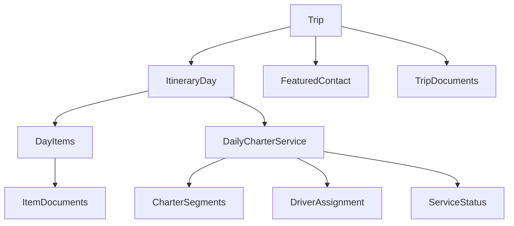
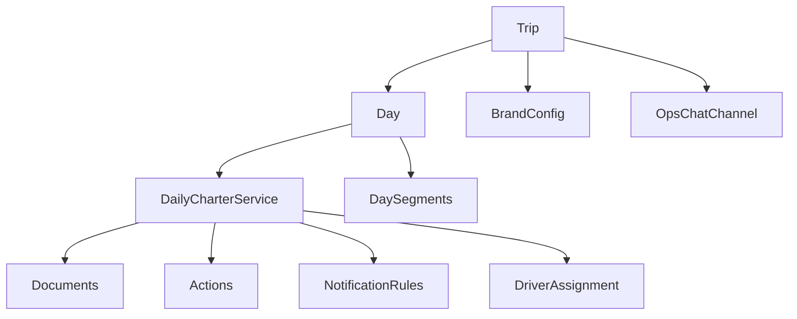
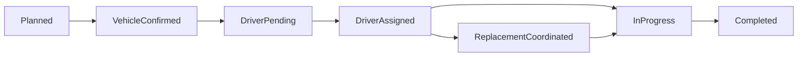

# AXUS Travel App and mTrip Research for Farland Daily Itinerary and Charter UX

## AXUS Travel App report

**Executive summary**

- AXUS is strongest as an advisor-led itinerary delivery and collaboration product, not as a dedicated transportation or chauffeur-dispatch system. Its public materials consistently emphasize a fixed traveler information architecture—Home, Itinerary, Guides, Documents, Messages, Notifications, Past Trips, and Profile—plus publish/unpublish controls, real-time web view sharing, messaging, task management, and flight updates. citeturn27view0turn17view5turn3view0
- For Farland, AXUS is highly relevant as a model for the **outer shell** of the daily trip experience: a trip-first home screen, expandable day-by-day itinerary entries, clickable addresses, clearly emphasized times, attached documents, advisor contact, and synchronized change notifications. Its public screenshots show that pattern clearly. citeturn21view0turn22view0turn22view1turn22view2turn22view4
- AXUS is materially weaker for Farland’s charter problem. In the official material reviewed here, transport appears as generic itinerary bookings and flight status updates, not as a first-class object with driver assignment, continuity rules, vehicle substitution, or backup handling. User reviews also point to limitations around guides, copy-and-paste, notification state, and offline reliability. citeturn27view0turn17view4turn25view0turn14view1

**Product positioning and target users**

AXUS positions itself as “the complete itinerary building & collaboration platform for travel professionals,” with explicit support for advisor collaboration, supplier/DMC collaboration, GDS import, vendor parsing, CRM/API integrations, itinerary calendar, task manager, analytics, and a traveler-facing mobile app. The company also offers custom branded apps and API access, which is important for any Farland-style white-label future. citeturn1view0turn27view0

Its target users are not end-consumer travelers booking on their own. The target is travel advisors, agencies, tour operators, and DMC-adjacent teams that want to create, publish, and maintain itineraries for clients. Trade coverage and travel-industry listings describe AXUS as a tool for modern luxury or FIT-oriented travel planners, and AXUS’s own testimonials heavily emphasize advisors, destination specialists, and collaborator workflows. citeturn24view0turn24view1turn27view1

For Farland, the closest analog is not “ride hailing”; it is **advisor-authored trip execution**. That matters because the charter card lives inside a broader trip narrative, not as a standalone point-to-point booking object. AXUS is very good at that narrative layer. citeturn27view0turn24view0

**Information architecture and core modules**

AXUS’s public product page explicitly names its traveler-facing modules, and the supporting screenshots match those names. The structure is unusually clear and stable, which is useful for Farland if the goal is a calm, premium trip container rather than a marketplace dashboard. citeturn27view0

| Module | What AXUS publicly shows | Farland relevance |
|---|---|---|
| Home | Trip-list home with agency logo, past trips entry, and trip cards with title and dates. Official screenshot available. citeturn21view0turn27view0 | Strong model for **My Trip** entry and current/next trip selection. |
| Itinerary | Day-by-day trip details with expandable detail views, clickable addresses, highlighted times, images, and links. Official screenshots and product copy show this directly. citeturn27view0turn22view0 | Excellent model for Farland’s day page and per-segment detail drill-down. |
| Documents | Native in-app document section; AXUS accepts PDF/JPG/PNG/GIF and shows a document-list screen. Official screenshot available. citeturn27view0turn22view1turn0search10 | Strong template for vouchers, confirmations, school appointment PDFs, and vehicle instructions. |
| Messages | Itinerary-level messaging with push notifications to travelers and email/web notifications to advisors. Official screenshot available. citeturn17view1turn22view2 | Good model for “Contact Farland advisor” tied to a trip or day, not generic customer support. |
| Notifications | Published-itinerary changes trigger push notifications; flight updates can also push once confirmed. Official screenshot available. citeturn17view2turn17view3turn17view4turn22view3 | Useful precedent for changed pickup time, reassigned vehicle, and updated school-visit reminders. |
| Guides | Destination overview, POIs, dining, and travel42 content. citeturn27view0 | Potential future module for school/city guides, but not essential for the charter MVP. |
| Profile | Contact tab with photo/logo, phone, email, website, bio, and itinerary-specific featured contact. Official screenshot available. citeturn17view0turn22view4 | Highly relevant for Farland advisor visibility and accountability. |
| Past Trips | Travelers can access past trips through web view after return, with a “Past Trips” section in the app. citeturn19view0 | Useful later for student history, prior visits, and repeat-family context. |

**UI patterns for day-by-day itinerary and service cards**

The most useful official AXUS visuals are the Home trip list, the itinerary detail screen, the document list, the messages screen, the notification lock-screen example, and the profile/contact screen. Those are all official English-language assets published on axustravelapp.com. citeturn21view0turn22view0turn22view1turn22view2turn22view3turn22view4

From those visuals and product copy, several patterns stand out.

The **Home** screen is trip-first, not function-first. It begins with brand identity, then shows trip cards with trip names and dates. This is the right precedent for Farland’s “My Trip” entry point because it leads the traveler into context before exposing actions. citeturn21view0turn27view0

The **day-by-day itinerary** pattern is detail-on-tap rather than detail-all-at-once. AXUS explicitly says travelers can see day-by-day plan details and expand for more information. The detail screen screenshot shows a familiar hierarchy: hero image, activity title, address/URL, a compact three-column time table, meeting point, then description. The product page also says inserted addresses open the phone’s map application and times are highlighted “in a table.” citeturn27view0turn22view0

The **Documents** pattern is list-based and quiet. Documents are displayed as simple rows with minimal chrome, which is appropriate for confirmations, vouchers, menus, tickets, and PDFs. This supports Farland’s need to expose school instructions, hotel confirmations, and vehicle service notes without turning the day view into a file manager. citeturn22view1turn27view0turn0search10

The **Messages** pattern is itinerary-native. The screenshot shows Messages as one of the in-trip tabs, alongside Itinerary, Documents, and Guides. That is important: communication is embedded in trip execution, not spun out into a generic support inbox. AXUS also routes traveler replies to advisor email and web app notifications, which is strong operationally. citeturn22view2turn17view1

The **Notifications** pattern is event-driven and lightweight. AXUS surfaces itinerary-change notifications, message notifications, and flight-related notifications; it also lets advisors suppress bulk change notifications while editing a published itinerary. That is useful for Farland because daily charter changes should notify the traveler selectively rather than on every low-level edit. citeturn17view2turn17view3turn17view4

The **Profile/contact** pattern is accountability-forward. Travelers can tap to call or email the featured contact for that itinerary, and the featured contact can differ by itinerary. That is exactly the sort of trust signal Farland should preserve for student and parent users. citeturn17view0turn22view4

Where AXUS is thinner is the **service-card layer** for transport. Public AXUS materials do not show a dedicated “daily vehicle service” card with explicit service window, contingency state, or driver-assignment status. Instead, transportation is treated as one booking among others, plus separate flight status logic. AXUS does have a red airplane indicator for flight changes and traveler-added bookings, but that is not the same as a charter operations object. citeturn3view0turn17view4turn3view2

**Data and modeling implications for a Farland-style daily charter card**

For Farland, AXUS suggests a clean way to model the **trip container**, but it does not provide enough transport semantics on its own. The right takeaway is to adopt the trip/day/document/contact/message model, then layer a Farland-specific charter entity on top.

| Farland entity or field | Recommendation inspired by AXUS | Why this follows from AXUS |
|---|---|---|
| `trip` | Keep a top-level trip object with title, date range, city summary, publish state, featured contact, and traveler list. | AXUS is explicitly trip-centric and publish-state centric, with a featured contact and traveler credentials tied to the itinerary. citeturn17view5turn17view0 |
| `itinerary_day` | Model each day as a first-class object with date, city, title, summary, and an ordered list of day items. | AXUS publicly emphasizes day-by-day structure and expandable detail views. citeturn27view0turn22view0 |
| `day_item` | Use a polymorphic day item for school visit, hotel, activity, transfer segment, or advisory note. | AXUS handles many item types under one itinerary system, including air, accommodations, restaurants, tours, and traveler-added items. citeturn27view0turn3view2turn3view4 |
| `daily_charter_service` | Add a Farland-only layer above day items: service window, included hours, service area, vehicle class, contingency note, overtime note, advisor note. | AXUS does **not** expose this object publicly; this is where Farland must extend the AXUS shell. citeturn27view0turn17view4 |
| `documents[]` | Attach documents either at trip level or per day/per item. | AXUS supports organized documents and file uploads tied to itineraries. citeturn22view1turn0search10 |
| `featured_contact` | Make advisor/operations contact visible per trip and optionally per day. | AXUS supports itinerary-specific featured contacts and one-tap call/email. citeturn17view0 |
| `status` | Separate `publish_status` from `service_status`. Example: `unpublished/published` for trip visibility, and `planned/confirmed/driver_pending/assigned/replaced/completed` for charter execution. | AXUS already separates publication workflow from item-change and flight-update logic; Farland should keep that separation explicit. citeturn17view5turn17view2turn17view4 |

A practical Farland extension of the AXUS logic looks like this:



**Operational and workflow features**

Operationally, AXUS is mature in the areas Farland needs for trip publishing. All itineraries begin unpublished, then become live when published. Publishing triggers a traveler welcome email with app credentials and a web-view link; once published, advisors can message travelers, collaborate on booking changes, and generate push notifications. citeturn17view5turn3view1turn3view3

Its web-view model is especially relevant. AXUS lets travelers see the latest itinerary online without requiring app download, and the web view is always the current version after publish. That is a strong precedent for Farland because parents often prefer a shareable link or lightweight browser view. citeturn3view1turn4search14

AXUS also has an operational home page for advisors with flight updates, itinerary calendar, and itinerary-linked tasks that can be assigned to collaborators, including third-party DMCs and agencies. That points to a useful Farland future state where “confirm driver,” “sync vehicle details,” and “upload school visit instructions” are itinerary-linked operational tasks rather than side-band Slack work. citeturn3view0

On change management, AXUS is explicit: edits to a published itinerary normally send push notifications, but advisors can suppress those notifications while making bulk edits. Flight updates require advisor confirmation before the updated flight data is pushed to travelers. That is a good pattern for Farland because driver reassignment or timing changes should often require ops confirmation before surfacing to families. citeturn17view2turn17view3turn17view4

**Dispatch and backend features relevant to charter**

This is where AXUS becomes substantially less useful as a direct model.

AXUS imports and manages travel content from airlines, hotels, car rentals, OpenTable, select activity providers, GDS PDFs, and email parsing. It supports collaboration with DMCs and travel planners and provides tasks, CRM/API integrations, and a content library. All of that is helpful at the itinerary level. citeturn3view4turn1view0turn27view0

But in the official pages and support material reviewed here, I did **not** find native public documentation for chauffeur dispatch, driver roster assignment, same-driver continuity logic, vehicle substitutions, or backup-driver workflows. Flight update tracking exists; transportation-as-itinerary-content exists; dedicated charter dispatch does not appear to be a public first-class module. citeturn27view0turn17view4turn3view4

That means AXUS should inform Farland’s **presentation model and publish workflow**, but not its **driver operations model**.

**Strengths, weaknesses, and risks for adopting AXUS patterns**

AXUS’s biggest strength is information architecture discipline. It gives travelers a comprehensible trip container with modest visual noise, strong advisor visibility, documents in context, and operationally meaningful publish/change workflows. It also has a real white-label path and an advisor-facing operational home page. citeturn27view0turn3view0turn1view0

Its biggest weakness for Farland is transport specificity. A “daily charter service” card would need to be invented by Farland because AXUS’s public transport model is mostly “booking rows plus flight updates.” That is not enough for student charter operations where continuity, cutoff times, and replacement states matter. citeturn17view4turn27view0

There is also a product-experience risk. AXUS’s public App Store rating is 3.5 on iOS and 3.3 on Google Play, and user reviews cite offline issues, lack of easy copy/paste for addresses and phone numbers, guidebook usability problems, and stale unread message badges. Those pain points are especially relevant to families trying to use addresses, directions, or call buttons while traveling. citeturn25view0turn14view0

**Concrete recommendations for Farland**

Farland should borrow AXUS’s shell, not its transport semantics.

The best AXUS-inspired wording for Farland is calm and itinerary-native:

- **Today’s charter service**
- **Today’s plan**
- **Related documents**
- **Contact Farland advisor**
- **Updated itinerary**
- **Change confirmed**
- **View on map**

Farland should avoid treating the charter as just another itinerary row. Instead, the day page should have **three layers**: day header, a dedicated daily charter card, then the movement timeline. That preserves AXUS’s day-by-day clarity while adding the transport object AXUS lacks. The recommendation below is a deliberate extension of AXUS, not a copy of AXUS. citeturn27view0turn22view0

```xml
<view class="day-page">
  <view class="day-header">
    <text class="day-date">Jun 3 · Boston</text>
    <text class="day-title">Boston Campus Visit Day</text>
    <text class="day-summary">
      Farland has coordinated hotel departure, campus transfers, waiting time,
      and evening return.
    </text>
  </view>

  <view class="charter-card">
    <view class="card-top">
      <text class="card-title">Today’s charter service</text>
      <text class="status-pill">Driver pending</text>
    </view>

    <view class="card-meta">
      <text>09:00–19:00</text>
      <text>Large SUV</text>
      <text>Boston / Cambridge</text>
    </view>

    <view class="card-body">
      <text>Vehicle confirmed. Driver details will be synced by Farland.</text>
      <text>Reasonable waiting included. Overtime or added stops require confirmation.</text>
      <text>If the original driver changes, Farland will coordinate an equivalent replacement.</text>
    </view>

    <view class="card-actions">
      <button>Contact advisor</button>
      <button>Related documents</button>
      <button>View map</button>
    </view>
  </view>

  <view class="timeline">
    <view class="timeline-item">
      <text class="time">09:00</text>
      <text class="title">Depart hotel</text>
      <text class="note">Boston Marriott Cambridge → Harvard University</text>
    </view>
    <view class="timeline-item">
      <text class="time">13:00</text>
      <text class="title">School transfer</text>
      <text class="note">Harvard area → MIT / Boston College</text>
    </view>
  </view>
</view>
```

The minimum AXUS-shaped MVP for Farland should be: **trip home, day page, daily charter card, timeline, documents placeholder, advisor contact, publish/update states**. Do **not** spend the first cycle on guides, past trips, or traveler-added bookings. Farland will get more value from operational clarity than from trip-enhancement features. citeturn27view0turn17view5turn17view0

A practical implementation order is: first build the trip/day shell; then add the daily charter card; then attach documents/contact; then add change notifications; then add ops-facing task hooks; only after that should Farland build supplier-side driver assignment and replacement workflows.

## mTrip report

**Executive summary**

- mTrip is stronger than AXUS for the **service-card layer** around transport and ground logistics. Its official materials show adaptive trip layouts, day-by-day itinerary views, detailed daily schedules, transport and accommodation cards, contextual notifications, and action-driven UI such as **Check-In**, **Manage my flight**, **View on map**, **Directions**, and even **Book your airport transfer**. citeturn18view0turn18view1turn23view0turn23view2
- For Farland, mTrip is the more useful reference for a **daily charter card** because it treats travel services as rich, status-bearing, actionable cards rather than passive itinerary rows. It also synchronizes app, web, and PDF from one back office and supports strong offline behavior. citeturn18view4turn7view2turn16view0
- mTrip still does not appear to be a true chauffeur-dispatch system in its public materials. It supports transfers, shuttles, ground updates, Tour Leader workflows, group messaging, transport manifests, and shared logistics, but public documentation does not describe native driver rosters, backup-driver SLAs, or same-driver continuity management. Farland would still need its own operational layer for those needs. citeturn18view2turn18view6turn10view9

**Product positioning and target users**

mTrip positions itself as a white-label platform for travel agencies, tour operators, DMCs, and TMCs. Its headline promise is broader than AXUS’s: one platform combining branded mobile apps, itinerary builder, automated travel documents, and optional duty-of-care tools, all under the client’s brand. The company says it supports 300+ travel brands in 35+ countries and manages 4M+ trips per year. citeturn26view0turn7view1

Unlike AXUS, mTrip’s positioning is explicitly **multi-segment** and **multi-channel**. It serves FIT, group tours, cruises, MICE, DMC ground operators, and corporate/TMC workflows from the same platform. It also distinguishes between the entry-level shared-infrastructure **Trip Agent** product and a fully white-label app published under the agency’s own App Store identity. citeturn26view0turn18view1turn20search6

For Farland, that means mTrip is not simply a prettier itinerary app. It is closer to a configurable **trip-delivery operating system**, which is why its transport and notification patterns are more instructive for charter UX. citeturn18view4turn18view0

**Information architecture and core modules**

mTrip does not publicly document a fixed module list the way AXUS does. Instead, it exposes a configurable traveler app whose layout adapts by trip type, and a back office with 17+ toggleable app features. That makes its information architecture more flexible—but also more variable. citeturn18view0

| Module | What mTrip publicly shows | Farland relevance |
|---|---|---|
| Home / dashboard | “Smart Trip Display” adapts layout by trip type; official screenshot shows a hero trip header, utility row, trip information card, itinerary map, and trip cards/segments. citeturn18view0turn21view2 | Strong model for a configurable day dashboard with a daily charter card near the top. |
| Itinerary | Personalized day-by-day mobile itinerary for FIT; detailed daily itineraries and activity schedules for groups; App Store reviews describe a day-by-day overview with tappable detailed items. citeturn18view0turn18view1turn16view0 | Very relevant to Farland’s day view and charter + segment duality. |
| Documents | Travel documents appear offline in the app; documents can be attached to specific days or components; app/web/PDF stay synchronized. citeturn18view4turn18view5turn7view2 | Excellent precedent for attaching service notes, pickup instructions, hotel PDFs, and school confirmations. |
| Messages | In-app messaging is integrated with Zendesk, Missive, Genesys, email/CRM, and official screenshot shows branded chat UI. citeturn18view3turn21view1 | Strong model for advisor/ops messaging without exposing personal phone numbers. |
| Notifications | Contextual notifications are triggered by time, location, or booking type; official visuals show check-in reminders, transfer alerts, and flight updates. citeturn18view3turn23view2 | Best-in-class reference for departure reminders and day-of-service alerts. |
| Guides | 3,600+ offline destination guides, maps, GPS navigation, AI-curated recommendations; official guides/maps screenshot available. citeturn18view2turn23view1 | Optional for Farland later, but not necessary in MVP. |
| Profile / contact | Public app-store copy says the app includes travel-agency contact information; support is also routed through branded chat. citeturn16view0turn7view6 | Adequate model for advisor contact, though AXUS is more explicit about the profile screen. |

**UI patterns for day-by-day itinerary and service cards**

The most useful official mTrip visuals for Farland are the group trip dashboard, the flight/hotel/transfer card screen, the guides/maps screens, the traveler messaging screen, Trip Genius preferences, and the contextual notification graphics. Those are all official English-language assets hosted on mtrip.com. citeturn21view2turn23view0turn23view1turn21view1turn23view4turn23view2

The first major takeaway is that mTrip’s **home/dashboard is modular** rather than fixed-tab minimal. The group screenshot shows a cover image, trip title, date range, notification bell, settings, and a quick-action strip before getting into trip information and the itinerary map. This is visually richer than AXUS and can feel more “app-like,” but it can also become busy if Farland indiscriminately copies it. citeturn21view2turn18view0

The second takeaway is that mTrip’s **service cards are much closer to Farland’s charter need**. In the official transport/accommodation screenshot, a flight card carries a green **ON TIME** status pill; the hotel card exposes **View on map** and **Directions**; the flight card has primary CTAs for **Check-In** and **Manage my flight**; and there is also a secondary row to **Book your airport transfer**. This is the strongest public reference in this research set for how to make a travel service card both readable and actionable. citeturn23view0

The third takeaway is that mTrip’s **notifications are contextual, not merely reactive**. Official materials say rules can fire by time, location, or booking type, and the visual examples show pre-trip reminders, transfer prompts, gate-change notices, and post-disruption compensation prompts. For Farland, this is highly relevant: a charter card should not just display status; it should also know when to surface reminders like “driver details available,” “departure in 90 minutes,” or “new pickup point confirmed.” citeturn18view3turn23view2

The fourth takeaway is that mTrip’s **trip display adapts to trip type**. FIT itineraries, group departures, cruises, and MICE programs are treated differently. This is analytically important for Farland because a private-school campus day, a summer-school shuttle day, and a one-off airport reception do not need the same card anatomy. Farland should strongly consider trip-type templates rather than one universal transport UI. citeturn18view0turn18view1turn26view0

The fifth takeaway is that mTrip is willing to expose **commercial actions** inside service surfaces. Official copy highlights bookable activities, transfer alerts, and upsell opportunities; the screenshots visually confirm that ancillary actions can live underneath the primary itinerary information. Farland does not need upsell first, but it can use the same layout logic for **View map**, **Message advisor**, **View documents**, and **Service updated**. citeturn18view1turn18view3turn23view0

The main risk in copying mTrip too literally is complexity. mTrip’s public traveler experience also includes journals, eSIM, translations, restaurant suggestions, theme parks, AR, and other travel utilities. Those are impressive, but they would dilute Farland’s daily operations UX. The pattern to adopt is the **rich service card**, not the full super-app. citeturn18view0turn18view2turn11view2

**Data and modeling implications for a Farland-style daily charter card**

mTrip suggests a more granular object model than AXUS. It is a better reference if Farland wants the charter object to have its own status, actions, and attachment model.

| Farland entity or field | Recommendation inspired by mTrip | Why this follows from mTrip |
|---|---|---|
| `trip` | Keep one synchronized trip object across app/web/PDF and brand configuration. | mTrip explicitly uses one source of truth distributed to app, web, and PDF. citeturn18view4turn7view2 |
| `itinerary_day` | Make day objects trip-type aware: FIT, school-visit day, airport-service day, group day. | mTrip’s trip display adapts by trip type and supports FIT/group/multi-city programs. citeturn18view0turn18view1 |
| `daily_charter_service` | Give the daily charter card its own state and metadata: `service_window`, `vehicle_class`, `service_area`, `primary_status`, `secondary_alert`, `included_services`, `overtime_rule`, `actions[]`. | mTrip’s transport/accommodation cards carry status, details, links, and actions. citeturn23view0turn18view2 |
| `charter_segment[]` | Split the day into ordered movements or waiting segments under the daily charter. | mTrip supports detailed daily itineraries and activity schedules, plus drag-and-drop day planning with flights, hotels, activities, transfers, and free time. citeturn18view1turn18view5 |
| `document_attachment[]` | Attach documents to specific day components and cache them offline. | mTrip attaches documents to days/components and keeps them synchronized/offline. citeturn18view5turn18view4 |
| `notification_rule[]` | Store rules triggered by time, location, or booking type for reminders and changes. | mTrip publicly documents contextual notifications with rule-based triggers. citeturn18view3 |
| `ops_contact_channel` | Store advisor chat/contact channel without exposing personal numbers. | mTrip’s messaging is integrated and branded, not a raw phone-number workflow. citeturn18view3turn21view1 |
| `driver_assignment` | Add Farland-only assignment objects: `driver_pending`, `assigned`, `replaced`, `backup_in_progress`. | mTrip’s public model reaches ground logistics and Tour Leader control, but not explicit chauffeur assignment continuity; Farland must add that layer. citeturn18view6turn10view9 |

A mTrip-inspired Farland model can be visualized like this:



**Operational and workflow features**

mTrip’s operational model is built around automated ingestion and synchronized delivery. Bookings can come from GDS, mid-office systems, supplier documents, PDFs, emails, and—in DMC contexts—even transport manifests and rooming lists. The AI Import Wizard structures that content into day planning and pushes it into the traveler-facing channels. citeturn7view1turn10view5turn18view6

The delivery principle is clear and powerful: build the trip once, then distribute it through mobile app, web portal, and branded PDF simultaneously, with changes syncing in real time. On the MICE side, mTrip even emphasizes that edits push across channels with “no republishing steps.” citeturn7view2turn18view4turn7view5

For chat and support, mTrip is more workflow-integrated than AXUS. Messaging can connect to Zendesk, Missive, Genesys, email, or CRM, which means the traveler sees a clean branded chat while the agency keeps working inside its existing support stack. That is very relevant if Farland wants advisor/ops communication without adding a separate in-house messaging backend from day one. citeturn18view3turn21view1

On notifications, mTrip goes beyond “itinerary changed.” It publicly describes automated check-in reminders, transfer alerts, activity suggestions, and rules based on time, location, or booking type. That is exactly the kind of engine that can later support Farland’s “driver details ready,” “pickup in 60 minutes,” “meeting point updated,” or “replacement arranged” flows. citeturn18view3turn23view2

mTrip’s branding and rollout workflow is also important. The company distinguishes between an entry-level Trip Agent experience and a fully white-label app under the agency’s own developer account. Official materials say Trip Agent can be provisioned immediately or within roughly 1–2 weeks, while a fully branded app may take a few weeks to a couple of months depending on integrations and app-store requirements. citeturn20search3turn26view0

**Dispatch and backend features relevant to charter**

mTrip is materially better than AXUS on **ground-program operations**, but it still stops short of full chauffeur dispatch.

The official DMC material says mTrip is built for ground operators coordinating destination logistics, and that its Tour Leader feature gives the ground team group messaging, participant location visibility, and day-by-day management without exposing personal phone numbers. It also supports pushing real-time schedule changes to travelers and tour leaders. citeturn18view6turn10view9

The public trip and transport material explicitly mentions train, car rental, private jet, ferry, shuttle, hotel directions, transfer alerts, and even third-party integrations for ride-hailing and ground transportation. The screenshot showing **Book your airport transfer** confirms that transfer-related actions are part of the service-card vocabulary, not an afterthought. citeturn18view2turn18view0turn23view0

The MICE and DMC pages also mention shared transfers, hotel logistics, meeting agendas, multiple concurrent programs, and program delivery under a client’s brand. That is close to Farland’s campus-visit and summer-school logistics reality. citeturn26view0turn20search13

However, in the public materials reviewed here, I did **not** find explicit concepts for chauffeur roster assignment, same-driver continuity guarantees, replacement-driver approval, or per-day vehicle utilization capacity. Those remain Farland-specific operational needs. mTrip gets much closer to the correct **shape** of the problem than AXUS, but it is still not a limousine-dispatch or Moovs-style routing system. citeturn18view6turn10view9

**Strengths, weaknesses, and risks for adopting mTrip patterns**

mTrip’s strengths for Farland are substantial. It offers a richer traveler-facing service card language, stronger offline depth, multi-channel sync, dynamic trip-type layouts, and more mature ground-operations-adjacent features. Its public Trip Agent app also has materially stronger traveler ratings than AXUS: 4.9 on Apple with 386 ratings and 4.7 on Google Play with 119 reviews, versus AXUS’s 3.5 and 3.3 baselines. citeturn16view0turn8view1turn25view0turn14view0

Its weaknesses are mostly about scope and density. Public mTrip collateral routinely bundles messaging, trip journal, eSIM, guides, maps, upsell, travel tools, and more into the app. That may be excellent for leisure agencies, but it risks overwhelming Farland’s daily charter UX if copied too literally. citeturn21view2turn18view0turn11view2

There are also usability and implementation risks. One Google Play review specifically calls out the lack of a “jump to today” behavior in long itineraries, and a G2 review says communication around product changes and customization timelines could improve. The full white-label path also takes longer than a basic shared app rollout. citeturn8view1turn24view2turn26view0

**Concrete recommendations for Farland**

If Farland wants a compelling daily charter card, mTrip is the better inspiration source than AXUS.

The right pieces to borrow are:

- a **status pill** on the service card
- a **primary action row**
- embedded **map / directions / documents** affordances
- contextual secondary text under the main status
- optional **transfer/arrival reminders** via notifications
- trip-type adaptive layout, so airport, visit-day, and multi-point charter days do not look identical citeturn23view0turn18view3turn18view0

Farland should use service-card copy that feels operational, not consumer-travel flashy:

- **Today’s charter service**
- **Vehicle confirmed**
- **Driver details pending**
- **Updated meeting point**
- **View route**
- **Related documents**
- **Message Farland advisor**
- **Replacement coordinated**

A clean mTrip-inspired—but Farland-reduced—card mockup would look like this:

```xml
<view class="charter-card">
  <view class="card-header">
    <view>
      <text class="eyebrow">TODAY’S SERVICE</text>
      <text class="title">Today’s charter service</text>
    </view>
    <text class="status-pill status-confirmed">Vehicle confirmed</text>
  </view>

  <view class="meta-row">
    <text>09:00–19:00</text>
    <text>Large SUV</text>
    <text>Boston / Cambridge</text>
  </view>

  <view class="service-summary">
    <text class="primary-line">
      Driver details will be synced by Farland before departure.
    </text>
    <text class="secondary-line">
      Reasonable waiting is included. Added stops or overtime require review.
    </text>
  </view>

  <view class="actions-row">
    <button>View route</button>
    <button>Documents</button>
    <button>Message advisor</button>
  </view>

  <view class="service-note">
    <text>
      If the original driver changes, Farland will coordinate an equivalent replacement and notify you.
    </text>
  </view>
</view>
```

The minimum mTrip-shaped MVP for Farland should be narrower than mTrip itself:

- day header
- daily charter card with status pill
- action row for map, documents, advisor
- timeline list underneath
- time-triggered notification hooks
- offline-safe cached documents if feasible

Do **not** start with trip journal, eSIM, destination guides, ride-hailing partners, or dynamic upsell modules. The value lies in the way mTrip structures service cards and notification logic, not in its full feature breadth. citeturn18view3turn18view4turn18view0

## Direct comparison

The biggest practical difference between AXUS and mTrip is this: **AXUS is the cleaner reference for the itinerary shell; mTrip is the stronger reference for the service card and ground-logistics layer.** That conclusion follows directly from the official materials. citeturn27view0turn18view2turn18view3

| Dimension | AXUS | mTrip |
|---|---|---|
| Core positioning | Advisor-led itinerary building and collaboration for travel professionals. citeturn1view0turn24view0 | White-label travel platform for agencies, tour operators, DMCs, and TMCs across leisure and business. citeturn26view0 |
| Traveler app structure | Fixed module list publicly documented: Home, Itinerary, Guides, Documents, Messages, Notifications, Past Trips, Profile. citeturn27view0 | Configurable and trip-type adaptive; public materials emphasize dashboard + modules rather than a single fixed nav. citeturn18view0 |
| Day itinerary UX | Clean day-by-day plan with expandable details, clickable addresses, time tables, and lightweight detail pages. citeturn27view0turn22view0 | Richer dashboard/service-card style with daily itineraries, group schedules, transport cards, and more embedded actions. citeturn18view1turn23view0 |
| Transport / charter support | Generic itinerary content plus flight updates; no public native charter object. citeturn17view4turn27view0 | Stronger transport/accommodation card model, transfer alerts, shuttles, group-ground updates, and Tour Leader workflows; still no clear native chauffeur roster module. citeturn18view2turn10view9 |
| Documents | Strong, simple list-based document delivery. citeturn22view1turn0search10 | Stronger document synchronization across app/web/PDF and component-level attachment. citeturn18view4turn18view5 |
| Messaging | Itinerary-level messaging with traveler push + advisor email/web notifications. citeturn17view1 | Branded chat integrated with support tools like Zendesk/Missive/Genesys. citeturn18view3turn21view1 |
| Notifications | Publish-change notifications plus flight-update notifications; suppression supported during edits. citeturn17view2turn17view3turn17view4 | Contextual notifications triggered by time, location, or booking type. citeturn18view3turn23view2 |
| Guides | Destination guides via travel42; public reviews suggest mixed usability. citeturn27view0turn25view0 | Extensive offline guides/maps and travel tools. citeturn18view2turn23view1 |
| Offline depth | Officially supported, but some user reviews report unreliable offline access. citeturn14view0turn25view0 | Strong public offline positioning across itinerary, docs, guides, and maps. citeturn16view0turn11view0 |
| Advisor / ops workflow | Publish/unpublish, web view, task manager, flight validation, collaborator network. citeturn17view5turn3view0turn3view1 | Import wizard, synchronized back office, feature toggles, support integrations, Tour Leader / DMC workflows. citeturn18view4turn18view0turn18view6 |
| Backend dispatch relevance | Low for chauffeur operations. citeturn27view0turn17view4 | Medium for ground programs and transfers, but still not full chauffeur dispatch. citeturn18view6turn23view0 |
| Best use for Farland | Trip shell, documents, advisor contact, publish/change workflow. | Daily charter service card, transport actions, contextual alerts, trip-type templates. |

## Farland synthesis

Farland should not copy either product wholesale.

The most defensible product direction is a **hybrid architecture**:

- use **AXUS-style information architecture** for the outer trip shell
- use **mTrip-style service cards and alert logic** for the charter layer
- build a **Farland-only driver operations layer** for assignment, continuity, replacement, and ops approvals

That synthesis fits the evidence. AXUS is better at calm trip framing and advisor visibility; mTrip is better at stateful transport cards and trip-type-aware ground-service UX. Neither is publicly documented as a complete chauffeur dispatch product for Farland’s use case. citeturn27view0turn18view2turn18view3turn18view6

A strong Farland daily-charter lifecycle would look like this:



The most concrete product recommendation is to split Farland’s day experience into three layers:

1. **Day header**
   date, city, title, summary

2. **Daily charter service card**
   service window, vehicle class, service area, charter status, replacement note, actions

3. **Timeline**
   ordered movements, school visits, waiting segments, returns

That architecture gives parents and students the “What is happening today?” answer before asking them to parse “At what time do we stop where?” It also gives operations a clean place to inject replacement updates without rewriting the whole itinerary. The recommendation is supported by AXUS’s day-first shell and mTrip’s rich service-card model. citeturn27view0turn23view0turn18view1

A realistic MVP sequence for Farland is:

- **Step one:** AXUS-style trip shell with trip list and day page
- **Step two:** mTrip-style daily charter card above the timeline
- **Step three:** advisor contact and related documents
- **Step four:** publish/update states and change notifications
- **Step five:** internal ops tasking and confirmation workflow
- **Step six:** Farland-specific driver assignment and backup logic

If Farland follows that order, it will avoid the common failure mode of overbuilding dispatch before the traveler-facing day model is stable. The traveler will first experience clarity, then confidence, then operational sophistication. That is the right order for a student-oriented charter product.