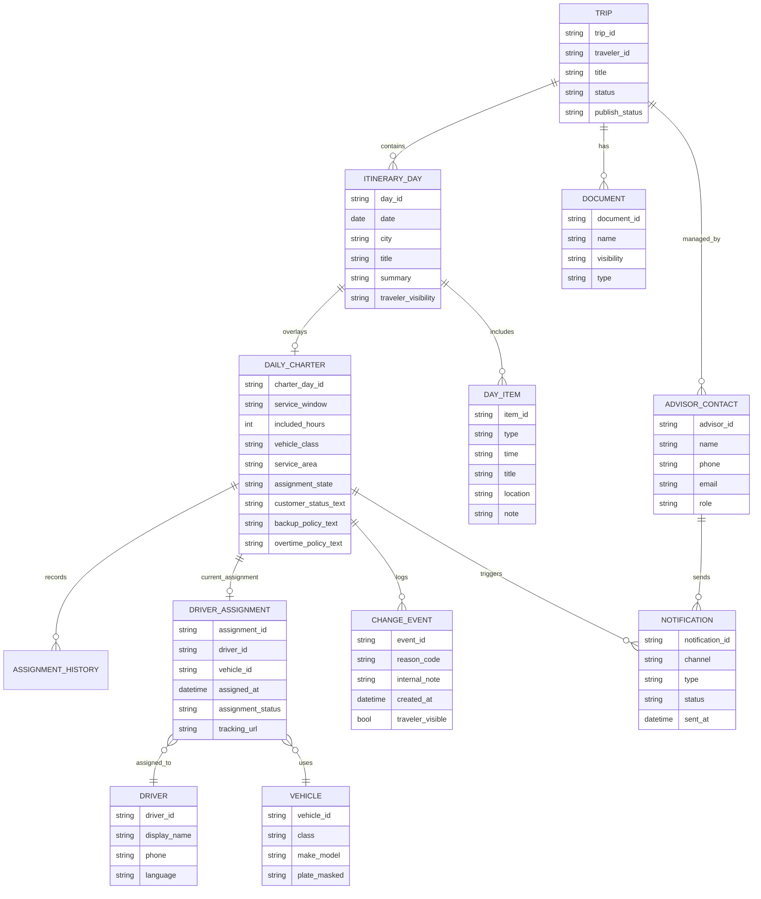
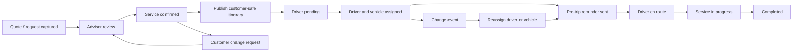

# Farland Benchmark Report on AXUS Travel App and Comparable Itinerary and Transport Platforms

## Executive summary

The ten products reviewed split cleanly into two groups. **AXUS, Travefy, mTrip, TripCreator, Wetu, and Tourwriter** are primarily itinerary-delivery systems: they excel at day-by-day presentation, document delivery, branded trip sharing, and in some cases chat or notifications. **Blacklane, Uber Central, Moovs, and Limo Anywhere** are primarily transport-operations systems: they excel at quoting, ride creation, dispatch, assignment, live tracking, and operational status handling. citeturn6view0turn17view0turn22search7turn37view0turn32search1turn17view9turn38view0turn17view6turn17view7turn17view8

For **Farland’s daily charter card**, the best market pattern is not to copy any single vendor. The strongest direction is a **hybrid**: use **AXUS / Travefy / Wetu** for the customer-facing “today’s itinerary” shell, and use **Moovs / Limo Anywhere / Uber Central** for transport-specific states, assignment visibility, automated notifications, and reassignable dispatch mechanics. Blacklane contributes useful language for wait-time, hourly-hire framing, and “service continuity without overpromising the same driver.” citeturn6view0turn4search3turn21search9turn32search1turn18view1turn28search10turn39view0turn38view0turn27search4

The central design conclusion is simple: **Farland should present charter as a day-level service layer inside the itinerary, not as a generic order card and not as a pure dispatch screen**. Customer-facing UX should answer: *what is happening today, what vehicle service window is covered, what is confirmed, what may still change, who is responsible, what are the guardrails for overtime or re-assignment, and where are the supporting files or advisor contact details?* That is closer to AXUS than to Moovs visually, but closer to Moovs and Limo Anywhere operationally. citeturn6view0turn18view2turn18view3turn28search19

## Consolidated recommendations

Farland should **adopt** five elements immediately. The first is the **AXUS-style publish model**—internal draft versus traveler-visible published view—because it cleanly separates planning from customer communication. The second is the **Travefy/Wetu mobile-first trip shell**, where the traveler opens a branded trip, sees today first, and reaches documents or contact actions without digging. The third is the **Moovs/Limo-style assignment stack**, where a booking can be confirmed before a driver is visible, and where dispatch can reassign without breaking the traveler experience. The fourth is **Uber Central-style coordinator controls and re-book logic** for last-minute changes. The fifth is **Blacklane-style wait-time and change-policy copy** so expectations are explicit before the travel day starts. citeturn4search3turn3search0turn21search9turn32search1turn18view2turn18view3turn39view0turn38view0turn27search4

Farland should **adapt cautiously** three areas. It should adapt—not copy—**mTrip’s enterprise synchronization model**, because app/web/PDF parity is valuable but a full white-label, multi-channel enterprise stack is too heavy for MVP. It should adapt **TripCreator and Tourwriter’s operations depth** around confirmations, vouchers, supplier notes, and pricing, but only once the customer-facing daily charter card is stable. It should also adapt **Wetu’s high-polish image-led presentation** selectively; premium visuals help, but student-focused charter days must prioritize execution details over destination storytelling. citeturn22search7turn35view1turn37view0turn33view2turn33view1turn32search2

Farland should **avoid** three traps. It should avoid promising an unconditional **same-driver guarantee**, because the transport-native products emphasize continuity and visibility rather than a hard same-driver promise. It should avoid exposing a raw dispatch interface to travelers, because that produces an operational screen rather than a reassuring travel product. It should avoid burying charter inside a generic orders list, because the strongest itinerary products all keep the traveler mentally anchored on the trip day, not the booking record. citeturn18view1turn18view3turn39view0turn6view0turn17view0turn32search1

A practical MVP sequence for Farland is therefore: **Trip Home → Today Card → Daily Charter Card → Timeline → Files → Advisor Contact → Status updates**. Only after that should Farland invest in deeper quoting, dispatch optimization, or document automation. This ordering best matches what the strongest reviewed products do for traveler reassurance and what the strongest transport tools do for day-of reliability. citeturn6view0turn17view0turn18view0turn18view1turn28search19

## Cross-product comparison

The table below mixes **explicit vendor capabilities** with **analyst judgments** for qualitative columns such as *driver assignment visibility* and *backup support*. Those qualitative ratings are based on the cited official sources and public product documentation reviewed for this report.

| Product | Itinerary focus | Transport support | Driver assignment visibility | Backup support | Messaging | Offline access | Target market | Pricing model |
|---|---|---:|---:|---:|---:|---:|---|---|
| AXUS Travel App citeturn6view0turn4search3turn20search1 | High | Medium | Low | Low | High | Not explicit in reviewed public docs | Travel advisors, luxury/FIT agencies, DMCs, tour operators | $35/seat monthly, $329 yearly, team pricing for DMCs/TOs citeturn20search1 |
| Travefy citeturn21search9turn7search1turn36view0 | High | Low–Medium | Low | Low | High | High | Travel agents, agencies, tour operators, DMOs | Core $39/mo annual; Premium $59/mo annual; agency/team pricing from $20/mo annual add-on structure citeturn36view0 |
| mTrip citeturn22search7turn17view1turn35view1 | High | Medium | Low–Medium | Low | High | High | Agencies, DMCs, tour operators, TMCs | Custom; trip-based monthly pricing; Trip Agent tier and full white-label tier citeturn35view1turn35view0 |
| TripCreator citeturn30view0turn37view0turn24view0 | High | Medium | Low | Low | Low–Medium | High | DMCs, MICE agencies, travel agencies | Standard $69/user/mo annual; Pro $119/user/mo annual; enterprise custom citeturn24view0 |
| Wetu / TravelKey citeturn32search1turn32search2turn31view0 | High | Medium | Low–Medium | Low | Low | High | DMCs, operators, agents, supplier ecosystem | Lite $75/mo; Premium $150/mo; enterprise custom/API pricing citeturn23view0 |
| Blacklane citeturn38view0turn17view5turn11search1 | Low | High | Medium | Medium | Low | Low / not product focus | End travelers, business travelers, travel managers | Per ride / hourly, fixed upfront price, distance-based pricing citeturn38view0turn26search1 |
| Uber Central citeturn17view6turn39view0turn39view1 | Low | High | Medium | Medium | Low–Medium | Low | Coordinators in hospitality, healthcare, auto, executive support, events | Free account; pay only for rides taken citeturn17view6 |
| Moovs citeturn18view2turn18view1turn25view0 | Medium | High | High | High | High | Not explicit in reviewed public docs | Chauffeur, limo, shuttle, charter and motorcoach operators | Free test drive; Standard $149/mo; Pro $199/mo; add-ons and card processing fees citeturn25view0 |
| Limo Anywhere citeturn17view8turn18view3turn28search2 | Medium | High | High | High | High | Low / PWA-style access rather than offline-first consumer app | Chauffeur, limo, livery operators | Tiered plans with add-ons; custom/operator-tailored plans citeturn20search3turn18view7 |
| Tourwriter citeturn17view9turn34view0turn33view1 | High | Medium | Low | Low | Low in reviewed traveler layer | Not explicit in reviewed public docs | Boutique and luxury tour operators, DMCs | Request-quote plans; Starter/Pro/Premium plus setup cost citeturn34view0 |

## Recommended Farland data model and workflow

The recommended Farland model should combine four patterns that recur across the strongest products reviewed. From **AXUS**, take the split between **draft** and **published** traveler visibility. From **Travefy, TripCreator, and Wetu**, take the **day-first mobile trip shell** with documents and advisor/contact actions close to the daily view. From **Moovs, Limo Anywhere, and Uber Central**, take the **transport-specific assignment layer** with request, confirmation, driver visibility, tracking, and editable / re-bookable operations. From **Blacklane**, take explicit **wait-time, change, and overtime policy fields**. citeturn4search3turn17view0turn30view0turn32search1turn18view1turn18view3turn39view0turn38view0

The resulting object model should treat **daily_charter** as a first-class entity attached to **itinerary_day**, not as just another timeline item. Within that entity, Farland should track: service window, included hours, vehicle class, vehicle hint, service area, assignment state, assigned driver snapshot, assigned vehicle snapshot, traveler-visible policy copy, and change events. A separate **assignment_history** object should preserve reassignment without overwriting prior state. That will let Farland present customer-safe copy such as “vehicle confirmed, driver details pending” while still supporting day-of operational edits. citeturn18view2turn18view3turn39view0turn27search4



For Farland’s workflow, the most robust state design is not a single linear reservation status. It is a combination of **publish state** and **operational state**. Publish state should be simple—`draft`, `published`, `archived`. Operational state for the daily charter layer should be `quote_pending`, `confirmed`, `driver_pending`, `assigned`, `changed`, `in_progress`, `completed`, `cancelled`. The key idea is that `changed` should act as an event overlay rather than the only state, because day-of reassignment should preserve whether service is still confirmed and active. citeturn4search3turn18view8turn28search10turn39view0



## Company reports

Suggested Chinese and English UI copy in the company sections below is **recommended Farland copy**, not verbatim vendor copy.

### AXUS Travel App

**Executive summary.** AXUS is the cleanest benchmark for Farland’s customer-facing mental model. It is explicitly an itinerary-building and collaboration platform for travel professionals, with a traveler app organized around **Home, Itinerary, Guides, Documents, Messages, Notifications, Past Trips, and Profile**, and it distinguishes clearly between **unpublished** internal work and **published** traveler-visible trips. citeturn6view0turn4search3turn20search1

**Product positioning and customers.** AXUS targets travel advisors, agencies, DMCs, and tour operators that need to create, publish, and collaboratively refine itineraries. Its strengths are collaboration with partners, image-rich presentation, document delivery, day-by-day structure, advisor messaging, webview sharing, and task / analytics support in the advisor home screen. citeturn6view0turn18view9turn3search0turn4search2

**UI and operations patterns.** AXUS’s traveler-facing patterns are highly relevant to Farland: the day-by-day plan is expandable, times are highlighted, inserted addresses open the phone’s map app, documents are bundled into a trip-level documents area, and traveler messaging lives inside the itinerary rather than in a generic support inbox. When an itinerary is published, the traveler gets credentials and a web link that always reflects the most recent version. Flight changes are accepted or declined by the advisor, and only then pushed to travelers. citeturn6view0turn4search4turn3search0turn4search0turn4search1

**Data, states, messaging, backup.** AXUS gives Farland an excellent publish model—`unpublished → published`—plus app credentials, webview access, and push notifications for messages and itinerary revisions. It also supports visibility rules for documents, including internal documents that travelers cannot see. What AXUS does **not** publicly document is a transport-native dispatch layer for driver assignment, backup driver guarantees, or customer-visible reassignment history. For Farland, that means AXUS is best used as the **shell**, not the complete operational core. citeturn4search3turn3search0turn3search5turn3search6

**Strengths and weaknesses for Farland.** AXUS is the strongest single UX precedent for a **daily itinerary with a dedicated charter card inside it**. Its main weakness for Farland is that driver operations and day-of chauffeur reassignment are not first-class public product concepts. That gap must be filled with transport-native mechanics from Moovs or Limo Anywhere. citeturn6view0turn4search3turn4search1

**Suggested Farland copy.**
- Card title: `今日包车服务` — `Today's Charter Service`
- Status badges: `草稿 / Draft` · `已发布 / Published` · `车辆已确认 / Vehicle Confirmed` · `司机待同步 / Driver Details Pending`
- Backup text: `优先安排同一司机；如因工时、档期或突发情况需要调整，Farland 将协调同等级替代方案。` — `We will prioritize the same driver when possible; if hours-of-service, availability, or unforeseen issues require a change, Farland will coordinate an equivalent replacement solution.`
- Overtime note: `超时、加点或跨区域行程可能产生额外费用，请提前联系顾问确认。` — `Additional charges may apply for overtime, extra stops, or out-of-area routing; please confirm with your advisor in advance.`

**Farland-oriented mock JSON.**
```json
{
  "itinerary_day": {
    "day_id": "day_2026_06_03",
    "publish_status": "published",
    "date": "2026-06-03",
    "city": "Boston",
    "title": "Boston Campus Visit Day",
    "summary": "Advisor-published day with live webview access and traveler-visible documents."
  },
  "daily_charter": {
    "charter_day_id": "axus_like_001",
    "card_title": "Today's Charter Service",
    "service_window": "09:00-19:00",
    "included_hours": 10,
    "vehicle_class": "Large SUV",
    "service_area": "Boston / Cambridge",
    "assignment_state": "driver_pending",
    "customer_status_text": "Vehicle confirmed; driver details pending.",
    "documents_visible": true,
    "advisor_chat_enabled": true,
    "webview_live": true
  }
}
```

**Public visuals.** Official AXUS public visuals are available on the product’s app-features gallery, support pages, and app-store listing. citeturn6view0turn0search10turn18view9

**Priority for Farland.** **Adopt** the publish model and day-first UX. **Adapt** messages, documents, and status wording. **Avoid** assuming AXUS alone solves driver assignment or backup dispatch.

### Travefy

**Executive summary.** Travefy is a powerful benchmark for simple, mobile-first itinerary delivery. Its Trip Plans app gives clients offline access to their itinerary, documents, and chat, while advisor-side plans add CRM, proposals, and agency team features. citeturn21search9turn17view0turn36view0

**Product positioning and customers.** Travefy targets travel agents, agencies, tour operators, and DMOs that need an integrated trip builder, CRM, proposal workflow, and client mobile experience. The product emphasizes ease of use, supplier integrations, and a free client app that updates automatically as the advisor edits the trip. citeturn21search3turn7search2turn20search11

**UI and operations patterns.** Travefy’s UI pattern is straightforward: the client receives an itinerary link, is prompted to view it in the Trip Plans app, and then sees itinerary content, trip documents, and chat in a single mobile interface. This is excellent for Farland’s “today card + files + advisor contact” pattern. However, Travefy treats transport as part of itinerary content rather than as a deeply operational charter object; public materials focus on itinerary delivery, chat, and flight notifications, not on chauffeur assignment or backup logic. citeturn17view0turn21search9turn7search0turn7search1

**Data, states, messaging, backup.** Publicly documented Travefy states are lighter than AXUS’s explicit publish/unpublish model, but the product clearly supports live updates to shared trips, push notifications for chat and flight changes, and offline trip storage. Messaging is a strong point; driver-change handling is not. That makes Travefy a strong pattern for **clean customer communication**, but not for **transport dispatch robustness**. citeturn7search1turn17view0turn21search9

**Strengths and weaknesses for Farland.** Travefy is especially relevant if Farland wants the daily charter card to feel **consumer-simple and reassuring** rather than enterprise-heavy. Its weakness for Farland is the same as AXUS’s: no public evidence of a charter-native assignment model. citeturn21search9turn36view0

**Suggested Farland copy.**
- Card title: `今日交通安排` — `Today's Transport Plan`
- Status badges: `已确认 / Confirmed` · `已更新 / Updated` · `司机待分配 / Driver Pending`
- Backup text: `如今日司机安排发生调整，Farland 会第一时间更新卡片并同步顾问。` — `If today’s driver arrangement changes, Farland will update the card immediately and notify the advisor.`
- Overtime note: `若现场节奏超出原定服务时长，请先联系顾问确认延时安排。` — `If the day runs beyond the planned service window, please contact your advisor before extending service.`

**Farland-oriented mock JSON.**
```json
{
  "itinerary_day": {
    "day_id": "day_2026_06_03",
    "share_mode": "app_and_web",
    "offline_available": true,
    "date": "2026-06-03",
    "title": "Boston Campus Visit Day",
    "documents": ["school_confirmation.pdf", "hotel_confirmation.pdf"]
  },
  "daily_charter": {
    "charter_day_id": "travefy_like_001",
    "card_title": "Today's Transport Plan",
    "status": "confirmed",
    "service_window": "09:00-19:00",
    "vehicle_class": "SUV",
    "driver_visible": false,
    "chat_thread_id": "trip_chat_001",
    "change_notifications": true
  }
}
```

**Public visuals.** Public visuals are available on the Trip Plans product page, the traveler app page, and Travefy pricing / solution pages. citeturn21search9turn7search0turn36view0

**Priority for Farland.** **Adopt** the frictionless itinerary-to-app handoff and embedded chat. **Adapt** the day card shell. **Avoid** using Travefy as the sole reference for transport-state logic.

### mTrip

**Executive summary.** mTrip is a white-label travel platform with the broadest backend footprint in this benchmark. It combines itinerary builder, branded app/web/PDF delivery, GDS and mid-office import, messaging, and real-time synchronization, and it is priced by trips rather than by seats. citeturn22search7turn17view1turn35view1

**Product positioning and customers.** mTrip is aimed at agencies, tour operators, DMCs, TMCs, and event organizations that need fully branded traveler experiences and deeper back-office integration than typical advisor tools provide. It is explicitly positioned as a B2B white-label system, not as a consumer app. citeturn35view1turn35view0turn22search4

**UI and operations patterns.** On the traveler side, mTrip’s strongest pattern is its **triple-channel delivery**—mobile app, web itinerary, and PDF—from a single synchronized source of truth. Travelers can access branded itineraries, documents, maps, and messaging offline, and operators can publish structured multi-source bookings into that experience. For Farland, the most useful lesson is architectural: daily charter data should render identically wherever the traveler opens the trip. citeturn22search7turn17view1turn8search15turn35view1

**Data, states, messaging, backup.** Public docs emphasize sync, white-label deployment, AI import, and multi-source itinerary consolidation more than granular traveler states. Messaging and push updates are clearly part of the product; driver assignment, backup driver workflows, and exposed reassignment histories are not. That makes mTrip overqualified for Farland MVP, but extremely relevant for later scaling if Farland wants deep multi-channel consistency. citeturn17view1turn35view1turn22search7

**Strengths and weaknesses for Farland.** mTrip is strongest where Farland becomes a **real operations platform with branded app delivery and systems integration**. Its weakness is that it is too heavy and too enterprise-oriented for a first-pass Chinese-student charter itinerary card. citeturn35view1turn35view0

**Suggested Farland copy.**
- Card title: `今日用车与行程` — `Today's Transport and Itinerary Service`
- Status badges: `已同步 / Synced` · `已确认 / Confirmed` · `司机信息待补充 / Driver Info Pending`
- Backup text: `如司机或车辆发生调整，最新安排会同步更新至小程序与行程链接。` — `If the driver or vehicle changes, the latest arrangement will sync to the mini-program and shared itinerary link.`
- Overtime note: `超时费用按最终确认的运营规则结算。` — `Overtime charges will follow the final confirmed operating rules.`

**Farland-oriented mock JSON.**
```json
{
  "itinerary_day": {
    "day_id": "day_2026_06_03",
    "channels": ["app", "web", "pdf"],
    "date": "2026-06-03",
    "city": "Boston",
    "title": "Campus Visit Day",
    "source_of_truth": "central_itinerary_builder"
  },
  "daily_charter": {
    "charter_day_id": "mtrip_like_001",
    "status": "confirmed",
    "service_window": "09:00-19:00",
    "vehicle_class": "Business SUV",
    "driver_assignment_visible": false,
    "documents": ["voucher.pdf", "advisor_note.pdf"],
    "sync_revision": 4
  }
}
```

**Public visuals.** Public visuals and official product descriptions are available on the mTrip mobile app page, itinerary builder page, and white-label platform documentation. citeturn17view1turn22search7turn35view1

**Priority for Farland.** **Adopt later** the channel-sync idea. **Adapt later** the data backbone. **Avoid now** the enterprise scope for MVP.

### TripCreator

**Executive summary.** TripCreator is a practical white-label itinerary and operations platform for DMCs, MICE operators, and agencies. It combines priced itinerary creation, operations workflows, single-checkout itinerary booking, and a free traveler app with offline access and automatic updates. citeturn37view0turn30view0turn24view0

**Product positioning and customers.** TripCreator is explicitly built for travel professionals rather than consumers. Its help center describes it as enabling sales teams to create priced itineraries quickly, operations teams to manage confirmations and vouchers, and travelers to book the full itinerary in one flow. citeturn37view0

**UI and operations patterns.** TripCreator’s traveler app offers full itinerary access, offline use, offline maps when pre-downloaded, automatic updates, and reference-number access. Compared with AXUS or Travefy, TripCreator leans more toward **sales + operations + booking** than toward high-touch advisor collaboration. For Farland, that means it is particularly relevant for how a day card can connect to confirmations, documents, and potentially paid upgrades—less so for advisor-authored luxury storytelling. citeturn30view0turn17view2turn24view0

**Data, states, messaging, backup.** Public docs clearly show itinerary distribution, offline access, operations modules, CRM, invoicing, and booking. They do not prominently show native traveler chat or explicit driver-reassignment workflows in the reviewed sources. That makes TripCreator a useful benchmark for **operations-aware itinerary cards**, but not for visible chauffeur continuity messaging. citeturn30view0turn37view0turn24view0

**Strengths and weaknesses for Farland.** TripCreator is stronger than AXUS or Travefy if Farland later wants customer booking and operations coordination in one place. Its weakness for Farland today is that the customer charter card would still need more explicit transport-state language than TripCreator publicly emphasizes. citeturn37view0turn24view0

**Suggested Farland copy.**
- Card title: `今日接驳与停靠` — `Today's Transfers and Stops`
- Status badges: `待确认 / Pending` · `已确认 / Confirmed` · `已更新 / Updated`
- Backup text: `如现场路线或司机安排调整，Farland 会同步最新停靠与接送信息。` — `If routing or driver arrangements change on the day, Farland will sync the latest stop and pickup details.`
- Overtime note: `新增停靠点或延时等待可能影响最终费用。` — `Added stops or extended waiting time may affect the final charge.`

**Farland-oriented mock JSON.**
```json
{
  "itinerary_day": {
    "day_id": "day_2026_06_03",
    "reference_code": "TC-ABCD1234",
    "offline_available": true,
    "date": "2026-06-03",
    "title": "School Visits",
    "booking_enabled": false
  },
  "daily_charter": {
    "charter_day_id": "tripcreator_like_001",
    "status": "updated",
    "service_window": "09:00-19:00",
    "vehicle_class": "SUV",
    "stop_count": 4,
    "documents": ["visit_confirmation.pdf"],
    "operations_note": "Supplier confirmations stored in ops system."
  }
}
```

**Public visuals.** Public visuals are available on TripCreator’s mobile-app product page, help-center app article, and pricing / main product pages. citeturn17view2turn30view0turn24view0

**Priority for Farland.** **Adopt later** the ops-doc mindset. **Adapt** the offline and reference-code simplicity. **Avoid** overcomplicating MVP with full booking / invoicing flows.

### Wetu

**Executive summary.** Wetu is one of the strongest premium-style benchmarks for visually compelling itineraries and branded traveler delivery. Its platform combines itinerary builder, content and product management, contact management, and the TravelKey traveler app, which emphasizes interactive itineraries, maps, documents, daily plans, countdowns, and offline access. citeturn32search1turn32search2turn31view0turn23view0

**Product positioning and customers.** Wetu serves agents, DMCs, tour operators, and suppliers inside a broader travel-content ecosystem. It is especially strong where presentation, destination content, co-branding, and mobile delivery matter. Premium pricing tiers explicitly include the TravelKey app, custom styling, and multilingual support. citeturn23view0turn32search1turn32search2

**UI and operations patterns.** TravelKey is useful for Farland because it exposes several mature traveler UI ideas: a **prominent today card**, day cards, tappable links in itinerary text, daily notes, downloadable documents, and transport-related display improvements such as car-hire pickup and drop-off details. Wetu’s presentation is more visual and brand-rich than AXUS, but still day-oriented. The tradeoff is that it is less clearly operations-led in the reviewed public documentation. citeturn31view0turn31view1turn32search0

**Data, states, messaging, backup.** Wetu’s public materials emphasize app updates, branded delivery, and transport view refinements, but not a built-in two-way traveler messaging layer or explicit driver backup workflow equivalent to Moovs or Limo Anywhere. For Farland, Wetu is therefore ideal as a **premium visual benchmark** for the daily charter card, especially the “today first” treatment, but not as the control plane for operational exception handling. citeturn31view0turn32search2turn32search1

**Strengths and weaknesses for Farland.** Wetu is especially valuable if Farland wants the charter card to feel premium, branded, and “gift-like” rather than transactional. Its weakness is that the product’s public narrative centers on itinerary beauty and content richness more than driver changes, service guarantees, or dispatch exception flows. citeturn32search2turn32search1

**Suggested Farland copy.**
- Card title: `今日车辆与路线` — `Today's Vehicle and Route`
- Status badges: `已发布 / Published` · `今日重点 / Today` · `司机待同步 / Driver Pending`
- Backup text: `如今日服务安排调整，Farland 将保持同级体验并更新路线信息。` — `If today’s service arrangement changes, Farland will preserve an equivalent experience and update the route information.`
- Overtime note: `超过计划服务时段后，路线与费用可能需要重新确认。` — `If service extends beyond the planned window, routing and pricing may need reconfirmation.`

**Farland-oriented mock JSON.**
```json
{
  "itinerary_day": {
    "day_id": "day_2026_06_03",
    "today_card": true,
    "date": "2026-06-03",
    "title": "Boston Visits",
    "daily_notes": "Today starts from hotel lobby.",
    "offline_enabled": true
  },
  "daily_charter": {
    "charter_day_id": "wetu_like_001",
    "card_title": "Today's Vehicle and Route",
    "status": "published",
    "service_window": "09:00-19:00",
    "vehicle_class": "SUV",
    "route_summary": "Hotel → Harvard → MIT → BC → Hotel",
    "documents_downloadable": true,
    "links_tappable": true
  }
}
```

**Public visuals.** Public visuals are available on Wetu’s main site, agent solution pages, and TravelKey app-store listings. citeturn32search1turn32search2turn31view0turn31view1

**Priority for Farland.** **Adopt** the today-card prominence and premium formatting. **Adapt** the visual polish carefully. **Avoid** letting imagery overpower operational status.

### Blacklane

**Executive summary.** Blacklane is not an itinerary builder; it is a premium chauffeur service. For Farland, its value lies in how it presents **hourly hire**, vehicle classes, wait-time policies, fixed pricing, flight-tracking support, and change windows in a way that feels premium but operationally clear. citeturn17view5turn17view4turn38view0turn11search1

**Product positioning and customers.** Blacklane serves end travelers and business travelers who want airport transfers, city-to-city service, or a chauffeur by the hour. Its service classes and booking language are simple, premium, and globally understandable. By-the-hour rides run from two to twenty-four hours, and airport transfers include one hour of complimentary wait time with flight tracking. citeturn17view5turn11search3turn38view0

**UI and operations patterns.** Blacklane’s traveler-facing UI is ride-centric rather than itinerary-centric. The customer sees a vehicle class, luggage capacity, service window, pickup/drop-off, and policy details. That makes Blacklane one of the best references for the **inside of Farland’s daily charter card**: a compact service window, vehicle class, capacity hint, wait policy, and change policy. It is not a good reference for Farland’s broader itinerary shell, because it does not frame a full day around schools, hotel, files, and advisor responsibility. citeturn38view0turn17view4

**Data, states, messaging, backup.** Blacklane tracks flights, auto-adjusts airport pickups, lets customers make booking changes within policy windows, and instructs customers to contact support or the chauffeur directly when late changes occur. Public materials reviewed do not expose a rich driver backup workflow; continuity appears to be managed by the service provider rather than surfaced as a dispatch process to the traveler. That is actually helpful for Farland: public copy should promise **service continuity**, not an over-detailed dispatch narrative. citeturn27search4turn27search0turn38view0

**Strengths and weaknesses for Farland.** Blacklane is the best benchmark for **plain-English charter policy copy** and premium vehicle framing. It is weak as a model for student itinerary structure, advisor collaboration, or multi-stop day storytelling. citeturn38view0turn17view5

**Suggested Farland copy.**
- Card title: `按小时包车服务` — `By-the-Hour Charter Service`
- Status badges: `已确认 / Confirmed` · `进行中 / In Progress`
- Backup text: `如司机临时无法服务，我们将协调同等级车辆与合适司机继续履约。` — `If the assigned driver becomes unavailable, we will coordinate an equivalent vehicle and suitable replacement driver to continue service.`
- Overtime note: `标准时段外的等待或加点将按额外服务计费。` — `Waiting time or additional stops outside the booked service window will be charged as extra service.`

**Farland-oriented mock JSON.**
```json
{
  "daily_charter": {
    "charter_day_id": "blacklane_like_001",
    "booking_type": "hourly",
    "duration_hours": 10,
    "vehicle_class": "Business SUV",
    "capacity_hint": "up to 5 passengers",
    "wait_policy": {
      "airport_complimentary_minutes": 60,
      "street_address_total_minutes": 30
    },
    "flight_tracking": true,
    "assignment_state": "assigned",
    "customer_visible_backup_policy": "equivalent replacement solution"
  }
}
```

**Public visuals.** Public visuals are available on Blacklane’s airport-transfer, chauffeur-service, and hourly-hire product pages. citeturn38view0turn17view5turn17view4

**Priority for Farland.** **Adopt** the policy language and service-class framing. **Adapt** the premium tone. **Avoid** using Blacklane’s ride-centric UX as the full Farland trip model.

### Uber Central

**Executive summary.** Uber Central is a coordination dashboard for requesting rides on behalf of others, including people without the Uber app. For Farland, it is most useful as a benchmark for **coordinator-driven request flows**, **scheduled versus flexible rides**, **SMS / app tracking**, and **edit / rebook / return-trip logic**. citeturn17view6turn39view0turn39view1

**Product positioning and customers.** Uber Central is designed for business coordinators in hospitality, healthcare, automotive, executive support, logistics, and related use cases. It is available globally and is explicitly sold around centralized control, policy settings, and visibility into in-progress and upcoming rides. citeturn17view6turn39view1

**UI and operations patterns.** Central’s UI starts with a dashboard and ride cards rather than an itinerary. Coordinators can create one-way, round-trip, scheduled, or flexible rides, add stops, add notes to drivers, save drafts, edit rides up to policy windows, and track the ride status centrally. Riders receive text or automated-call details and can track the trip even if they do not have the Uber app. For Farland, the key pattern is not the dashboard itself but the **coordinator-controlled state machine** behind daily charter operations. citeturn39view0turn39view1

**Data, states, messaging, backup.** Uber Central’s states are operationally concrete: draft, requested, scheduled, flexible, upcoming, completed, cancelled, re-booked, and return-trip booked. It also supports admin restrictions on pickup/drop-off and distance, which is a useful pattern for Farland if different student itineraries have area or hours constraints. What Central does not provide is a premium full-day chauffeur narrative or a visible same-driver continuity promise; its transport continuity comes from network liquidity. citeturn39view0turn17view6

**Strengths and weaknesses for Farland.** Uber Central is highly relevant for **ops rules and fallback behavior**, but weak for premium itinerary presentation and day-long charter framing. Farland should bring over the coordinator mechanics, not the consumer-facing ride look-and-feel. citeturn39view0turn39view1

**Suggested Farland copy.**
- Card title: `今日已安排用车` — `Today's Ride Arranged`
- Status badges: `已预约 / Scheduled` · `灵活出发 / Flexible Pickup` · `已改派 / Reassigned`
- Backup text: `如原安排无法执行，Farland 将优先完成当日行程连续性并更新车辆信息。` — `If the original arrangement cannot be fulfilled, Farland will prioritize continuity for the day and update the vehicle details.`
- Overtime note: `临时延长服务前，请先由顾问确认新的运营安排。` — `Please have your advisor confirm the revised operating plan before extending service.`

**Farland-oriented mock JSON.**
```json
{
  "daily_charter": {
    "charter_day_id": "central_like_001",
    "trip_type": "round_trip",
    "schedule_mode": "scheduled",
    "pickup": "Boston Marriott Cambridge",
    "dropoff": "Harvard University",
    "stops": ["MIT", "Boston College"],
    "driver_note": "Meet at lobby.",
    "status": "upcoming",
    "rider_notification_channel": ["sms"],
    "rebook_enabled": true,
    "policy": {
      "area_restriction": "Greater Boston",
      "edit_cutoff_minutes": 25
    }
  }
}
```

**Public visuals.** Public visuals and workflow descriptions are available on Uber for Business Central product pages and help-center articles. citeturn17view6turn39view0turn39view1

**Priority for Farland.** **Adopt** edit/rebook/flexible logic. **Adapt** coordinator controls. **Avoid** turning Farland into an on-demand ride marketplace.

### Moovs

**Executive summary.** Moovs is the strongest transport-native benchmark in this study for Farland’s daily charter operations. It connects quoting, booking, dispatch, fleet management, driver apps, passenger visibility, payments, and automated communication in a modern operator stack. citeturn17view7turn18view2turn18view1turn18view8

**Product positioning and customers.** Moovs targets chauffeur operators, party-bus and limo operators, shuttle transportation providers, and charter bus / motorcoach businesses. The product is built around operator efficiency and customer retention rather than around destination storytelling. citeturn25view0turn18view8

**UI and operations patterns.** Four Moovs patterns are directly useful for Farland. First, the **customer portal** lets customers input trip details, pick a vehicle, and receive a quote or book in three steps. Second, the **driver app** activates live tracking and ETA visibility for both customers and dispatch. Third, the **passenger app** shows upcoming trips, trip history, driver information, and real-time status. Fourth, the charter-bus product narrative explicitly frames the workflow as **quote → booking → driver / route management → final payment**, which is exactly the operational spine Farland needs behind a day-level charter card. citeturn18view2turn18view1turn18view0turn18view8

**Data, states, messaging, backup.** Moovs’ public pages also expose the right support systems: no per-trip fees, tiered monthly pricing, automated SMS and email notifications, chat / SMS, dynamic pricing, payables, driver tracking, and dispatch visibility. Public docs do not market “backup driver guarantee” as a headline feature, but the dispatch-centered product structure clearly supports reassignment and operational continuity much better than itinerary-first tools do. citeturn25view0turn18view1turn18view2

**Strengths and weaknesses for Farland.** Moovs is arguably the best benchmark for the **inside mechanics** of Farland’s daily charter entity. Its weakness is that its customer-facing visual language is transaction and transport oriented rather than trip and itinerary oriented; Farland should combine Moovs logic with AXUS-like trip framing. citeturn18view2turn18view1turn18view8

**Suggested Farland copy.**
- Card title: `今日包车运营` — `Today's Charter Service`
- Status badges: `待报价 / Quote Pending` · `已确认 / Confirmed` · `司机已分配 / Driver Assigned` · `进行中 / In Progress`
- Backup text: `若司机或车辆调整，Farland 将在不影响行程连续性的前提下完成改派。` — `If the driver or vehicle changes, Farland will complete reassignment without interrupting the continuity of the day.`
- Overtime note: `超时将按实际运营时长补收费用，并由顾问确认。` — `Overtime will be charged based on the actual service duration and confirmed by your advisor.`

**Farland-oriented mock JSON.**
```json
{
  "daily_charter": {
    "charter_day_id": "moovs_like_001",
    "quote_id": "Q-1001",
    "reservation_status": "driver_assigned",
    "service_window": "09:00-19:00",
    "vehicle_class": "Large SUV",
    "driver": {
      "name": "Assigned Driver",
      "visible_to_customer": true
    },
    "tracking": {
      "enabled": true,
      "eta_stop_by_stop": true
    },
    "notifications": {
      "sms": true,
      "email": true,
      "chat": true
    }
  }
}
```

**Public visuals.** Public visuals are available on Moovs’ customer portal, passenger app, driver app, charter software, and pricing pages. citeturn18view2turn18view0turn18view1turn18view8turn25view0

**Priority for Farland.** **Adopt** the assignment, tracking, and notification model. **Adapt** the quote-to-dispatch flow into a day-itinerary shell. **Avoid** copying its transport-only presentation.

### Limo Anywhere

**Executive summary.** Limo Anywhere is the most direct legacy-style benchmark for Farland’s dispatch and notification layer. It offers passenger web access, driver apps, ride status tracking, scheduled messaging, passenger-driver tracking links, and operator-grade reservation / dispatch tools. citeturn17view8turn18view3turn28search2turn18view7

**Product positioning and customers.** Limo Anywhere is built for limo, livery, and chauffeur operators that need dispatch, booking, reporting, messaging, and affiliate / driver workflows. The product is less polished than Wetu or AXUS from an itinerary-design perspective, but stronger in operational ride control. citeturn17view8turn18view7

**UI and operations patterns.** Limo Anywhere offers several specific patterns Farland can borrow. The **Passenger Web App** and **Passenger Link** let travelers book, manage, and track in-progress rides with status updates and driver GPS. The **Driver App** lets drivers receive trips, update status, process payments, and give dispatch live GPS visibility. The messaging stack supports **scheduled SMS and emails** based on trip statuses, including account-specific templates. This is exactly the type of hidden machinery Farland needs underneath a polished daily charter card. citeturn17view8turn28search12turn28search5turn18view3turn28search1turn28search3

**Data, states, messaging, backup.** Limo Anywhere publicly documents trip status updates, real-time GPS, automated flight tracking, scheduled texting, driver-status links, and dispatch visibility. Public pages do not advertise a customer-facing “backup driver” promise, but the platform’s design clearly assumes reassignment-capable operations. For Farland, that means Limo Anywhere is ideal for **status automation and reassignment plumbing**, while AXUS-like UX should handle traveler presentation. citeturn18view7turn28search10turn28search16turn28search19

**Strengths and weaknesses for Farland.** Limo Anywhere is one of the strongest precedents for the **state machine** behind daily charter. Its weakness is that its public UX is “ride management” rather than “premium student itinerary managed by an advisor.” citeturn18view3turn17view8

**Suggested Farland copy.**
- Card title: `当前用车状态` — `Current Ride Status`
- Status badges: `已派单 / Dispatched` · `司机前往中 / Driver En Route` · `已到达 / Arrived` · `进行中 / In Progress`
- Backup text: `若发生改派，Farland 将同步新的司机与车辆状态，不影响当日服务连续性。` — `If reassignment occurs, Farland will sync the new driver and vehicle status without interrupting same-day service continuity.`
- Overtime note: `延时与额外等待将按调度记录计费。` — `Extensions and additional waiting time will be charged according to dispatch records.`

**Farland-oriented mock JSON.**
```json
{
  "daily_charter": {
    "charter_day_id": "la_like_001",
    "dispatch_status": "driver_en_route",
    "service_window": "09:00-19:00",
    "assigned_driver": {
      "name": "Assigned Driver",
      "gps_tracking_enabled": true
    },
    "assigned_vehicle": {
      "class": "SUV"
    },
    "scheduled_messages": [
      "booking_confirmation",
      "driver_en_route",
      "arrival"
    ],
    "passenger_link_enabled": true
  }
}
```

**Public visuals.** Public visuals are available on Limo Anywhere’s passenger app / PWA, driver app, passenger link, and pricing pages. citeturn17view8turn18view3turn28search2turn18view7

**Priority for Farland.** **Adopt** status automation, driver / GPS linkage, and notification triggers. **Adapt** them into a cleaner, more premium traveler card. **Avoid** exposing raw limo-operator terminology to students.

### Tourwriter

**Executive summary.** Tourwriter is an end-to-end tour operator platform centered on **design → quote → share → book → manage**. It is strongest in supplier rates, itinerary pricing, booking automation, public/private itinerary sharing, vouchers, and multi-brand luxury-tour operations. citeturn17view9turn34view0turn33view1

**Product positioning and customers.** Tourwriter is aimed at boutique and luxury tour operators or DMCs that sell complex, tailor-made multi-day trips. Its plans highlight mobile-optimized itineraries, supplier and rates management, automatic pricing, booking management, multi-language itineraries, and integrations to Vamoos and AXUS for app delivery. citeturn34view0turn33view1turn16search2

**UI and operations patterns.** Tourwriter offers a helpful internal pattern for Farland: the itinerary is built day by day in the Build tab, and each item can carry display options, traveler notes, hide/show logic, and pricing. The Preview and Share flows let operators choose public or private sharing and customize what appears to the traveler. Confirmed itineraries can generate traveler vouchers. This makes Tourwriter a valuable benchmark for how operational data can stay behind the scenes while selected fields become traveler-visible. citeturn33view3turn18view4turn18view5turn33view2turn18view6

**Data, states, messaging, backup.** In the reviewed official materials, Tourwriter emphasizes sharing, supplier pricing, booking confirmation, and vouchers more than chat or transport dispatch. Confirmed itinerary state is important because voucher export is only available then. Public docs reviewed did not prominently show a native traveler messaging layer or a driver-change workflow. That means Tourwriter is a strong pricing and ops benchmark, but a weak direct model for visible daily charter assignment states. citeturn33view2turn18view6turn18view4turn33view3

**Strengths and weaknesses for Farland.** Tourwriter is valuable for Farland’s **future back-office maturity**—especially if Farland later manages complex multi-day, multi-supplier study tours. It is less relevant for the first version of a clean, student-facing, same-day charter UX. citeturn34view0turn33view1

**Suggested Farland copy.**
- Card title: `今日交通服务` — `Today's Transport Service`
- Status badges: `草稿 / Draft` · `已分享 / Shared` · `已确认 / Confirmed`
- Backup text: `如今日用车安排变化，顾问将更新最终可见版本并同步说明。` — `If today’s vehicle arrangement changes, your advisor will update the final visible version and share the latest note.`
- Overtime note: `最终费用与可见服务说明以确认版本为准。` — `The final cost and visible service description will follow the confirmed version.`

**Farland-oriented mock JSON.**
```json
{
  "itinerary_day": {
    "day_id": "day_2026_06_03",
    "share_mode": "public_link",
    "date": "2026-06-03",
    "title": "Boston Visit Day",
    "note_to_traveler": "Meet in the hotel lobby.",
    "pricing_visible": false
  },
  "daily_charter": {
    "charter_day_id": "tourwriter_like_001",
    "status": "confirmed",
    "service_window": "09:00-19:00",
    "vehicle_class": "SUV",
    "traveler_note": "Vehicle serves all campus stops today.",
    "voucher_available": true
  }
}
```

**Public visuals.** Public visuals and official workflow descriptions are available on Tourwriter’s product, plans, build, preview, share, pricing, and voucher pages. citeturn17view9turn34view0turn33view3turn18view4turn18view5turn33view2

**Priority for Farland.** **Adopt later** selective pricing / note-to-traveler ideas. **Adapt later** voucher logic. **Avoid** letting Tourwriter’s heavy back-office orientation shape the MVP UI.

## Open questions and limitations

Some products do not publicly document every traveler-visible state or every backup-driver workflow in the sources reviewed. In particular, **AXUS, Travefy, TripCreator, Wetu, and Tourwriter** are much clearer on itinerary delivery than on transport reassignment, while **Blacklane and Uber Central** are much clearer on ride handling than on itinerary presentation. Where official docs did not expose an explicit traveler-visible status or backup model, this report notes that gap rather than assuming hidden functionality. citeturn6view0turn17view0turn30view0turn32search1turn17view9turn38view0turn39view0

The most important implication is that Farland should not wait for a perfect one-to-one benchmark. The market evidence is strong enough already: **build an AXUS-like day shell, render a Wetu-like “today” emphasis, and power the card with Moovs/Limo/Uber-style operational states and Blacklane-like policy wording.** That combination is the clearest path to a premium but reliable daily charter product for Farland’s use case. citeturn6view0turn32search1turn18view1turn18view3turn39view0turn38view0