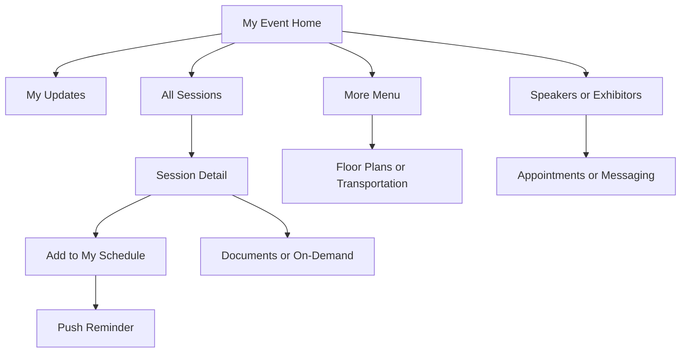
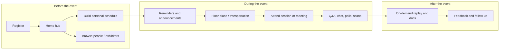
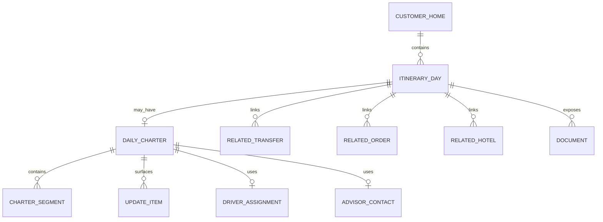

# Cvent Attendee Hub UI Logic for Farland Daily Charter Cards

## Executive Summary

Cvent Attendee Hub’s best design idea is not a flashy card style. It is the information architecture: a personalized high-frequency home hub, a separate schedule planner, and a progressively disclosed “More” area for secondary logistics. In Cvent’s own materials, **My Event** is the central personalized hub with profile access, quick links, a smart updates stack, schedule snapshot, and suggestions, while the event app keeps a dedicated **Schedule** view and a grouped **More** menu for lower-frequency content such as weather, Wi‑Fi, floor plans, transportation, and speakers. Official screenshots reinforce that pattern. citeturn13view3turn14view1turn25image7turn25image9

Farland’s current main branch already contains the raw ingredients for a similar pattern. The codebase has a customer home tab, a “today itinerary” timeline, a separate “my transport” area, and a transfer-detail drill-down page. But the active-day charter story is split across multiple sections: the day narrative lives in `todayItinerary`, while charter-service metadata and route segments live separately in `charterServices`. That split is the main UX problem to fix first. fileciteturn18file0L3-L3 fileciteturn19file0L3-L3 fileciteturn20file0L3-L3 fileciteturn22file0L3-L3

The repo also looks transitional. The README still frames the product as an internal operator-to-driver quote tool and still says “Customer quote” is out of scope, but the code already exposes customer-facing pages and a customer-home cloud function. That usually means the best next move is **IA normalization and state modeling**, not a full visual redesign. fileciteturn17file0L3-L3 fileciteturn18file0L3-L3 fileciteturn21file0L3-L3

For Farland, the strongest adaptation is a **Day Hub + Update Stack + Daily Charter Card + Timeline Snapshot** model. Put the active charter story inside the daily itinerary narrative, expose only the next important action, gate driver details by assignment state, and move lower-priority items like documents, hotels, and maps into secondary entry points. That follows both Cvent’s UX logic and Farland’s existing code structure. citeturn13view3turn25image7turn25image9turn29view4 fileciteturn19file0L3-L3 fileciteturn20file0L3-L3

## Farland Baseline from the Current Repository

The repository baseline matters because Cvent should inform Farland’s next IA step, not replace it. The current branch already contains a customer-facing mini-program flow even though the README still documents an internal MVP. fileciteturn17file0L3-L3 fileciteturn18file0L3-L3

| Artifact | What exists now | Why it matters for a daily charter card | Evidence |
|---|---|---|---|
| README vs. code | README still says customer quote is out of scope; code includes customer home, hotel request, transfer detail, and customer benefits pages | Product docs lag the actual branch; design work should align to code reality | fileciteturn17file0L3-L3 fileciteturn18file0L3-L3 |
| Customer entry point | `app.json` exposes `pages/customer/home/home` and makes “我的行程” a tab | The customer home page is already the system’s natural day-hub surface | fileciteturn18file0L3-L3 |
| Customer home IA | Home is organized as hero → Today itinerary → Overall trip → My transport → Hotels → Benefits | The active-day story is fragmented; transport context is not fully embedded in the day view | fileciteturn19file0L3-L3 fileciteturn20file0L3-L3 |
| Current active-day card | Today’s card already has date, city, title, summary, timeline items, driver, advisor, and call/contact CTAs | This is already close to a Cvent-like “schedule snapshot” but lacks unified charter status and update-stack logic | fileciteturn19file0L3-L3 |
| Current data loader | `home.js` loads `getCustomerHome`, normalizes trip-level states, hotel cards, transfer requests, transport orders, and charter services | This means Farland can introduce a front-end adapter instead of a major backend rewrite | fileciteturn21file0L3-L3 |
| Current mock home data | `getCustomerHome` already contains `today_itinerary`, `trip_overview`, `charter_services.segments`, `transfer_requests.activity_events`, and `transport_orders.driver` | The day-card data model can be composed now from existing objects | fileciteturn22file0L3-L3 fileciteturn23file0L3-L3 |
| Existing detail drill-down | `transfer-detail.wxml` already shows hero, request snapshot, operational status, curated quote options, and activity history | Farland already has a strong drill-down pattern that can be reused for daily charter detail | fileciteturn24file0L3-L3 |
| Visual language | The customer home uses a premium gradient hero, stacked white cards, pills, and timeline rails | Visual styling is not the main problem; IA and state design are | fileciteturn25file0L3-L3 |

Two specific repo behaviors are especially important. First, the home page currently shows a driver CTA whenever `todayItinerary.driver` exists, which is too coarse for a multi-state charter flow. Second, the transfer-detail page deliberately hides driver phone, plate, and internal quote-pool information during the quote stage; that is the right privacy and expectation-management rule to reuse on the daily charter card. fileciteturn21file0L3-L3 fileciteturn24file0L3-L3

## Cvent Product Logic and UI Breakdown

Cvent positions Attendee Hub as the attendee-journey layer of its event platform. It spans in-person, hybrid, and virtual formats; supports planners and attendees; and is delivered through **Attendee Hub Web** plus native mobile app delivery options where events can be published in the shared **Cvent Events** app or a **Custom Branded App**. Cvent’s product pages emphasize personal agenda building, networking, exhibitor engagement, on-demand content, and shared registration/check-in/engagement data across the platform. citeturn6view0turn16view0turn17view0turn29view7

Official screenshots show three stable design patterns. The **My Event** dashboard combines a profile header, actionable updates, a short “My morning” schedule snapshot, and AI-generated daily highlights. The **Schedule** screen separates **All Sessions** from **My Schedule**, uses chip filters, shows timezone, and presents compact session cards. The **More** screen groups utility content such as weather, dress code, agenda-at-a-glance, Wi‑Fi, floor plans, transportation, and speakers under collapsible headings. citeturn12image0turn25image7turn25image9

Simplified mockups from official Cvent screenshots:

```text
MY EVENT
[Avatar] Kaitlyn Artt  View profile
[My Updates] Survey pending      [Dismiss] [View]
[My Morning] 11:00 Exploring AI...
[Daily Highlights] AI summary
Nav: Home | Schedule | More | Profile
```

```text
SCHEDULE
[All Sessions] [My Schedule]
(Date) (Time) (More filters)
TZ: Eastern Time
[Featured] 2:00 The New Era of Appointments   [✓]
```

There is no single public document that enumerates every attendee-facing mobile field on every page. The table below is a synthesis of official product pages, release notes, official screenshots, and official blog explanations. citeturn17view0turn13view3turn15view0turn19view0

| Surface | What the attendee sees | Core fields and states | Primary behavior | Evidence |
|---|---|---|---|---|
| Home / My Event | Personalized hub with profile access, quick links, updates, schedule snapshot, suggestions, and daily highlights | Avatar/name, profile CTA, quick links, action cards, upcoming sessions, AI daily summary, suggestion widgets | Triage first tasks without opening deep pages | citeturn13view3turn14view1turn12image0turn29view2 |
| Agenda / All Sessions | A dedicated schedule page with `All Sessions` vs `My Schedule`, top search/filter chips, timezone, and compact session cards | Date filter, time filter, more filters, timezone, featured badge, title, time, location, inclusion/selection state; later releases add session guides, tag filters, search enhancements, readability improvements, and auto-scroll to upcoming sessions | Browse, filter, discover, then commit sessions | citeturn25image7turn17view0turn29view2turn29view1turn29view5 |
| Session detail | Detail page enhanced over time with better speaker display, ordered speakers, custom fields, documents, recording indicators, snapshots, and in-session engagement | Title, time, room, speakers, tags, custom fields, materials, recording state, Q&A/polls/chat, add/remove schedule state | Evaluate one item deeply, then add/join/engage | citeturn6view1turn29view4turn29view5turn29view7turn28view3 |
| My Schedule | Personal agenda that combines sessions with meetings/appointments and can sync to device calendars | Day grouping, session cards, appointment cards, personal time, conflict states, private notes/offline support, list view, calendar export | Manage commitments after selection | citeturn17view0turn29view4turn29view5turn29view7 |
| Maps / Floor Plans / More | Secondary utility area, typically not a primary tab, with grouped “know before you go” and event info links | Weather, dress code, agenda-at-a-glance, Wi‑Fi, floor plans, transportation, speakers; later releases add floor-plan visibility and appointment locations in floor plans | Pull logistics only when needed | citeturn25image9turn24image3turn18view3turn29view7 |
| Speaker list and speaker detail | List access plus rich speaker presentation, including stronger session-detail display | Name, role, company, category, portrait, bio, social links, ordered display on sessions, visibility controls | Learn context before attending a session | citeturn24image6turn29view4turn29view6 |
| Attendee list and attendee profile | Searchable people/networking layer with modernized profile cards and contact affordances | Profile card, pronouns, long bio, list sorting/display settings, profile images in chat, contact sharing, connection scanning | Connect, message, schedule appointments | citeturn17view0turn29view1turn29view4turn29view7 |
| Exhibitors / Sponsors | Rich exhibitor profiles and booth experiences with media, collateral, social links, sponsorship levels, and meeting actions | Name, level, booth location, short description, long description, categories, featured badge, contact info, videos, collateral, meeting CTA, filtering | Evaluate sponsor/exhibitor value and book meetings | citeturn6view0turn17view0turn24image1turn24image2turn29view1turn29view2 |
| Documents / On-demand / Custom pages | Documents are often distributed through sessions, exhibitor profiles, on-demand catalogs, and custom pages rather than always being a first-order tab | Session docs, on-demand videos, custom page documents or URLs, downloadable files, transcripts, presentation materials | Access supporting content contextually | citeturn16view0turn29view4turn29view5turn29view6turn18view3 |
| Notifications / My Updates | A smart, centralized action stack plus push notifications and announcements | Appointments, messages, connections, announcements, surveys, reported incidents; dismissable/actionable cards; audience-segment notifications; messaging push; appointment-related notifications | Pull urgent actions forward to the home hub | citeturn13view3turn6view0turn28view0turn29view6turn12image0 |
| Profile / Quick access | Personal event information frequently starts from profile + quick links rather than a separate “settings-first” page | My profile, quick links, personal event shortcuts, connection management | Anchor the experience around the attendee, not the event tree | citeturn13view3turn14view1turn29view4 |

The strongest UI logic here is that Cvent does **not** force everything into a single home card. It surfaces only a compressed, personally relevant slice on home, keeps scheduling as a dedicated behavior, and relegates cold logistics to grouped utilities. That is the right model for Farland’s daily charter card as well. citeturn13view3turn25image7turn25image9turn29view1

## Interaction Flow, State Model, and Accessibility

Cvent optimizes for a repeatable attendee loop: discover what matters, commit a few items, get reminded, navigate physically or digitally, then return later for materials and follow-up. Its official product pages explicitly describe agenda building before the event, push reminders and announcements during the event, and on-demand content, documents, and feedback after the event. The event-app FAQ adds conflict handling, capacity/access rules, and layered appointments inside the personal agenda. citeturn6view0turn16view0turn17view0turn28view3





Cvent’s public materials do not expose every internal enum, but the attendee-facing state model is still clear enough to use. The product repeatedly distinguishes between **actionable updates**, **selected vs. unselected schedule items**, **live vs. recorded content**, **appointment acceptance states**, and **visibility/access gating** through audience segments or configuration. citeturn13view3turn17view0turn29view4turn29view5turn29view6

| Domain | Attendee-facing states | Notification / behavior rule | Why it matters for Farland | Evidence |
|---|---|---|---|---|
| Update cards | New, actionable, dismissed | Important items appear in My Updates with buttons such as dismiss/view | Daily charter changes should surface as an update stack, not only inside deep pages | citeturn13view3turn12image0 |
| Schedule items | Not added, added, featured, filtered, recording available, possibly fee/included/ended depending event config | The schedule separates discovery from commitment; reminders and changes happen after selection | Farland should separate “today’s core service” from lower-priority options | citeturn25image7turn29view4turn12image11 |
| Appointments | Request, accepted, declined, cancelled, read-only, conflict/offline | Appointment states drive what action is visible and whether details are editable | Driver/contact CTAs on Farland should be similarly state-gated | citeturn13view4turn29view5turn29view7 |
| Visibility / access | Visible, segment-scoped, hidden | Page visibility, session visibility, and audience-segment notifications are configuration-level control points | Farland can use the same logic to hide driver data until appropriate | citeturn29view1turn29view6 |
| Messaging / alerts | Push-enabled, audience-segment targeted, announcement-based | Messaging push and audience-segment notifications supplement home updates | Farland should treat operational changes as alert objects, not raw text blobs | citeturn6view0turn29view6 |

Cvent’s accessibility guidance is unusually concrete and useful. It highlights keyboard-only navigation, color contrast, captions and subtitles, alt text, proper headers, compatibility with screen readers, interpreter video support, interactive maps that help attendees find accessible spaces, text-based Q&A and discussions, and downloadable documents/transcripts after the event. Cvent also says it strives to make attendee-facing solutions WCAG 2.2 AA compliant. citeturn18view1turn18view3turn18view4

For mobile UX, the product direction is equally clear: Cvent keeps persistent bottom navigation, visibly separated top tasks, chip-based filtering, progressive disclosure through grouped menus, and small but meaningful scanability upgrades such as schedule readability improvements, home-page visual refreshes, navigation enhancements, profile images in chat, and auto-scroll to upcoming sessions. That is exactly the kind of “reduce cognitive load first” discipline Farland should borrow. citeturn29view0turn29view1turn29view2

## Farland Daily Charter Card Recommendations

The best adaptation is to make Farland feel less like a stack of unrelated service modules and more like a **day-centric assistant**. Cvent’s pattern says: homepage = personal relevance first; schedule = detail only when needed; utilities = off to the side. Farland’s current code already has the right content but spreads it across `todayItinerary`, `charterServices`, `transportOrders`, and `transferRequests`. The design goal is to recombine those into one calm day story. citeturn13view3turn25image7turn25image9 fileciteturn19file0L3-L3 fileciteturn20file0L3-L3 fileciteturn22file0L3-L3

Recommended Farland day-card mockup:

```text
TODAY'S CHARTER
Wed, Jun 3 · Boston                   [Driver assigned]
Boston Campus Visit Day
Up next · 13:00 Harvard → MIT

[Update] Return pickup updated. Review latest stop.
Driver · David · Chevrolet Suburban
Advisor · Farland Advisor

09:00 Hotel departure
13:00 Inter-campus transfer
16:30 Boston College → Hotel

[Call driver] [Contact advisor] [View details]
```

| Placement | Component | Exact UI content | Chinese copy example | English copy example | Priority |
|---|---|---|---|---|---|
| Top of “My Trip” home | **Day Hub** | Date, city, day title, status chip, next milestone, one-line service confidence | 今日包车 / 波士顿访校日 | Today’s Charter / Boston Campus Visit Day | P0 |
| Directly under Day Hub | **Update Stack** | 1–3 actionable items only: timing change, driver pending, meeting point update, quote action | 行程更新：返程上车点已调整 | Update: Return pickup point changed | P0 |
| Main active-day card | **Daily Charter Card** | Service title, service window, vehicle class, status chip, driver state, next stop, continuity note | 今日用车 / 访校包车服务 | Today’s Service / Campus Charter Service | P0 |
| Inside the charter card | **Timeline Snapshot** | 3–5 key day segments; show next item first; “see all” opens detail page | 今日节奏 / 查看全部安排 | Today’s Timeline / See full plan | P0 |
| Under timeline | **Driver and Advisor Rail** | Show advisor always; show driver only when assigned; otherwise helper copy | 顾问已就绪；司机确认后显示 | Advisor ready; driver details appear once assigned | P0 |
| Secondary link group or lower section | **More for Today** | Map preview, pickup notes, hotel, files, transfer drill-down | 今日更多 / 地图 / 文件 / 酒店 | More for today / Map / Files / Hotel | P1 |

This mapping follows two clear rules. First, keep the **active day** as the top-level object. Second, do not expose operational complexity before the user needs it. Cvent consistently hides complexity behind schedule detail, profile detail, exhibitor detail, and the More menu; Farland should do the same with quote mechanics, route contingencies, and internal service notes. citeturn13view3turn25image9turn24image1turn24image2

A status system should be simple, calm, and CTA-aware. Farland’s current home state mapping only covers a thin subset of service states, while the mock data already mixes `pending`, `confirmed`, `quoted`, `assigned`, and hotel `processing`. Normalize those into one transport-day model. fileciteturn21file0L3-L3 fileciteturn22file0L3-L3 fileciteturn23file0L3-L3

| Status enum | Chip CN | Chip EN | Helper microcopy CN | Helper microcopy EN | CTA rule |
|---|---|---|---|---|---|
| `pending` | 待确认 | Pending | 顾问正在确认服务时间与范围 | Advisor is confirming the service window and scope | Show advisor only |
| `confirmed` | 已确认 | Confirmed | 时间与服务范围已锁定 | Time and service scope are locked in | Show advisor; driver optional if available |
| `driver_pending` | 配司机中 | Driver pending | 司机信息确认后将在此显示 | Driver details will appear once assigned | Hide driver phone; show advisor |
| `assigned` | 已配司机 | Driver assigned | 司机与车辆信息已就绪 | Driver and vehicle details are ready | Show call driver + advisor |
| `changed` | 有变更 | Updated | 请查看最新时间或上车点 | Please review the latest time or pickup point | Show “View update” first |
| `in_progress` | 进行中 | In progress | 如需临时调整，请联系顾问 | For live adjustments, contact your advisor | Keep driver + advisor visible |
| `completed` | 已完成 | Completed | 服务已完成，欢迎反馈 | Service completed. Feedback welcome | Replace call CTA with feedback / record |

One important repo-specific recommendation is non-negotiable: reuse the **transfer-detail privacy rule** on the main charter card. Today, transfer detail explicitly says the quote stage will not show driver phone or plate. Apply that principle everywhere. A driver object should not be treated as a simple boolean for instant exposure. fileciteturn24file0L3-L3 fileciteturn21file0L3-L3

## Front-End Data Model and Delivery Priorities

The safest implementation path is an **adapter layer** on top of the current `getCustomerHome` response. The branch already uses a customer-home cloud function, but the README’s documented cloud-function inventory does not yet include `getCustomerHome`, which reinforces that the repo is evolving faster than its docs. That is another reason to avoid a disruptive backend rewrite right now. fileciteturn21file0L3-L3 fileciteturn26file0L3-L3

| Proposed field | Type | Populate from current repo | Example / note |
|---|---|---|---|
| `day_id` | string | derive from `today_itinerary.date + city` | `2026-06-03_boston` |
| `day_title` | string | `today_itinerary.title` | `Boston Campus Visit Day` |
| `day_status` | enum | normalize from `trip_overview.status`, `charter_services.status`, `transport_orders.order_status`, `transfer_requests.status` | `assigned` |
| `status_reason` | string | derived helper text | “Driver assigned; return transfer still under review” |
| `next_milestone` | object | first future item from merged timeline | `{ time, label, route }` |
| `update_items[]` | array | start with `transfer_requests.activity_events`, later add true operational alerts | Dismissable/actionable cards |
| `charter_core` | object | `charter_services[0]` plus `today_itinerary.summary` | title, window, area, continuity note |
| `timeline[]` | array | merge `today_itinerary.items` + `charter_services.segments` + selected transfer/order milestones | one normalized day feed |
| `driver_status` | enum | derive from driver visibility rule + order status | `driver_pending` / `assigned` |
| `driver` | object | `today_itinerary.driver` or `transport_orders[].driver` | name, phone, vehicle, plate, meeting point |
| `advisor` | object | `today_itinerary.farland_contact` | always visible |
| `related_transfers[]` | array | `transfer_requests[]` | for drill-down to quote flow |
| `related_orders[]` | array | `transport_orders[]` | airport or confirmed sub-services |
| `related_hotels[]` | array | `hotel_requests[]` | secondary today context |
| `actions` | object | derive from state | `call_driver`, `contact_advisor`, `view_update`, `view_details` |
| `docs[]` | array | new field later | pickup PDF, campus brief, voucher, map, etc. |

A practical proposed payload:

```json
{
  "day_hub": {
    "day_id": "2026-06-03_boston",
    "day_title": "Boston Campus Visit Day",
    "date": "2026-06-03",
    "city": "Boston",
    "day_status": "assigned",
    "next_milestone": {
      "time": "13:00",
      "label": "Harvard → MIT"
    },
    "update_items": [
      {
        "type": "changed",
        "title_cn": "返程上车点已调整",
        "title_en": "Return pickup updated",
        "cta": "view_details"
      }
    ]
  },
  "daily_charter": {
    "charter_id": "charter_boston_001",
    "title": "访校包车服务",
    "service_window": "2026-06-03｜每日 10 小时",
    "vehicle_class": "Large SUV",
    "driver_status": "assigned"
  }
}
```

Entity relationship for the Farland daily-card model:



Recommended delivery sequence:

| Horizon | Deliverable | Why |
|---|---|---|
| MVP | Normalize a shared status enum for the active day | Current state logic is fragmented across itinerary, transfer, order, and charter objects |
| MVP | Build `Day Hub + Update Stack + Daily Charter Card` | This delivers the biggest UX clarity gain immediately |
| MVP | Merge `today_itinerary.items` and `charter_services.segments` into one day timeline | It fixes the current split between itinerary and transport |
| MVP | Gate driver CTA by `driver_status` | Prevents premature exposure of unstable details |
| MVP | Reuse the transfer-detail drill-down pattern for “View details” | Existing detail layout is already strong and privacy-aware |
| Later | Add map preview, pickup notes, and file links in a secondary cluster | Matches Cvent’s “More” pattern |
| Later | Add quick-link tiles for common trip actions | Mirrors Cvent’s investment in home customization and quick links |
| Later | Add AI summary or recommendation features | Cvent’s own roadmap added intelligence after home/navigation foundations |

That sequence is consistent with Cvent’s own product evolution. Their release history shows work on home prioritization and quick-link formatting first, then visual refresh/navigation enhancements, then **My Event**, then **Daily Highlights / AI Daily Summaries**, and later **Session Snapshots & Takeaways**. In other words: **foundation before intelligence**. Farland should follow that order. citeturn29view4turn29view1turn14view1turn29view2turn29view7

## Open Questions and Limitations

This report is high-confidence on Cvent’s **surface logic**, navigation patterns, and release-history direction, but a few details remain inherently inferred because Cvent’s public documentation does not expose a single canonical field schema for every attendee-facing mobile card. Some support-KB pages also did not render cleanly in the parser, so a portion of the UI analysis relies on official screenshots and official release notes rather than fully parsed KB text. The conclusions are still well-supported, but they should be treated as design synthesis, not reverse-engineered internal specs. citeturn12image0turn25image7turn25image9turn15view0

For Farland, the main unresolved product decisions are straightforward:

- Whether driver details should unlock exactly at `assigned`, or only after an additional time threshold before departure.
- Whether airport transfer, campus charter, and ad-hoc transfer requests should appear as one unified day feed with different badges, or as one primary day card plus linked secondary cards.
- Whether the first secondary logistics surface should be a static map preview, a pickup-note card, or a documents card.

Those are design-policy decisions, not structural blockers. The structural work can begin now with the current repo and an adapter layer on top of `getCustomerHome`. fileciteturn21file0L3-L3 fileciteturn22file0L3-L3 fileciteturn23file0L3-L3