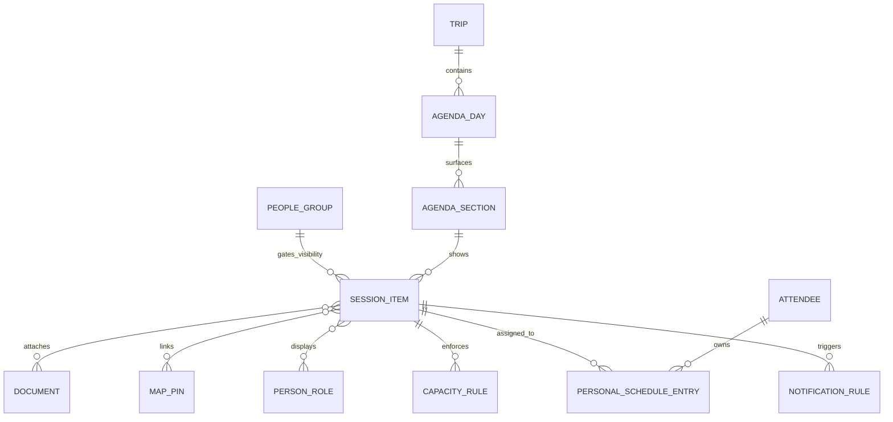
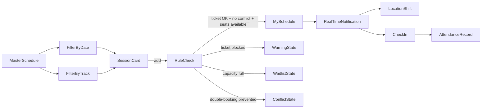

# Agenda Card Research for Farland Using EventMobi and Sched

## Current Farland baseline in the GitHub repo

The current repository still carries the DNA of an operator-to-driver quote tool. The README defines the product as an internal WeChat Mini Program for operator-to-driver quote collection, explicitly says the MVP is **not** a public ride-hailing platform, and lists customer quote, dispatch order, payment, and map/tracking as out of scope; at the same time, the live app configuration now exposes a customer-facing “我的行程” tab and customer pages such as `pages/customer/home/home` and `pages/customer/transfer-detail/transfer-detail`. That suggests the customer itinerary layer has been added on top of a quote-centric codebase, rather than the app being designed from day one as a travel agenda product. fileciteturn11file0L3-L3 fileciteturn13file0L3-L3

The customer home page is already structurally ambitious. It renders a hero card, a “next confirmed trip” card, a “today itinerary” card, then separate sections for overall trip overview, transfer requests, charter services, transport orders, hotels, and benefits. The page logic calls `getCustomerHome`, normalizes `trip_overview`, `hotel_requests`, `transfer_requests`, `transport_orders`, and `charter_services`, and then binds them into those separate sections. In other words, the repo already contains the raw material for an agenda product, but the rendering is still section-based rather than truly day-based. fileciteturn14file0L3-L3 fileciteturn15file0L3-L3

There are three especially important seams in the current design. First, the “today itinerary” header hard-codes the status pill as “已确认,” so the top card cannot express richer day states such as driver pending, changed, delayed, or partially confirmed. Second, the CTA row always renders “联系司机 / 联系顾问,” while the click handler merely toasts if no `todayItinerary.driver.phone` exists; that is weaker than a state-aware UI that only exposes driver contact after assignment. Third, the mock data already contains `charter_services[].segments` and the stylesheet already includes `.charter-segments`, `.segment-row`, `.segment-time`, `.segment-title`, and `.segment-route`, but those segments are not actually rendered on the customer home template. The cloud function also mixes a transport request into the day timeline as a `transfer_request` item with `client_status: 'quoted'`, which shows Farland already wants statusful timeline items, but has not yet turned the daily charter itself into a first-class agenda object. This is exactly the design gap where EventMobi and Sched become useful reference models. fileciteturn14file0L3-L3 fileciteturn15file0L3-L3 fileciteturn16file0L3-L3 fileciteturn17file0L3-L3 fileciteturn18file0L3-L3

## EventMobi report

**Executive summary.** EventMobi is the stronger structural north star for Farland’s daily charter card because it treats the attendee experience as a personalized event container: organizers define agenda structure, attach documents and maps at session level, assign access by people groups, create personal schedules, optionally disable attendee self-management, and push real-time updates. For Farland, that translates directly into a model where operators build a day agenda, pin a daily charter service to that day, attach school confirmations and pickup notes, control who sees what, and publish changes to the client-facing trip view. citeturn8view0turn7view6turn24view0turn35view0turn25view3

**Product positioning and target users.** EventMobi positions itself as a branded mobile event app and broader event platform for in-person, virtual, and hybrid events, available in mobile browser and native iOS/Android, and integrated with registration, virtual spaces, and digital signage. Its customer-facing messaging targets associations, nonprofits, corporations, and industries such as tech, finance, and healthcare, which means it is optimized for organizers who need both a polished attendee experience and meaningful backend control. citeturn6view0turn8view0

**Agenda and session-card UI logic.** EventMobi’s agenda model is explicitly interactive. Its product page says attendees can sort sessions by date/time or by tracks, add sessions to their personal schedule by starring them, and even receive organizer-created custom schedules for entire groups of attendees. Its knowledge base goes further: the default Agenda Section lives under `Event App > Menu Sections`, can show all sessions or specific tracks, and can itself be restricted by people groups; during the event the agenda defaults to today’s sessions and can expose an “On Now” state for sessions currently in progress. This is not a decorative list—it is an operational itinerary surface. citeturn7view6turn24view0turn35view1

At the session-detail level, EventMobi’s model is unusually rich. Organizers can define session name, date, start/end time, location type (`None`, `Text`, or `Map`), tracks and sub-tracks, descriptions with rich text, roles such as speaker/moderator, documents from the Documents library, external links, access control, visibility by people groups, capacity limits, and overlap rules. The same article also shows that the Excel import/export supports an `Attendee (External IDs)` column that adds a session directly to a specific attendee’s personal agenda in the Attendee Dashboard. That means the “personal schedule” is not just a favorite list; it can be deliberately assigned by the organizer. citeturn24view0turn25view5turn35view3

That evidence implies a session-card anatomy with at least these fields: visible time, title, track/category, location affordance, role metadata, document count or chips, capacity/access state, and a personal-schedule action. EventMobi’s own best-practices article reinforces this by stressing tracks for navigation, personal schedules for required attendance, roles for facilitators, live engagement inside session detail, and session-level resources such as documents and links. The same article explicitly notes that personal schedules are useful when sessions are private, capacity-limited, or tied to continuing-education requirements. citeturn12view0

**Personal schedules, states, and interactions.** EventMobi is especially valuable because it documents both attendee and organizer control over the same schedule object. The help center says attendees can be allowed to manage their own schedules, but organizers can also disable “Add to Your Schedule” globally while continuing to assign or remove sessions from attendees’ personal schedules; attendees can still view that personal schedule inside the Attendee Dashboard. Session capacity is also stateful: attendees see remaining seats, sessions turn greyed out when full, and check-in can be restricted so only signed-up attendees may check in onsite. That is exactly the kind of “explicit state, not implicit assumption” logic that Farland’s daily charter card currently lacks. citeturn35view0turn35view2turn25view3turn25view6

**Documents, maps, and notifications.** EventMobi’s product page says session pages act as a content library for slides, videos, and other high-value documents, and that organizers can send targeted messages, alerts, and push notifications, even pre-scheduled ones. Its mapping pages and session docs show a location model that supports uploaded image maps, Google Map views, searchable map locations, pins for sessions, booths, and check-in areas, and map-linked locations inside session setup. For Farland, this matters because campus visits and pickup points often behave more like session venues than like generic address strings. citeturn8view0turn13view4turn24view0

**Organizer/backend features enabling the front end.** EventMobi’s backend side is not just content entry; it is layout control and publishing infrastructure. The design tools support block editors, drag-and-drop widget placement, real-time preview, event-space branding, and instant publishing. Official screenshots and help-center materials also show Experience Manager settings for attendee-managed schedules, list/list-and-calendar agenda views, and session sign-up rules. Put differently, EventMobi’s attendee UX depends on a backend that exposes agenda sections, people groups, maps library, documents library, session capacity, attendee assignment, and publishing controls. citeturn22view0turn22view2turn23image3turn23image4turn25view6

The EventMobi-inspired entity model below is the clearest fit for Farland because it maps one-to-one to “trip day as agenda section” and “daily charter as a pinned transport session plus supporting items.” The fields shown are directly supported by the EventMobi sources reviewed. citeturn24view0turn25view3turn25view5turn35view3



**Strengths and weaknesses for Farland.** EventMobi’s biggest strength for Farland is that it understands the organizer as the source of truth. That is ideal for a concierge-style travel business where the client should see a polished, curated, continuously updatable day plan rather than a consumer-grade “order” screen. It is also strong on hidden/private items, group-specific visibility, session-level documents, map-linked locations, and stateful enrollment. Its weakness is that the ecosystem is broader than Farland needs; networking, sponsor surfaces, gamification, and many event-marketing features are irrelevant overhead for a private travel itinerary. citeturn8view0turn12view0turn13view4turn22view2

**Concrete UI/UX and data-model recommendations for Farland inspired by EventMobi.** The EventMobi lesson is to promote “daily charter” from a low-level transport record to a day-level agenda object with its own state, documents, map pin, coordinator, and visibility semantics. That would let Farland replace the hard-coded today-card status, stop exposing driver contact prematurely, and keep itinerary files/messages attached to the specific day item that needs them. The following mock JSON shows that shape. It is intentionally designed to sit above the repo’s current `today_itinerary` plus `charter_services` split. fileciteturn18file0L3-L3 citeturn24view0turn35view0turn25view3

```json
{
  "trip_id": "trip_boston_20260603",
  "day_id": "day_2026_06_03",
  "date": "2026-06-03",
  "city": "Boston",
  "title": "Boston Campus Visit Day",
  "summary": "Farland has coordinated hotel departure, campus stops, pacing, and transport coverage.",
  "publish_status": "published",
  "agenda_filters": [
    { "id": "all", "label": "All" },
    { "id": "transport", "label": "Transport" },
    { "id": "school", "label": "Schools" },
    { "id": "documents", "label": "Docs" }
  ],
  "daily_charter": {
    "id": "charter_day_001",
    "title": "Today's Charter Service",
    "service_window": { "start": "09:00", "end": "19:00" },
    "included_hours": 10,
    "vehicle_class": "Large SUV",
    "vehicle_hint": "Chevrolet Suburban or similar",
    "service_area": "Boston / Cambridge campus route",
    "status": "driver_pending",
    "status_text": "Vehicle confirmed, driver details pending",
    "continuity_text": "Farland will prioritize the same driver; if hours, availability, or operational issues require a change, we will coordinate an equivalent replacement.",
    "visibility": "all_clients",
    "map_pin_id": "hotel_marriott_cambridge",
    "documents": [
      { "id": "doc_driver_note", "type": "note", "title": "Pickup Note" },
      { "id": "doc_school_confirm", "type": "pdf", "title": "School Confirmation" }
    ],
    "coordinator": {
      "name": "Farland Advisor",
      "phone": "+1 (800) 000-0000"
    }
  },
  "agenda_items": [
    {
      "id": "ag_001",
      "kind": "departure",
      "title": "Hotel Departure",
      "start_time": "09:00",
      "end_time": "09:30",
      "track": "transport",
      "location": {
        "type": "map_pin",
        "label": "Boston Marriott Cambridge lobby",
        "map_pin_id": "hotel_marriott_cambridge"
      },
      "description": "Meet in the lobby. Driver is expected to arrive early.",
      "documents": ["doc_pickup_note"],
      "roles": [{ "type": "advisor", "label": "Farland Advisor" }],
      "personal_schedule": {
        "assigned_by_organizer": true,
        "client_can_remove": false
      }
    },
    {
      "id": "ag_002",
      "kind": "school",
      "title": "Harvard University",
      "start_time": "10:00",
      "end_time": "12:00",
      "track": "school",
      "location": {
        "type": "map_pin",
        "label": "Harvard visitor meeting point",
        "map_pin_id": "harvard_gate"
      },
      "description": "Campus visit and surrounding neighborhood review."
    }
  ]
}
```

An EventMobi-like implementation should also visibly separate the **daily charter service layer** from the itemized agenda beneath it. The same structure can be expressed cleanly across WeChat Mini Program, React, and Flutter:

```xml
<!-- WXML outline -->
<view class="day-screen">
  <view class="day-header"></view>
  <view class="filter-chip-row"></view>
  <view class="daily-charter-card"></view>
  <view class="on-now-strip"></view>
  <block wx:for="{{agendaItems}}" wx:key="id">
    <view class="session-card"></view>
  </block>
  <view class="document-chip-row"></view>
  <view class="map-preview-card"></view>
  <view class="advisor-footer"></view>
</view>
```

```jsx
// React outline
<AgendaDayScreen>
  <DayHeader />
  <AgendaFilters />
  <DailyCharterCard />
  <OnNowBanner />
  <AgendaList>
    <SessionCard />
  </AgendaList>
  <DocumentRow />
  <MapPreview />
  <AdvisorActions />
</AgendaDayScreen>
```

```dart
// Flutter outline
Scaffold(
  body: CustomScrollView(
    slivers: [
      SliverToBoxAdapter(child: DayHeader()),
      SliverToBoxAdapter(child: AgendaFilters()),
      SliverToBoxAdapter(child: DailyCharterCard()),
      SliverToBoxAdapter(child: OnNowBanner()),
      SliverList(delegate: SliverChildBuilderDelegate((context, index) => SessionCard())),
      SliverToBoxAdapter(child: DocumentRow()),
      SliverToBoxAdapter(child: MapPreviewCard()),
      SliverToBoxAdapter(child: AdvisorActions())
    ],
  ),
);
```

## Sched report

**Executive summary.** Sched is the better secondary reference when Farland wants a lighter, more operational agenda UI. Its reviewed official sources emphasize personalized schedules, fully brandable event apps, session content, track/category filtering, room capacities and waitlists, conflict prevention, location changes, real-time notifications, check-in, and granular attendance reporting. That makes it excellent for compact list cards and explicit state chips. It is less well-documented than EventMobi on organizer-assigned custom schedules or rich session-detail pages with documents/maps, so it is not as strong a complete north star for Farland’s concierge day view—but it is very strong for interaction patterns and operational states. citeturn8view1turn36view0turn36view1turn36view4turn5news1

**Product positioning and target users.** Sched positions itself as event management software serving K‑12 schools, higher education, nonprofits, conferences, conventions, festivals, seminars, professional development, and hybrid events. Its own copy emphasizes multi-track scheduling for speakers, attendees, moderators, vendors, and sponsors, plus repeated use across education and professional-development events. In short, it is a lighter schedule-management platform with strong operational affordances rather than a heavily curated event-space platform. citeturn36view5turn10view0

**Agenda and session-card UI logic.** The strongest evidence from Sched’s official features page is that the attendee experience revolves around a master schedule plus a personalized schedule. The company explicitly advertises personalized schedules, a fully brandable mobile event app, session content, filtering and categorization, room capacities and waitlists, frozen schedules with double-booking prevention, session-location changes, and real-time in-app notifications. A long-running public description from Wired adds that attendees build a personalized agenda by selecting items from the master schedule, receive a unique shareable URL, and use maps to find their way around the event. Taken together, the most defensible interpretation is that Sched’s agenda card is intentionally compact and optimized for **selection states** rather than deep detail states. citeturn8view1turn36view0turn7view4turn36view3turn5news1

Because the current official Sched sources reviewed are more capability-grid than UX manual, the attendee-side card anatomy is partly inferential. Still, a Farland-oriented reading is clear: a Sched-like card needs visible start time/time range, title, category or track, location, add/remove state, and warning or lock state. That is because Sched explicitly supports sessions that cannot be added due to ticket rules, sessions that become waitlisted due to capacity, sessions that conflict with existing selections, and sessions whose locations can shift after publication. This is exactly the sort of explicit micro-state system Farland needs for “driver pending,” “advisor approval required,” “school slot limited,” or “return transfer options published.” citeturn36view0turn7view4turn36view3

**Personal schedules, documents, and maps.** Sched’s official copy is strongest on attendee-controlled personalization: “personalized schedules for attendees” and “session content” that can include presentations, videos, images, logos, and text. It is also explicit that session content remains accessible across computer, tablet, and smartphone in virtual scenarios. Where EventMobi uses the language of organizer-created custom schedules and session libraries, Sched presents a more lightweight “choose and follow your day” model. Reviewed current official sources did not surface equivalently explicit bulk organizer-created custom schedules, so I would not use Sched as the model for Farland’s advisor-assigned day plan. Map support is the weakest part of the reviewed evidence: Wired described maps as part of the attendee experience, but the current Sched features page foregrounds digital signage, shifted locations, and check-in rather than maps. citeturn7view2turn36view0turn36view5turn5news1

**Notifications and backend features.** Sched is unusually clear about the backend features that generate front-end state. It supports ticket warnings when sessions cannot be added, an embeddable event website, unlimited admin roles including speakers/moderators/volunteers/sponsors/vendors, custom pages, page ordering, real-time in-app notifications, flexible check-in methods, badge printing, central attendance records, and granular attendance reporting by session/day/attendee. An official guide screenshot for Sched’s check-in app also shows organizer-side “All / Attending / Waitlist” tabs and a walk-up enrollment form, which confirms that Sched’s state model is not theoretical; it is tied directly to operational registration and check-in flows. citeturn36view0turn36view1turn36view2turn36view4turn29image0

The Sched-inspired state model below is therefore best understood as **agenda card as operational state machine** rather than **agenda card as rich content object**. That difference is exactly why Sched is such a good secondary reference for Farland’s daily charter and transfer micro-states. The diagram reflects only capabilities explicitly surfaced in the reviewed Sched sources plus the historic Wired description of the master-schedule flow. citeturn36view0turn7view4turn7view3turn5news1



**Strengths and weaknesses for Farland.** Sched’s strengths for Farland are clarity, compactness, and operational honesty. It is a very strong reference for filter chips, my-schedule versus all-sessions separation, capacity/waitlist badges, conflict prevention, “cannot add” warnings, location-change events, and push-notification logic. Its weaknesses for Farland are equally important: the reviewed official sources do not give the same confidence as EventMobi on organizer-assigned custom schedules, rich session-detail pages with documents and maps, or role-based visibility at the same depth. That makes Sched better as a card-and-state reference than as the full conceptual model for Farland’s concierge itinerary. citeturn8view1turn36view0turn36view2turn5news1

**Concrete UI/UX and data-model recommendations for Farland inspired by Sched.** The Sched lesson for Farland is to turn itinerary items into compact, state-aware cards with clean filters and explicit warnings. That means the current `client_status` mini-status pattern in the repo should be generalized into a stronger rule-and-warning system, especially for day-of-trip transport items. A Sched-inspired data shape would look like this: fileciteturn18file0L3-L3 fileciteturn14file0L3-L3 citeturn36view0turn7view4turn7view3

```json
{
  "day_id": "day_2026_06_03",
  "screen_mode": "all_items",
  "tabs": [
    { "id": "all_items", "label": "All Items" },
    { "id": "my_day", "label": "My Day" }
  ],
  "filters": [
    { "id": "date", "label": "Date", "value": "2026-06-03" },
    { "id": "time", "label": "Time", "value": "Morning" },
    { "id": "track", "label": "Track", "value": "Transport" },
    { "id": "more", "label": "More" }
  ],
  "agenda_items": [
    {
      "id": "seg_001",
      "title": "Hotel Departure",
      "start_time": "09:00",
      "end_time": "09:30",
      "track": "Transport",
      "location_label": "Boston Marriott Cambridge",
      "add_state": "locked_assigned",
      "warning_state": null,
      "capacity_state": null,
      "conflict_state": null,
      "notification_state": "subscribed",
      "detail_state": "normal"
    },
    {
      "id": "seg_004",
      "title": "Boston College Return Transfer",
      "start_time": "17:30",
      "end_time": "18:30",
      "track": "Transport",
      "location_label": "Boston College",
      "add_state": "selection_required",
      "warning_state": "advisor_confirmation_required",
      "capacity_state": null,
      "conflict_state": null,
      "notification_state": "subscribed",
      "detail_state": "quoted"
    }
  ],
  "rules": {
    "prevent_overlap": true,
    "show_warning_copy": true,
    "allow_client_self_add": false
  }
}
```

For Farland’s UI, the Sched translation is not “copy a conference schedule.” It is “make every itinerary line item behave like a clear, selectable state object.”

```xml
<!-- WXML outline -->
<view class="agenda-screen">
  <view class="top-tabs"></view>
  <view class="filter-bar"></view>
  <view class="sticky-charter-summary"></view>
  <block wx:for="{{agendaItems}}" wx:key="id">
    <view class="agenda-item-card"></view>
  </block>
  <view class="update-banner"></view>
</view>
```

```jsx
// React outline
<AgendaScreen>
  <TopTabs tabs={['All Items', 'My Day']} />
  <FilterBar />
  <PinnedCharterSummary />
  <AgendaList>
    <AgendaItemCard />
  </AgendaList>
  <RealtimeUpdateBanner />
</AgendaScreen>
```

```dart
// Flutter outline
Scaffold(
  body: Column(
    children: [
      TopTabs(),
      FilterBar(),
      PinnedCharterSummary(),
      Expanded(
        child: ListView.builder(
          itemBuilder: (_, index) => AgendaItemCard(),
        ),
      ),
      RealtimeUpdateBanner()
    ],
  ),
);
```

## Comparison

The table below summarizes the most important product differences specifically for Farland’s daily-charter problem.

| Dimension | EventMobi | Sched | Farland implication |
|---|---|---|---|
| Core metaphor | Personalized event space with agenda, content, maps, messaging, and organizer-controlled attendee paths. citeturn8view0turn7view6 | Event schedule management with attendee personalization, operational rules, notifications, and check-in. citeturn8view1turn36view1 | Use EventMobi for the structural model; use Sched for card-level operational states. |
| Personal schedules | Explicitly supports both attendee-managed schedules and organizer-assigned schedules through attendee assignments and group custom schedules. citeturn7view6turn35view0turn35view3 | Explicitly markets attendee personalized schedules; reviewed official sources were less explicit on organizer-created bulk schedules. citeturn36view0turn36view5 | Farland’s advisor-curated itinerary fits EventMobi much better. |
| Session detail richness | Rich session schema: maps, tracks, roles, documents, external links, access control, capacity, overlap, visibility. citeturn24view0turn25view5turn25view3 | Strong “session content” and categorization, but less explicit attendee-side detail schema in reviewed sources. citeturn7view2turn36view0 | Farland should model school/transport items closer to EventMobi sessions than to Sched rows. |
| Maps and navigation | Strong official map model with pins, image maps, Google map view, searchable locations, and session-linked map fields. citeturn13view4turn24view0 | Maps appear in older public Sched coverage, but current reviewed official feature copy foregrounds signage and location shifts more than map tooling. citeturn5news1turn36view3 | Farland should build lightweight map pins and not wait for a full event-map system. |
| Notification logic | Targeted alerts and push notifications can be pre-scheduled; all changes update in real time. citeturn8view0turn22view2 | Real-time in-app notifications are explicit, and state changes are closely tied to ticket rules, capacities, locations, and check-in. citeturn7view3turn36view1turn36view2 | Sched is the better reference for warning chips and update banners. |
| Capacity and access states | Seat counts, full/greyed-out state, sign-up requirement for check-in, people-group visibility, hidden sessions for selected attendees. citeturn25view3turn25view6turn35view1 | Waitlists, room capacities, double-booking prevention, ticket warnings, check-in methods, and attendance reporting. citeturn7view4turn36view0turn36view4 | For Farland, use EventMobi-style access control plus Sched-style warning states. |
| Best fit role for Farland | Daily itinerary backbone. | Compact card interactions and operational micro-states. | Final design should be EventMobi backbone + Sched interaction layer. |

## Farland design synthesis

The most important conclusion is that Farland should **not** keep treating charter as a lower “My Transport” card below the real day. The repo already shows a better direction: there is a meaningful `today_itinerary`, there are micro-status timeline rows, and there is structured charter segment data waiting to be rendered. The correct move is to pull the charter service up into the **Today** surface and make it a pinned day-level service card above the timeline, with its own state model, documents, and advisor responsibility. That is much closer to EventMobi’s organizer-curated agenda than to the current repo split between `today_itinerary.items` and `charter_services`. fileciteturn14file0L3-L3 fileciteturn18file0L3-L3 citeturn24view0turn35view0

The practical synthesis is simple. Borrow EventMobi’s backbone: day header, per-day agenda section, pinned daily-charter card, session-level docs/maps/visibility, organizer-assigned schedule, and advisor-owned publishing model. Then borrow Sched’s interaction logic: top tabs or filter chips, compact agenda rows, lock/warning/full/changed states, location-changed chips, and real-time update banners. For Farland, that means replacing the hard-coded “已确认” today pill with a real state enum, hiding driver contact until assigned, rendering charter segments inline, and using explicit status copy such as “vehicle confirmed, driver details pending” or “return transfer options published.” fileciteturn14file0L3-L3 fileciteturn15file0L3-L3 fileciteturn16file0L3-L3 fileciteturn17file0L3-L3 citeturn25view3turn36view0turn7view3

If Farland follows that hybrid direction, the resulting product stops looking like a miscellaneous customer home page and starts behaving like a true **daily service agenda**: one day, one source of truth, one visible charter layer, explicit states, and clean advisor accountability. That is the right design center for a premium school-visit and charter service experience. citeturn8view0turn7view6turn8view1turn36view0