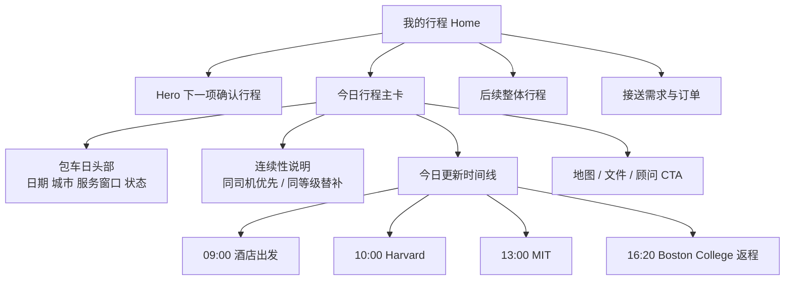
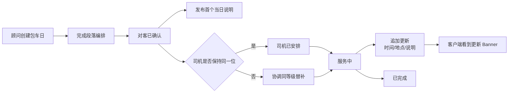

# EventMobi 议程卡与移动会务 UI 研究，以及 Farland 每日包车卡的设计映射

## 执行摘要

本次研究先从你指定的 GitHub 仓库 `violetwind123/farland-driver-quote-miniapp` 入手；已启用连接器只有 **GitHub**。仓库现状非常明确：`pages/customer/home/home` 已经是 tabBar 里的“我的行程”主入口，主页会通过 `getCustomerHome` 拉取 `today_itinerary`、`trip_overview`、`transfer_requests`、`transport_orders`、`charter_services` 等结构化数据，因此“每日包车卡”不是新能力，而是现有“我的行程”主页中最该补全的一块。更重要的是，mock 数据里已经有包车 `segments`，而样式文件也已经写好了 `.charter-segments`、`.segment-row`、`.segment-time`、`.segment-title`、`.segment-route` 等时间线样式；目前缺的不是后端，而是模板层把这些信息真正渲染出来。fileciteturn13file0L3-L3 fileciteturn21file0L3-L3 fileciteturn20file0L3-L3 fileciteturn23file0L3-L3 fileciteturn27file0L3-L3 fileciteturn28file0L3-L3

EventMobi 最值得借鉴的，不是某一张卡片长什么样，而是它把 **Agenda 当成整个产品的一级骨架**：会务中的 session 不是“附件”，而是可排序、可筛选、可加入个人日程、可附文档、可挂地图、可做群组可见性控制、可接收针对性更新的主对象。EventMobi 的官方产品页和知识库显示，它支持按日期/时间/track 浏览 Session，支持 “My Agenda” 个人日程，支持给 Session 绑定文档、地图、角色、容量、访问控制，支持针对此类内容发送定向 announcement / push / email，并且多数内容更新会实时生效，少数设置类更新会触发 “Update Now”。citeturn3view0turn4view0turn10view0turn11view0turn12view0turn13view0turn14view0turn15view2turn15view3turn38view0

对 Farland 来说，最合理的设计翻译不是把“会务 app”原样照抄，而是做一层业务映射：**EventMobi 的 Session = Farland 包车日里的一个 segment；Agenda = 当日包车动线；My Agenda = 家庭当天确认行程；Announcement = 顾问行程更新；Maps = 上下车/校园/酒店点位；Documents = 访校确认文件、酒店订单、接送说明**。这意味着 Farland 的“每日包车卡”应该是一个 **时间优先、状态驱动、可展开的日程主卡**，而不是今天这种只展示标题、日期、车型、服务区域和一条 continuity note 的静态摘要卡。fileciteturn20file0L3-L3 fileciteturn23file0L3-L3 citeturn4view0turn10view0turn14view0turn15view2turn15view3

如果只讨论“每日包车卡”的产品逻辑，我的结论很清楚：**Farland 最适合借 EventMobi 的 agenda engine，借 AXUS 的高端旅行呈现语气，再保留你仓库里已经形成的 premium grouped-card 视觉基调。**EventMobi 在结构化日程、群组可见性、实时更新、地图/文档/个人日程方面最强；AXUS 在“高端旅行日程展示”“时间高亮”“文档/消息/通知的一体感”上更贴近 Farland 业务语境；Whova 更强在社交和活跃度；Sched 更强在排期治理，但都没有 EventMobi 这种“议程即信息架构”的完整度。citeturn22view0turn29view0turn30view0turn31view0

## GitHub 仓库现状

### 当前页面与数据结构

`app.json` 把 `pages/customer/home/home` 放在 tabBar，文案就是“我的行程”。这说明无论从导航层级还是产品心智，这个页面都不是次级详情页，而是用户看每日安排的主入口。fileciteturn13file0L3-L3

`home.js` 在 `loadHome()` 里直接调用 `getCustomerHome`，然后把返回结果整理成 `todayItinerary`、`tripOverview`、`transferRequests`、`transportOrders`、`charterServices` 等多个前端对象。这里已经有两个非常重要的事实：第一，包车日信息本来就和“今日行程”“整体行程”“接送需求”“正式订单”并列存在；第二，`charterServices` 目前只是被**原样塞进页面**，没有像 `transferRequests` 那样被加工成更强的交互对象。fileciteturn21file0L3-L3 fileciteturn22file0L3-L3

`home.wxml` 的结构非常清晰：顶部 Hero、今日行程、整体行程、我的用车、我的酒店、福利面板。其中“我的用车”里同时渲染了 transfer request、charter card、transport order。问题在于：`transferRequests` 有“查看用车方案”按钮，`transportOrders` 至少展示了司机/车型/车牌，而 `charterServices` 却只显示标题、日期范围、车型、服务区域和 continuity 文案，没有分段时间线、没有地图入口、没有文件入口、没有“今日动线”展开按钮，也没有状态细分。fileciteturn20file0L3-L3

更值得注意的是，`home.wxss` 里已经有一整套现成的包车时间线样式，包括 `.charter-segments`、`.segment-row`、`.segment-time`、`.segment-title`、`.segment-route`。这不是“未来可能会做”，而是**已经把视觉层准备好了，只差模板绑定**。换句话说，最短路径不是新建复杂详情页，而是在现有 `charter-card` 里补出 EventMobi 式的“日程段落展示”。fileciteturn27file0L3-L3 fileciteturn28file0L3-L3

`getCustomerHome` 的 mock 更进一步说明，这件事几乎不需要新增数据契约：当前包车 mock 已包含 `charter_id`、`title`、`date_range_text`、`vehicle_class`、`service_area`、`continuity_text`、`status_text`，以及最关键的 `segments` 数组；而 `today_itinerary.items` 里还已经混入了 `linked_entity_type: 'transfer_request'` 和 `client_status: 'quoted'` 的节点。这说明你的后端 mock 已经天然支持“**一天时间线中既有访校节点，也有包车节点，也有补充接送节点**”的 EventMobi 式 agenda 结构。fileciteturn23file0L3-L3 fileciteturn24file0L3-L3

### 这对每日包车卡意味着什么

从代码层看，现在的主页存在一个典型问题：**“今日行程 timeline”和“包车服务摘要卡”是分裂的。**用户在 `todayItinerary.items` 里看到一天的时间流，又在下方的 `charter-card` 里看到一个没有段落的摘要，这会让“包车服务”看起来像附属服务，而不是当天动线的主骨架。fileciteturn19file0L3-L3 fileciteturn20file0L3-L3 fileciteturn23file0L3-L3

你仓库里另一个对我很有启发的页面是 `transfer-detail`。这个页面已经把“需求快照”“运营状态”“优选用车方案”“处理进度”四层结构做出来了，并明确写了“报价阶段不会显示司机手机号、车牌或内部报价池”“价格包含司机报价、Farland 服务费 10% 与预计总价”等规则。这套 copy 纪律、分层卡片结构、状态说明方式，可以直接迁移到“每日包车卡”的文案和信息优先级里。fileciteturn29file0L3-L3 fileciteturn30file0L3-L3

所以，从仓库现实出发，**你的最佳策略不是“重做每日行程页”，而是把现有 charter card 升级成 EventMobi 风格的 day agenda card**：同一张卡里展示服务窗口、状态、连续性说明、分段时间线、地图/文件/联系顾问 CTA，让它成为“今日行程”里最强的动作对象。fileciteturn20file0L3-L3 fileciteturn27file0L3-L3 citeturn4view0turn10view0turn14view0

## EventMobi 的产品逻辑与议程卡范式

### 产品定位与信息架构

EventMobi 官方把自家产品定义成贯穿 in-person、virtual、hybrid 的 event app，并强调它既可以通过移动浏览器访问，也可以通过 iOS/Android 原生 app 访问，同时与 Registration、Virtual Space、Digital Signage 同步；换句话说，EventMobi 的 event app 不是“活动附属页”，而是事件运行中的统一前台。citeturn3view0turn13view1turn16view0

在 EventMobi 的产品叙述里，Agenda、Networking、Maps、Badges、Documents、Announcements、Analytics 不是孤立功能，而是一套围绕 attendee journey 的信息架构。官方页明确写到：session pages 可以作为内容库组织 presentation slides、videos 和其它 high-value documents；同一套 app 还负责 targeted messages、alerts 和 push notification，并支持预排发送。citeturn3view0turn4view0

知识库层面，EventMobi 的后台工作流同样印证这一点：Organizer 通过 Experience Manager 管 Sessions、People、Documents、Maps、Announcements、Event App Settings、Branding & Design、Page Designer；Session 自身不仅有 title/date/time/location，还能挂 tracks、roles、documents、external links、experience type、access control、capacity。也就是说，EventMobi 的最小业务单位不是“页面”，而是 **Session 这个被多种服务围绕的内容对象**。citeturn8view0turn10view0turn12view0turn38view0

对 Farland 的启发很直接：**每日包车卡不该被理解成“一张卡片”，而应该被理解成一个日程对象。**它需要像 EventMobi 的 Session 一样，自带时间、地点、状态、访问控制、地图、文档、通知、支持联系人、更新记录。然后 UI 只是在首页把这个对象的高价值切片做出来。citeturn10view0turn12view0turn15view2turn15view3

### 议程卡 UI 规律

EventMobi 关于 Agenda 的公开信息里，最核心的 UI/UX 规律有四条。第一，**时间永远是一级信息**。Agenda 按日期、开始时间、结束时间和 track 顺序组织；场次可以按 date/time 或 tracks 浏览；用户也可以在 list 与 list+calendar 之间切换。第二，**“我的日程”是显式入口**，不是隐式收藏。第三，**动作按钮离卡片很近**：可以从 Agenda 或 Session Detail 直接 add/remove，自主管理个人日程。第四，**状态反馈轻量但明确**：容量满时会 grey out，并显示没有余票/没有座位。citeturn4view0turn14view0turn15view0turn14view3turn38view0

从 Farland 视角看，这套规律几乎可以一比一映射：包车日卡里最显眼的不是车型，也不是服务区域，而应该是 **服务窗口** 与 **当日段落时间**；“我的包车日程”应该是用户自然认知的一部分，而不是埋在次级详情页；每个 segment 要放就近动作，比如“看地图”“看文件”“查看接送更新”；而状态反馈需要精确到“已确认 / 协调中 / 已更新 / 司机待显示 / 已完成”，而不是一块统一的“已确认”大章。citeturn14view0turn38view0

EventMobi 的另一个关键模式是 **Agenda 的结构化过滤与分层**。Organizer 可以给 Session 设 track/sub-track，可以创建“Specific Tracks” Agenda Section，可以按 People Groups 做 visibility control，还可以给特定 attendee 批量预分配 personal schedules。对于 Farland，这并不意味着要把“tracks”字眼照搬到客户端，而是意味着你应该在数据模型里保留类似结构，例如 `segment_type`、`stop_category`、`audience_role`、`visibility_scope`，前台再翻译成“访校”“返程”“酒店出发”“学校转场”“仅家长可见说明”等业务语义。citeturn10view0turn11view0turn14view3turn38view0

下面这些官方截图很能说明 EventMobi 的核心取向：它把“首页模块入口、Agenda/My Agenda 设置、地图导航、访问控制/登录设置”都做成一级能力面，而不是藏在深层详情里。对 Farland 来说，这正好支持“每日包车卡即主卡、地图/文件/更新即直达动作”的设计方向。citeturn37image4turn37image1turn37image8turn37image6

iturn37image4turn37image1turn37image8turn37image6

### 维度映射表

| 维度 | EventMobi 的做法 | 对 Farland 每日包车卡的映射 | 证据 |
|---|---|---|---|
| 产品定位 | Event app 是 event experience 主前台，支持浏览器和 iOS/Android 原生入口 | 每日包车卡应该在“我的行程”主入口高位展示，而不是次级详情页 | citeturn3view0turn13view1turn16view0 |
| Agenda / Session | 按日期/时间/track 组织；支持 list 与 list+calendar；支持 My Agenda | 包车卡应以服务窗口和 segments 为核心，支持“今日安排 / 我的包车日程”视角 | citeturn4view0turn14view0turn15view0turn14view3 |
| 个性化日程 | 用户可自行 add/remove；Organizer 也可为个人或群组预分配 schedule | 顾问可预排当天动线；客户端可看到已确认段落，但不需要自定义复杂编辑 | citeturn11view0turn14view2turn15view0 |
| 文档附件 | Session 可绑定 documents，Document Library 可建独立 section，并按群组控制可见性 | 访校文件、酒店确认、接送说明应作为包车卡的附属资源，不要散在别处 | citeturn10view0turn12view0 |
| 地图与导航 | Map / pin 可直接关联 session；Map section 自动存在 | 每个 segment 要能挂 pickup / dropoff / campus pin，并给“查看路线”入口 | citeturn11view2turn15view3turn19view1 |
| 通知与提醒 | Announcement 可发给全部/群组/个人，可同时发 push 和 email，可预定时 | 顾问更新应作为“当天更新”进包车卡，必要时再做强提醒 | citeturn15view2turn13view0 |
| 群组与访问控制 | People Groups + Session Visibility + Capacity + onsite check-in rule | 家长/学生/顾问备注、司机信息显隐、私密说明都应有可控显隐层级 | citeturn38view0 |
| 后台工作流 | Experience Manager 管 Sessions / Maps / Documents / Announcements / Design | Farland admin 也应以“包车日 object”做集中编辑，而不是在多个表里碎片更新 | citeturn8view0turn10view0turn12view0 |
| 发布与更新 | 默认是“边建边 live”；多数内容即时更新，设置类更新会触发 Update Now | Farland 不应完全复制这个 continuous publish，应加“对客发布”闸门 | citeturn13view1turn13view0 |
| 品牌与白标 | 支持 fully brandable / white label，支持 Design Studio、Page Designer、Custom CSS | Farland 可以保留自己的品牌色与高端感，但仍要坚持“低噪音、低营销感” | citeturn3view0turn14view1turn15view1 |
| 易用性、性能与风险 | 官方强调易用、更新快、99% uptime、SOC2/GDPR/ISO27001-backed AWS；但本次检索到的官方公开资料中未见专门 WCAG 说明 | Farland 可以借它的可靠性心法，但无障碍要自己补标准 | citeturn20view0 |

### 运营与发布模型

EventMobi 的后台运营模型值得认真看，因为它和普通产品的“草稿—发布”逻辑不一样。官方知识库直说：event app 在你选定的 URL 上 **边建边 live**，浏览器里就能预览；想控制发布，就不要分享链接，或通过 passcode、限制 self sign-up、首次登录邮箱验证等方式管入口。与此同时，内容库和 section 级修改大多会即时反映到 app，只有 Event Details / Event App Settings 之类的设置更新会触发用户手动 “Update Now”。citeturn13view1turn13view0turn37image6

这套模型对会务非常合理，因为 session room 变更、地图点位变更、announcement 通知都要快。但对 Farland 来说，直接照搬会有风险：**包车服务里的 meeting point、司机显隐、顾问备注、替补协调，都是高风险信息。**所以我建议 Farland 在借 EventMobi 的“实时更新”优势时，仍然额外加一个 `published_to_client_at` 或 `visibility_state` 的闸门，让内部调整和对客展示分层，而不是所有编辑都立刻上屏。这个建议是基于 EventMobi 的 continuous-publish 机制和你仓库当前 customer-facing 首页结构做出的设计推断。citeturn13view0turn13view1 fileciteturn21file0L3-L3

## EventMobi 与 Sched、Whova、AXUS 的比较

| 平台 | 核心重心 | 议程 / 日程能力 | 典型 UI 要素 | 对 Farland 最有价值的借鉴 | 主要来源 |
|---|---|---|---|---|---|
| EventMobi | “Agenda 作为事件前台骨架” | tracks、My Agenda、list/list+calendar、容量与访问控制、文档、地图、announcement、targeted push/email、group schedule | 模块化首页、Agenda/My Agenda、session 详情、地图点位、强后台控制 | **最适合做每日包车卡的产品逻辑骨架**：时间线、地图、文件、更新、访问控制一体化 | citeturn3view0turn4view0turn10view0turn11view0turn12view0turn13view0turn14view0turn15view2turn15view3turn38view0 |
| Sched | 排期治理与会议日程管理 | personalized schedules、fully brandable native app、session content、filtering/categories、room capacities、waitlists、freeze schedules、shift session locations、real-time in-app notification | 更偏 schedule utility，强调排期规则和会场变更治理 | 适合借 **排序纪律、容量/冲突治理、实时通知**，但旅行感和服务语气不如 AXUS / Farland | citeturn22view0 |
| Whova | 参与度与社交活跃 | personalized agenda、interactive maps、document sharing、branding、push+email announcements、polls、surveys、community board、messaging、offline accessible、instant update | 功能热闹，社交入口多，通知和社区氛围强 | 适合借 **即时更新、地图/文档入口、app adoption 机制**，但整体气质更偏 conference community，不够 concierge | citeturn29view0turn30view0 |
| AXUS | 高端旅行 itinerary 与旅行文档分发 | day-by-day itinerary、expand for details、times highlighted in table、map app links、documents、messages、revision notifications、past trips、custom branded app | **旅行语境最对路**：简洁、强时间感、文档/通知/消息统一，少花哨 | 适合借 **高端旅行语气、时间高亮、日程式排版、文件/消息/通知的一体感** | citeturn31view0 |

如果只问“哪个 UI 逻辑最适合 Farland 每日包车卡”，我的结论是：**逻辑上选 EventMobi，气质上借 AXUS。**EventMobi 解决的是“当天服务如何被组织和更新”；AXUS 解决的是“高端旅行客户如何舒服地看一天行程”；你仓库现有视觉则已经在往 premium grouped-card 方向走。fileciteturn17file0L3-L3 citeturn14view0turn31view0

## Farland 每日包车卡的推荐方案

### 核心交互原则

第一，不要把“每日包车”继续做成静态摘要卡。它应该成为当天行程中的**主时序卡**，至少覆盖：日期、城市、服务窗口、状态 badge、同司机优先说明、segments 时间线、地图/文件/联系顾问 CTA。这个结论直接来自 EventMobi 对 Agenda 的处理方式，以及你仓库里现成的 `segments` 数据和样式储备。fileciteturn20file0L3-L3 fileciteturn23file0L3-L3 fileciteturn27file0L3-L3 citeturn14view0turn15view3

第二，不要复制 conference vocabulary。客户端文案不要直接出现 “Agenda”“Session”“Track” 这些会务词，但你的**数据结构完全可以向这些概念借模型**。对客展示可以叫“今日包车安排”“今日动线”“已更新”“查看路线”“查看文件”；后台和数据层可以保留 `segments`、`announcements`、`map_pins`、`visibility_scope` 这样的工程命名。这个分层做法既能保证业务语义自然，也能复用成熟的 schedule engine 思路。citeturn10view0turn12view0turn15view2turn15view3

第三，不要让包车信息和 today itinerary 重复。当前最理想的重构不是再新增一个 section，而是把 `today_itinerary.summary` 升成 day header，把 `charter_services[0].segments` 变成这张今日主卡的时间线主体；如果当天没有包车，再退回到普通 `todayItinerary.items` 的混合 timeline。这样结构最清晰，也最贴近 EventMobi 的“Agenda 是主对象”原则。fileciteturn19file0L3-L3 fileciteturn20file0L3-L3 fileciteturn23file0L3-L3 citeturn14view3

### 推荐状态体系

下面这套状态体系不是你仓库当前的既成事实，而是基于 EventMobi 的 visibility / capacity / update 机制，和你现有 mock 的 `status_text`、`continuity_text`、`client_status`、`assigned` 等字段推导出来的 **Farland 建议 taxonomy**。它的目的是把“大卡状态”“段落状态”“司机显隐状态”分开。fileciteturn23file0L3-L3 fileciteturn24file0L3-L3 citeturn38view0turn13view0

| 层级 | 建议状态 | 对客 badge | 含义 |
|---|---|---|---|
| day_status | `planning` | 顾问规划中 | 顾问仍在搭建当天服务 |
| day_status | `confirmed` | 已确认 | 当天包车服务已确认 |
| day_status | `coordination` | 行程调整中 | 时间/停靠/司机有调整，顾问协调中 |
| day_status | `assigned` | 司机已安排 | 司机可见，服务即将开始 |
| day_status | `in_service` | 服务中 | 当天已开始执行 |
| day_status | `backup_coordinated` | 已协调替补 | 司机变更但已落实同等级替补 |
| day_status | `completed` | 已完成 | 当天服务结束 |
| segment_status | `upcoming` | 即将开始 | 还未到点 |
| segment_status | `active` | 进行中 | 当前执行段 |
| segment_status | `updated` | 已更新 | 时间/地点有变化 |
| segment_status | `done` | 已结束 | 已完成段 |
| driver_visibility | `advisor_only` | 司机稍后显示 | 出发前不展示司机详情 |
| driver_visibility | `revealed` | 可联系司机 | 司机信息可见、可拨打 |

### 建议的中英双语文案

下面这些文案不是官方原文，而是依据 EventMobi 的 “My Agenda / Update / visibility / targeted announcement” 逻辑，加上你仓库现有 Farland 文案风格整理出的建议文案。它们适合后续给小程序、英文版、顾问后台共用。fileciteturn29file0L3-L3 fileciteturn23file0L3-L3 citeturn15view2turn14view0

| 场景 | 中文 | English |
|---|---|---|
| Day badge | 已确认 | Confirmed |
| 调整中 | 行程调整中 | Schedule Update in Progress |
| 替补说明 | 优先同一司机；如需调整，Farland 将协调同等级替补。 | Same driver prioritized; if a change is needed, Farland will coordinate an equivalent replacement. |
| 地图 CTA | 查看今日路线 | View Today’s Route |
| 文件 CTA | 查看行程文件 | View Trip Documents |
| 顾问 CTA | 联系顾问 | Contact Advisor |
| 司机显隐 | 司机信息将在出发前显示 | Driver details will appear closer to departure |
| 更新 banner | 已更新：Boston College 出发时间调整为 16:20 | Updated: Boston College departure moved to 4:20 PM |
| 文档状态 | 已上传访校确认文件 | Visit documents uploaded |
| 时间窗口 | 今日 09:00–19:00 包车服务 | Today’s charter service: 09:00–19:00 |

### 建议的数据模型

下面这份 schema 是推荐 mock schema，不是仓库现有最终数据契约。它的目的，是把你目前分散在 `today_itinerary`、`charter_services`、`transport_orders`、`transfer_requests` 里的“当日服务信息”合并成一个可以直接驱动包车日卡的对象。这个结构本质上就是把 EventMobi 的 `agenda + session + docs + maps + announcements`，映射到 Farland 包车日服务上。fileciteturn21file0L3-L3 fileciteturn23file0L3-L3 citeturn10view0turn12view0turn15view2turn15view3

```ts
type DailyCharter = {
  charter_day_id: string
  trip_id: string
  date: string
  day_no: number
  city: string
  timezone: string

  title: string
  subtitle?: string
  summary: string

  day_status:
    | 'planning'
    | 'confirmed'
    | 'coordination'
    | 'assigned'
    | 'in_service'
    | 'backup_coordinated'
    | 'completed'
    | 'cancelled'

  day_status_text: string
  day_status_class: 'pending' | 'confirmed' | 'quoted' | 'warning' | 'done'

  service_window: {
    start_time: string
    end_time: string
    duration_text: string
  }

  vehicle: {
    vehicle_class: string
    vehicle_model?: string
    capacity_text?: string
  }

  continuity_policy: {
    same_driver_priority: boolean
    backup_level: 'equivalent' | 'advisor_confirmed'
    public_text: string
  }

  contacts: {
    advisor: {
      name: string
      phone: string
    }
    driver?: {
      name: string
      phone?: string
      plate_number?: string
      visible_state: 'advisor_only' | 'revealed'
    }
  }

  announcements: Array<{
    id: string
    level: 'info' | 'warning' | 'critical'
    title: string
    message: string
    published_at: string
  }>

  documents: Array<{
    id: string
    title: string
    type: 'pdf' | 'image' | 'link'
    status: 'ready' | 'updated' | 'pending'
    url?: string
  }>

  map_summary: {
    area_text: string
    preview_label?: string
    pin_count?: number
  }

  segments: CharterSegment[]
}

type CharterSegment = {
  segment_id: string
  type: 'pickup' | 'dropoff' | 'campus_visit' | 'hotel' | 'meal' | 'buffer' | 'transfer'
  sequence: number

  start_time: string
  end_time?: string
  time_text: string

  title: string
  subtitle?: string
  route_text?: string
  venue_name?: string

  segment_status: 'upcoming' | 'active' | 'updated' | 'done' | 'cancelled'
  segment_status_text?: string

  map_pin_id?: string
  linked_entity_type?: 'transfer_request' | 'transport_order' | 'document'
  linked_entity_id?: string

  notes?: string[]
}
```

### 示例 JSON

```json
{
  "charter_day_id": "cd_boston_2026_06_03",
  "trip_id": "trip_boston_ny_001",
  "date": "2026-06-03",
  "day_no": 1,
  "city": "Boston",
  "timezone": "America/New_York",
  "title": "Boston Campus Visit Day",
  "subtitle": "今日 10 小时包车服务",
  "summary": "全天访校行程，Farland 顾问已协调酒店出发、校园停靠、午间节奏与返程说明。",
  "day_status": "confirmed",
  "day_status_text": "已确认",
  "day_status_class": "confirmed",
  "service_window": {
    "start_time": "09:00",
    "end_time": "19:00",
    "duration_text": "10 小时包车"
  },
  "vehicle": {
    "vehicle_class": "Large SUV",
    "vehicle_model": "Chevrolet Suburban",
    "capacity_text": "3-4 人 / 4 件行李"
  },
  "continuity_policy": {
    "same_driver_priority": true,
    "backup_level": "equivalent",
    "public_text": "优先同一司机；如需调整，Farland 将协调同等级替补。"
  },
  "contacts": {
    "advisor": {
      "name": "Farland Advisor",
      "phone": "+1 (800) 000-0000"
    },
    "driver": {
      "name": "Driver D.",
      "phone": "+1 (617) 000-0000",
      "plate_number": "Confirmed",
      "visible_state": "revealed"
    }
  },
  "announcements": [
    {
      "id": "ann_001",
      "level": "info",
      "title": "今日提醒",
      "message": "Harvard 结束后将直接前往 MIT，午餐时间根据现场节奏调整。",
      "published_at": "2026-06-03T08:10:00-04:00"
    }
  ],
  "documents": [
    {
      "id": "doc_001",
      "title": "访校确认文件",
      "type": "pdf",
      "status": "ready",
      "url": "https://example.com/doc_001.pdf"
    }
  ],
  "map_summary": {
    "area_text": "Boston / Cambridge 校园路线",
    "preview_label": "查看今日路线",
    "pin_count": 4
  },
  "segments": [
    {
      "segment_id": "seg_001",
      "type": "pickup",
      "sequence": 1,
      "start_time": "09:00",
      "time_text": "09:00",
      "title": "酒店出发",
      "subtitle": "Boston Marriott Cambridge 大堂集合",
      "route_text": "Boston Marriott Cambridge → Harvard University",
      "segment_status": "upcoming"
    },
    {
      "segment_id": "seg_002",
      "type": "campus_visit",
      "sequence": 2,
      "start_time": "10:00",
      "time_text": "10:00",
      "title": "Harvard University",
      "route_text": "校园参访与周边生活环境了解",
      "segment_status": "upcoming"
    },
    {
      "segment_id": "seg_003",
      "type": "campus_visit",
      "sequence": 3,
      "start_time": "13:00",
      "time_text": "13:00",
      "title": "MIT Campus Visit",
      "route_text": "MIT 主校区参访，午餐时间根据现场节奏调整",
      "segment_status": "upcoming"
    },
    {
      "segment_id": "seg_004",
      "type": "transfer",
      "sequence": 4,
      "start_time": "16:20",
      "time_text": "16:20",
      "title": "Boston College 返程",
      "route_text": "Boston College → Boston Marriott Cambridge",
      "segment_status": "updated",
      "segment_status_text": "已更新",
      "linked_entity_type": "transfer_request",
      "linked_entity_id": "tr_boston_return_001"
    }
  ]
}
```

### WXML 线框片段

下面这个 WXML 片段有一个重要原则：**尽量复用你仓库里已经存在的 class 命名**，尤其是 `.charter-card`、`.charter-segments`、`.segment-row`、`.status-chip`、`.cta-row`。这样变动最小，也最容易快速出 MVP。这个建议直接基于你现有页面样式结构。fileciteturn20file0L3-L3 fileciteturn27file0L3-L3 fileciteturn28file0L3-L3

```xml
<view wx:if="{{dailyCharter}}" class="charter-card card-surface">
  <view class="transfer-head">
    <view>
      <view class="transfer-title">{{dailyCharter.title}}</view>
      <view class="transfer-meta">
        {{dailyCharter.date}} · {{dailyCharter.service_window.duration_text}} · {{dailyCharter.vehicle.vehicle_class}}
      </view>
    </view>
    <view class="status-chip {{dailyCharter.day_status_class}}">
      {{dailyCharter.day_status_text}}
    </view>
  </view>

  <view class="body-text">{{dailyCharter.summary}}</view>
  <view class="charter-note">{{dailyCharter.continuity_policy.public_text}}</view>

  <view wx:if="{{dailyCharter.announcements.length}}" class="ops-card">
    <view class="ops-title">{{dailyCharter.announcements[0].title}}</view>
    <view class="ops-sub">{{dailyCharter.announcements[0].message}}</view>
  </view>

  <view class="charter-segments">
    <view wx:for="{{dailyCharter.segments}}" wx:key="segment_id" class="segment-row">
      <view class="segment-time">{{item.time_text}}</view>
      <view>
        <view class="timeline-title-row">
          <view class="segment-title">{{item.title}}</view>
          <view wx:if="{{item.segment_status_text}}" class="mini-status">
            {{item.segment_status_text}}
          </view>
        </view>
        <view wx:if="{{item.subtitle}}" class="segment-route">{{item.subtitle}}</view>
        <view wx:if="{{item.route_text}}" class="segment-route">{{item.route_text}}</view>
      </view>
    </view>
  </view>

  <view class="request-grid">
    <view>
      <view class="field-label">服务区域</view>
      <view class="field-value">{{dailyCharter.map_summary.area_text}}</view>
    </view>
    <view>
      <view class="field-label">文件</view>
      <view class="field-value">{{dailyCharter.documents.length}} 份</view>
    </view>
  </view>

  <view class="cta-row">
    <button class="cta-secondary" bindtap="viewCharterMap">查看路线</button>
    <button class="cta-primary" bindtap="contactAdvisor">联系顾问</button>
  </view>
</view>
```

### HTML 语义线框片段

```html
<section class="daily-charter-card">
  <header class="card-header">
    <div>
      <p class="kicker">TODAY'S CHARTER</p>
      <h2>Boston Campus Visit Day</h2>
      <p class="meta">Jun 3 · 10-hour charter · Large SUV</p>
    </div>
    <span class="status status-confirmed">Confirmed</span>
  </header>

  <p class="summary">
    Farland has coordinated hotel departure, campus stops, pacing, and return logistics.
  </p>

  <aside class="continuity-note">
    Same driver prioritized; if a change is needed, Farland will coordinate an equivalent replacement.
  </aside>

  <div class="timeline">
    <article class="segment">
      <time>09:00</time>
      <div>
        <h3>Hotel Departure</h3>
        <p>Boston Marriott Cambridge → Harvard University</p>
      </div>
    </article>

    <article class="segment">
      <time>13:00</time>
      <div>
        <h3>MIT Campus Visit</h3>
        <p>Main campus visit; lunch timing may shift based on onsite pacing.</p>
      </div>
    </article>

    <article class="segment segment-updated">
      <time>16:20</time>
      <div>
        <h3>Boston College Return</h3>
        <p>Boston College → Boston Marriott Cambridge</p>
        <span class="mini-badge">Updated</span>
      </div>
    </article>
  </div>

  <footer class="card-actions">
    <button>View Route</button>
    <button>Contact Advisor</button>
  </footer>
</section>
```

### Mermaid 图

下面两个图分别对应 **页面布局** 和 **状态/时间流**。它们不是 EventMobi 的官方图，而是把 EventMobi 的 agenda 逻辑映射到 Farland 包车日卡后的推荐蓝图。fileciteturn20file0L3-L3 citeturn14view0turn15view2turn15view3





### MVP 范围与优先级

如果只做 MVP，我建议把需求压到五件事，并且全部围绕现有代码改，而不是开新页面体系。这个优先级既符合你当前仓库结构，也符合 EventMobi 最值得借的 agenda 思路。fileciteturn20file0L3-L3 fileciteturn23file0L3-L3 citeturn14view0turn15view2turn15view3

首先，统一数据入口。优先在 `getCustomerHome` 里新增一个 `daily_charter` 或把 `charter_services[0]` 规范化成主页强对象，不要继续让 `today_itinerary` 与 `charter_services` 双轨表达同一天。fileciteturn23file0L3-L3

其次，直接在 `home.wxml` 现有 `charter-card` 内渲染 `segments`。因为样式已经写好，这是最低成本、最高价值的一步。fileciteturn20file0L3-L3 fileciteturn27file0L3-L3

再次，加两个动作入口就够：**查看路线**、**联系顾问**。地图和文件入口可以先做成轻入口或计数，不必一开始就做复杂页。EventMobi 的经验也说明，用户先关心“我接下来去哪里”和“出了问题找谁”，其次才是附加互动。citeturn15view2turn15view3turn19view1

然后，补一个 update banner 机制。只要当天有时间或停靠点变更，就在卡里显示一条最新更新，而不是把更新淹没在纯静态 timeline 里。EventMobi 的 announcement / real-time update 逻辑在这里非常值得借。citeturn15view2turn13view0turn38view1

最后，真正需要延后的是这些：自定义个人编辑、多人分角色 schedule、复杂文档库、司机替补完整 activity feed、英语切换、深入详情页。它们都重要，但不是“让每日包车卡从摘要卡升级成主时序卡”的前提。citeturn11view0turn12view0turn14view0

## 限制与开放问题

本次关于 EventMobi 的结论主要来自官方官网、官方知识库、官方帮助截图，以及你指定 GitHub 仓库里的现有页面与 mock 数据，因此**对核心产品逻辑的把握是高置信度的**。fileciteturn13file0L3-L3 citeturn3view0turn8view0

但有两点需要明确。第一，**EventMobi 官方公开资料里，我这次没有找到清晰、可引用的离线缓存机制说明**；因此本文对它的 “offline/webview behavior” 只敢下到“支持浏览器 + 原生 app 分发，更新机制成熟，但离线能力公开证据不足”的结论。citeturn3view0turn13view1turn16view0

第二，**我在本次检索到的 EventMobi 官方公开页面中，也没有看到专门的 WCAG/Accessibility 合规陈述页**。所以文中关于无障碍的部分，重点是提醒 Farland 自己要把大字号、语义层级、对比度、按钮尺寸、地图替代文案、状态颜色不单靠色彩表达这些要求主动补上，而不是声称 EventMobi 已经公开证明了此类合规。相反，官方公开证据更强的是其易用性、实时更新和安全/稳定性诉求。citeturn20view0

综合来看，如果你的目标是“现在只做一件事，就是把每日包车从摘要卡做成真正能用的行程主卡”，那么最稳的方向不是另起炉灶，而是：**在现有 `pages/customer/home` 上，用 EventMobi 的 agenda 逻辑把 `charter_services.segments` 接出来，并用 AXUS 的旅行语气来润色呈现。**这会是目前代码库里投入产出比最高的一步。fileciteturn20file0L3-L3 fileciteturn23file0L3-L3 citeturn31view0turn14view0