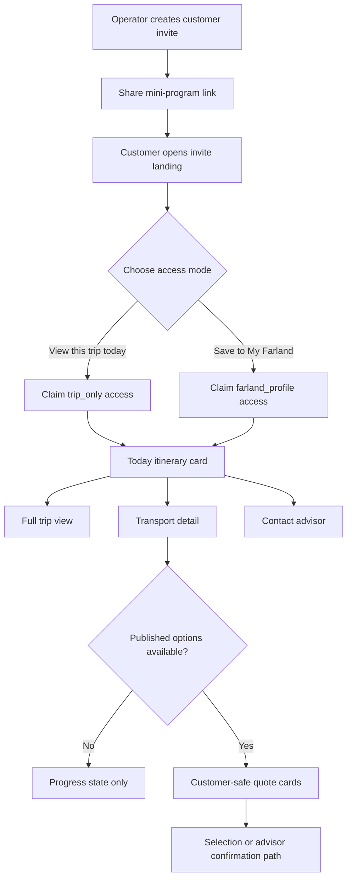
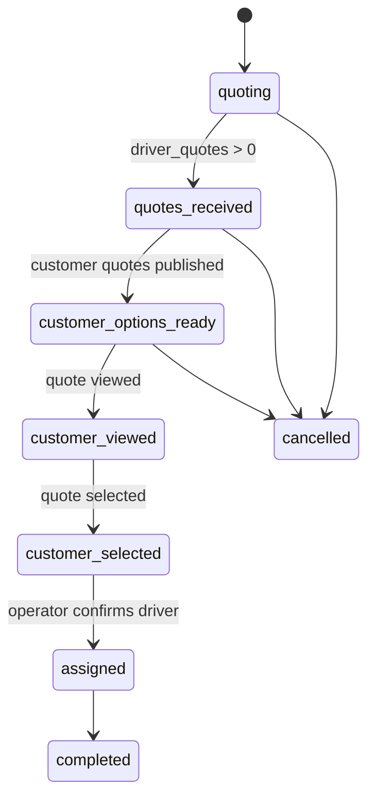

# Farland Mini-Program UI/UX Synthesis for Daily Itinerary Cards

## Executive summary

Farland’s mini-program is no longer just a driver-quote tool with a customer layer added later. The current repository already contains a customer invite flow, a customer home aggregator, customer-safe quote retrieval, operator quote review/publish planning, and a driver token-based quick-quote flow. But the UI still reflects its earlier data model: `createRideRequest` writes a very small, generic request object; `getCustomerHome` returns multiple parallel sections instead of a single day-first surface; `claimCustomerInvite` still defaults toward persistent profile-style binding when no bind mode is passed; and `submitQuickQuote` currently rejects repeat submissions with a 409 conflict even though both the API doc and test plan say repeated submission should update the original quote. fileciteturn45file0L3-L3 fileciteturn47file0L3-L3 fileciteturn49file0L3-L3 fileciteturn40file0L3-L3 fileciteturn33file0L3-L3 fileciteturn37file0L3-L3

The strongest pattern across the studied products is not “more features.” It is a repeatable UI logic: one personalized home surface, one deeper detail view, one time-first agenda layer, progressive disclosure for everything secondary, and strict role-scoped visibility. TripIt builds a single itinerary from fragmented confirmations and then adds context-aware reminders and maps around that itinerary. Guidebook, EventMobi, Sched, and Cvent Attendee Hub all treat the attendee’s current agenda, navigation, and updates as the core experience rather than as supporting pages. AXUS, Travefy, and mTrip all reinforce the same delivery model in travel: a mobile-friendly, branded itinerary shell with documents, updates, and limited, deliberate communication pathways. citeturn3view0turn22view0turn23view0turn21view0turn19view0turn18view0turn17view0turn14view0turn25view0turn25view1turn26view0turn26view2

For Farland, that means the next UI milestone should not be “more sections on My Trip.” It should be a **daily shared today-itinerary card** as the primary customer surface for a given trip day, with `request_id` and trip-day context underneath it. That card should sit on top of a safer and more structured backend/UI contract: `service_type`-specific request creation, customer-safe published transport options, explicit state labels, and a driver quote page that changes shape depending on whether the job is a `transfer` or a `charter`. The proposed direction below keeps Farland’s current architecture intact, but reorders it around the way users actually think: *What is happening today? What is confirmed? What still needs a decision? Who do I contact?* fileciteturn34file0L3-L3 fileciteturn35file0L3-L3 fileciteturn36file0L3-L3 fileciteturn42file0L3-L3

## Evidence base

The GitHub scan covered the repo’s customer, operator, driver, cloud-function, and product-doc layers. The files inspected were:

```text
README.md
docs/API.md
docs/TEST_CASES.md
docs/product/p1-1-data-boundary-customer-quotes.md
docs/product/p1-2a-implementation-plan.md
docs/product/p2-customer-system-trip-json.md
docs/product/p3-formal-release-plan.md
docs/reviews/p2-implementation-review.md

cloudfunctions/checkEntryAccess/index.js
cloudfunctions/claimCustomerInvite/index.js
cloudfunctions/createCustomerInvite/index.js
cloudfunctions/createRideRequest/index.js
cloudfunctions/getCustomerHome/index.js
cloudfunctions/getCustomerTransportQuotes/index.js
cloudfunctions/getCustomerTransportQuotes/lib/auth.js
cloudfunctions/getOperatorRequests/index.js
cloudfunctions/getQuoteInviteByToken/index.js
cloudfunctions/getRequestDetail/index.js
cloudfunctions/selectCustomerQuote/index.js
cloudfunctions/selectDriverQuote/index.js
cloudfunctions/submitQuickQuote/index.js

miniprogram/pages/hotel/request/request.js
miniprogram/pages/hotel/request/request.wxml
miniprogram/pages/driver/quick-quote/quick-quote.wxml
```

The repo evidence was then combined with official product pages for TripIt, Guidebook, EventMobi, Sched, Cvent Attendee Hub, AXUS Travel App, Travefy, and mTrip, plus the uploaded workspace research reports and the uploaded trip 091 PDFs. Where the repo’s review docs and current cloud-function code conflict, the current code should be treated as the source of truth. For example, the P2 implementation review says `selectCustomerQuote` still performs identity binding, but the current cloud function instead verifies existing access or invite validity and updates only the selection state. fileciteturn53file0L3-L3 fileciteturn44file0L3-L3

Two repo facts matter most for the next phase. First, Farland’s customer layer is already built around invite-based access and customer-safe published quotes rather than raw `driver_quotes`. Second, the current customer home contract is section-heavy by design: `today_itinerary`, `trip_overview`, `transfer_requests`, `charter_services`, `hotel_requests`, and `benefits` all arrive as parallel modules, which makes a clean “today card” difficult unless the top-level IA is reorganized. fileciteturn50file0L3-L3 fileciteturn42file0L3-L3 fileciteturn47file0L3-L3

## Page-by-page review and concrete change list

### Customer entry and landing

Farland’s customer entry model is already invite-first in the backend. `createCustomerInvite` generates a mini-program path directly to `pages/customer/home/home` with `invite_code` and `request_id`, and the product standard says invite access should bootstrap visibility rather than force open browsing or self-registration. But `claimCustomerInvite` currently normalizes a missing bind mode to `farland_profile`, while the product architecture doc explicitly says the default access model should be `trip_only`. That mismatch creates the wrong mental model at the first moment of entry: a user who only expects to “view this trip” can be pushed into a persistent-account feeling before seeing any value. fileciteturn50file0L3-L3 fileciteturn49file0L3-L3 fileciteturn36file0L3-L3

The UI change should be simple and deliberate. The first customer-facing state should not look like a login wall or a profile-binding task. It should be a **trip access landing state** with two choices: **View this trip today** as the primary action and **Save to My Farland** as a secondary action. The behavioral reason is straightforward: invite-based access works best when the user’s first action matches the reason they opened the link. TripIt’s “forward confirmation, get itinerary” model and Travefy’s “email handoff into Trip Plans” model both reduce friction by getting the user into usable context first rather than front-loading account work. citeturn22view0turn25view1

Concrete change list:

- Keep the existing invite path, but add a dedicated landing state inside `customer/home` before full-page content is shown.
- Change the default claim mode to `trip_only` unless the customer explicitly chooses persistent save. This aligns the code with the product standard. fileciteturn49file0L3-L3 fileciteturn36file0L3-L3
- Ask for display name only on the **Save to My Farland** path, not on the first **View this trip** path.
- If access is expired, show a polite recovery state rather than empty home immediately.
- Keep operator and driver entry untouched through `checkEntryAccess`, since that role-based redirect is already correct. fileciteturn46file0L3-L3

### Customer home and the future today-itinerary card

The most important current issue is in `getCustomerHome`: the function aggregates rich data, but its “today” object is not actually date-resolved. It flattens itinerary arrays and returns `daily[0]` as `today_itinerary`, which means the customer’s top card is effectively “first itinerary item” rather than “the correct day for now in the trip timezone.” For a daily itinerary product, this is the single highest-priority correctness bug. fileciteturn47file0L3-L3

The second issue is IA, not correctness. The home contract currently exposes separate modules for trip overview, transfer requests, charter services, hotels, and benefits. That structure may be fine for storage and aggregation, but it is not the best top-level reading surface on a phone. The studied products repeatedly use a “home hub + current agenda + deeper pages” model. Cvent Attendee Hub describes a personal dashboard with guidance and daily summaries; EventMobi centers interactive agendas and event essentials; Guidebook emphasizes one-tap access to schedules, maps, and messages; Sched emphasizes personalized schedules and real-time notifications. Farland should apply the same logic to the top of `customer/home`: one current-day service card first, everything else below. citeturn17view0turn19view0turn21view0turn18view0

The concrete change is to promote a new `today_card` view model above the current modules. That card should contain:

- trip number or share label
- day/date/timezone
- current status chip
- current service window
- next stop
- timeline segments for today
- “contact advisor” as the default action
- driver contact only when assigned
- “view full trip” as the drill-down

The behavioral reason is that customers do not open a mini-program to study all data domains equally. They open it because they need immediate orientation. Structured’s “single-day vertical timeline” logic and the uploaded Notion Calendar/Structured reports both reinforce the same lesson: the current day must be scannable in seconds, and depth should be optional rather than mandatory.

For trip **091**, the uploaded PDF already shows the right content model for a daily card. On Day 1, the card should not show the whole eight-day trip. It should show the current day only:

- **Fri Jun 5**
- **Depart Boston 8:10 AM**
- **Amherst College 10:00 AM**
- **Renaissance Providence Downtown Hotel 1:40 PM**
- “Tomorrow: Brown University + Yale University”

That is the right amount of information for a shared mobile card. The longer itinerary, hotel details, cost sheet, and later days belong behind drill-down links.

Concrete change list:

- Extend `getCustomerHome` to return `today_card`, `up_next`, and `remaining_day_count`, and compute them using trip timezone and the current date, not `daily[0]`. fileciteturn47file0L3-L3
- Keep current arrays for backward compatibility, but demote them below the day card.
- Add `last_updated_at` and `change_summary` to the day card so customers can trust edits without re-reading the whole itinerary.
- Show only one primary CTA on the first screen: **Contact advisor**.
- If no day data is available yet, show a skeleton and a precise empty state such as “Today’s details are being finalized by Farland.”

### Customer transport detail

The transport detail flow is already conceptually safer than the old mock design. The product rules and cloud functions are clear that customer pages must never read `driver_quotes`; customer pages should read only `customer_transport_quotes`; and the cloud function should return only published/viewed/selected/confirmed customer-safe quote states, with assigned driver details released after assignment/confirmation. The current implementation follows that boundary. `getCustomerTransportQuotes` reads `customer_transport_quotes`, formats customer-safe money fields, returns a maximum of three quotes, and only adds `assigned_transport` once the request is assigned or confirmed. `getCustomerHome` also sanitizes blocked fields such as `driver_quotes`, `driver_cost`, `margin`, `internal_note`, and `supplier_private_notes`. fileciteturn35file0L3-L3 fileciteturn34file0L3-L3 fileciteturn42file0L3-L3 fileciteturn47file0L3-L3

This is the right data boundary, but the UI should be reframed around reassurance and decision timing. For the daily card product, transport detail should become a **secondary decision page**, not a heavy first-stop marketplace. The page should read in this order:

- request snapshot
- current Farland status
- customer-safe options
- what happens next
- contact advisor

The behavioral reason is that a transportation quote is not a shopping grid in this product. It is an advisor-mediated decision surface. TripIt, AXUS, Travefy, and mTrip all teach the same lesson in different ways: visible detail should answer *what, when, where, and what changed*, not force the user into raw operational reasoning. citeturn3view0turn14view0turn25view1turn26view2

Concrete change list:

- Keep the current customer-safe quote cards, but add a clearer status block above them:
  - **Farland is reviewing options**
  - **Options are ready**
  - **You selected an option**
  - **Driver confirmed**
- If selection remains disabled in the frontend for now, replace any dead-end selection control with **Ask Farland to confirm this option** or **Contact advisor**.
- If selection is enabled later, require explicit confirmation and use optimistic conflict handling because `selectCustomerQuote` already returns 409 conflict states when another selector exists. fileciteturn44file0L3-L3
- Keep plate number and driver phone hidden until assignment, matching the documented and implemented boundary. fileciteturn35file0L3-L3 fileciteturn42file0L3-L3

### Operator create-request and operator request review

The current operator request model is too generic for the UI Farland wants. `createRideRequest` accepts only `service_type`, `service_date`, `driver_region`, `task_description`, `quote_deadline`, and `internal_note`. That may be enough for initial cloud-function success, but it is not enough for good operator UX, clean driver quoting, or a strong customer-facing daily card. The current form forces operators to compress route, service window, passenger needs, luggage, language, and edge conditions into `task_description`, which increases ambiguity upstream and layout debt downstream. fileciteturn45file0L3-L3

This is the clearest place to apply the “time/context first” design logic found across the studied products. Sched, Guidebook, EventMobi, and Cvent all reduce cognitive load by grouping things according to how users make decisions: dates, sessions, tracks, locations, personalization, updates. Farland should do the same with `service_type`. The operator should choose `transfer` or `charter` at the top, and the form should then collapse to the relevant field groups rather than showing one generic request editor. citeturn18view0turn21view0turn19view0turn17view0

Concrete change list for **operator create-request**:

For `transfer`, group fields as:

- **Service basics**: date, pickup time, pickup location, drop-off location
- **Capacity**: passengers, luggage, child seat, language
- **Execution notes**: meet-and-greet, waiting rule, flight number if relevant
- **Driver-safe brief**: a generated concise summary for quoting
- **Internal ops only**: internal notes, sourcing constraints, preferred supplier notes
- **Quote settings**: quote deadline, recommended vehicle class

For `charter`, group fields as:

- **Service window**: start time, end time, date or day span
- **Coverage area**: city/region, hotel base, expected mileage or usage assumptions
- **Known stops**: a list of segments with time/place/type
- **Capacity & staffing**: passengers, luggage, interpreter/language, extra guide if needed
- **Commercial assumptions**: hotel/parking/overtime handling
- **Driver-safe brief**
- **Internal ops only**
- **Quote settings**

The behavioral reason is that operators do not think in one long memo. They think in constraints, stops, time windows, and commercial assumptions. If the form reflects that structure, every downstream page gets simpler.

For **operator request hall and request detail**, the code already gives you the foundation for a better UI. `getOperatorRequests` calculates derived tags such as `pending_selection`, `expiring_soon`, and `no_quote`. `getRequestDetail` already combines the request, quote invites, driver quotes, and customer quote linkage per source quote. The P1.2A plan also defines the intended review/draft/publish flow for customer-visible quotes. fileciteturn51file0L3-L3 fileciteturn41file0L3-L3 fileciteturn34file0L3-L3

Concrete change list for **operator request detail**:

- Split the page into three stacked bands:
  - **Request snapshot**
  - **Supply review**
  - **Customer publishing**
- Add visible chips on each driver quote:
  - **Submitted**
  - **Approved**
  - **Rejected**
  - **Draft created**
  - **Published to customer**
  - **Selected by customer**
- Move legacy **Select driver** into a lower-priority action area when `use_customer_quote_flow` is on, because the primary reading mode changes from “pick supplier now” to “review, curate, publish, then assign.”
- Add a compact audit timeline so operators can see who approved, published, or selected without entering multiple pages.

### Driver quick-quote

Farland’s driver-safety boundary is already mostly correct. `getQuoteInviteByToken` returns only a narrowed request payload: request number, service type, service date, driver region, task description, quote deadline, status, and the current driver’s own information if known. It does not return customer phone, customer pricing, other drivers’ quotes, or internal notes. The quick-quote page also has explicit invalid, cancelled, loading, and submit-success states in its WXML. fileciteturn39file0L3-L3 fileciteturn29file0L3-L3

But the page still behaves like a generic quote form rather than a service-aware quote page. The task summary is mostly a single `task_description` block, even though the code already returns `service_type`. That is a missed opportunity. A `transfer` quote and a `charter` quote do not create the same cognitive task for a driver. A driver quoting a transfer needs clear pickup/drop-off/timing/capacity assumptions. A driver quoting a charter needs service window, area, stop density, likely mileage/hours, parking/hotel/overtime assumptions, and whether the plan is fixed or still evolving.

The repeat-submission bug makes this even worse. The API doc says repeat quote submission should update the original quote, and the test plan says the same, but the current cloud function returns a 409 conflict as soon as a quote already exists for the same `request_id + driver_id`. This creates a UI dead-end: the page tells the driver they cannot modify an existing quote, even though the documented product expectation is update-in-place. fileciteturn33file0L3-L3 fileciteturn37file0L3-L3 fileciteturn40file0L3-L3

Concrete change list:

- Add a **job summary** block that changes with `service_type`.
- For `transfer`, show:
  - pickup
  - drop-off
  - pickup time
  - passengers / luggage
  - wait rule
  - language / meet-and-greet expectation
- For `charter`, show:
  - service window
  - area / city
  - key stops or stop count
  - expected hours or mileage assumptions
  - hotel/parking/overtime notes
- Add a driver-safe line: **Customer contact will be coordinated by Farland after confirmation.**
- If repeat updates are allowed, change `submitQuickQuote` to idempotent upsert by `request_id + driver_id`.
- If repeat updates are not allowed, then the API doc and test plan must be corrected to match the actual lock behavior. Right now they are inconsistent. fileciteturn40file0L3-L3 fileciteturn33file0L3-L3 fileciteturn37file0L3-L3

## Transferable UI principles from the studied products

### One current hub, one deeper detail page

TripIt, Cvent Attendee Hub, Guidebook, EventMobi, and AXUS all center the “current trip/event” as the first thing the user sees, then push richer detail into drill-down views. In different vocabulary, they all teach the user the same model: the home surface answers **what’s happening now**, and detail pages answer **what exactly is inside this item**. That pattern should become Farland’s customer rule: **the day card is the home surface; full itinerary and transport detail are secondary pages**. citeturn3view0turn17view0turn21view0turn19view0turn14view0

### Time is the organizing surface

TripIt’s itinerary is chronological by construction; Sched’s core promise is personalized schedules; EventMobi’s agenda is interactive, sortable, and personal; Cvent Attendee Hub emphasizes agenda building and daily summaries. The uploaded Structured and Notion Calendar reports reinforce the same point from a different domain: when people need confidence under time pressure, time must be the primary visual surface, not one more filter. For Farland, this means `transfer`, `charter`, hotel, and document content should all be subordinate to a date-and-time-first read model on the customer side. citeturn22view0turn18view0turn19view0turn17view0

### Progressive disclosure beats one long wall of data

Guidebook’s product language emphasizes one-tap access to the essentials, while AXUS explicitly describes day-by-day details that expand for more information. Travefy and mTrip also treat the itinerary shell as a clean delivery layer while placing deeper documents, updates, and richer travel material one step behind it. Farland should follow that same principle in every user role:
- operators see grouped panels, not one monolithic request page
- customers see a day card first, not all sections equally
- drivers see the minimum briefing required to price the job, not the entire internal record citeturn21view0turn14view0turn25view1turn26view2

### Updates need visible trust signals

TripIt Pro emphasizes alerts, reminders, alternate flights, gate changes, and maps around itinerary changes. EventMobi and Sched both emphasize real-time notifications and schedule updates. AXUS emphasizes notifications when published itineraries change, and Travefy tells customers that trip changes update automatically in the app. That implies a direct Farland rule: if the day card or transport detail changes, the UI should say **updated at** and optionally **what changed**, so customers do not have to reverse-engineer whether the information is still reliable. citeturn23view0turn19view0turn18view0turn14view0turn25view1

### Roles and permission boundaries must be legible in the UI

The studied products all separate organizer/advisor tooling from traveler/attendee-facing experiences. Farland’s product docs go even further and explicitly prohibit customer exposure of `driver_quotes`, internal notes, margin, and other drivers’ prices, and they delay driver-contact release until assignment. The UI should not merely “trust the backend.” It should mirror the boundary visually: customer pages should never imply that more quote-pool data exists; quick-quote pages should explicitly frame themselves as a driver-only pricing brief; operator pages should clearly mark internal-only data. fileciteturn35file0L3-L3 fileciteturn34file0L3-L3 fileciteturn38file0L3-L3

## Proposed Farland UI architecture and wireframes

The recommended customer flow is:



The recommended state model is:



The recommended **today itinerary card** for trip 091 should look like this:

```text
┌──────────────────────────────────────────────┐
│ Fri, Jun 5 · Day 1 · Trip 091               │
│ Boston / Providence · Updated 8:42 AM       │
│ STATUS: Advisor confirmed                   │
│ SERVICE: Today’s route in progress          │
├──────────────────────────────────────────────┤
│ Current service window                      │
│ 8:10 AM depart · Boston → Amherst → Hotel   │
│ Party: 6 · Luggage: 3                       │
├──────────────────────────────────────────────┤
│ Today’s timeline                            │
│ 8:10   Depart Boston                        │
│ 10:00  Amherst College                      │
│ 1:40   Renaissance Providence Downtown      │
├──────────────────────────────────────────────┤
│ What’s next                                 │
│ Tomorrow: Brown University + Yale           │
├──────────────────────────────────────────────┤
│ [Contact Advisor] [View Full Trip]          │
│ [Driver Contact] only after assignment      │
└──────────────────────────────────────────────┘
```

For transfer-detail, the structure should be:

```text
Request snapshot
Current Farland status
Published options
What happens next
Advisor contact
```

For driver quick quote, the structure should be:

```text
Job summary
Your driver/vehicle profile
Your quote
Submission state / last updated
```

For operator request detail, the structure should be:

```text
Request snapshot
Driver quote review lane
Customer-quote publish lane
Assignment lane
Audit/history
```

## Prioritized implementation plan

### Immediate stabilization

**Backend**
- Change `claimCustomerInvite` so missing bind mode defaults to `trip_only`, matching the product architecture. fileciteturn49file0L3-L3 fileciteturn36file0L3-L3
- Fix the `submitQuickQuote` drift so repeated driver submission either updates the original quote or the docs/tests are corrected. The preferred path is idempotent update by `request_id + driver_id`. fileciteturn40file0L3-L3 fileciteturn33file0L3-L3 fileciteturn37file0L3-L3
- Extend `getCustomerHome` to compute a real `today_card` by date/timezone and not just return the first itinerary item. fileciteturn47file0L3-L3

**Frontend**
- Add a lightweight invite landing state inside `customer/home`.
- Add customer home skeletons for the top card and timeline segments.
- Replace any dead-end customer selection CTA with explicit advisor-confirmation language until final selection UX is approved.

**Feature flags**
- `use_trip_only_default_bind`
- `use_today_card_v1`
- `use_quick_quote_upsert_v1`

### Daily itinerary card release

**Backend**
- Extend `getCustomerHome` or add `getCustomerDayCard` with:
  - `today_card`
  - `up_next`
  - `last_updated_at`
  - `change_summary`
  - `share_label`
- If using trip JSON as the source, map imported `itinerary_days` into a day-card-friendly segment array. fileciteturn36file0L3-L3

**Frontend**
- Make the top of `customer/home` a day card instead of a section stack.
- Add a full-trip page or overlay that reads from the same itinerary object.
- Add a “tomorrow” teaser row if the next day already exists.

**Feature flags**
- `use_day_card_share_entry`
- `use_day_card_timeline_v1`

### Structured request creation and service-type-specific UIs

**Backend**
- Introduce `createRideRequestV2` fields for structured transfer and charter data, while still writing a backward-compatible `task_description` string for legacy consumers. fileciteturn45file0L3-L3
- Persist service-type-specific fields needed downstream by driver and customer pages.

**Frontend**
- Rebuild operator create-request as a service-type-first editor.
- Rebuild driver quick quote summary so it uses the new fields differently for `transfer` and `charter`.
- Keep current quote amount / currency / note block, but change what appears above it.

**Feature flags**
- `use_structured_request_v2`
- `use_service_type_specific_quick_quote`

### Operator review and customer-safe publishing polish

**Backend**
- Keep `driver_quotes` as supply-side only.
- Continue customer-safe publication through `customer_transport_quotes`. fileciteturn34file0L3-L3 fileciteturn35file0L3-L3
- If customer choice is enabled later, consider optimistic locking or transaction-like conflict protection for selection and assignment, since current multi-write flows are conflict-aware but not strongly transactional. fileciteturn44file0L3-L3 fileciteturn52file0L3-L3

**Frontend**
- Add clearer review/publish chips to operator request detail.
- Show customer-viewed/customer-selected status in operator UI.
- Add an audit/history panel for sensitive actions.

**Feature flags**
- `use_customer_quote_flow`
- `use_operator_detail_v2`

## Acceptance criteria and QA

The acceptance bar should be written against user behavior, not just function success.

### Customer entry and home

- Opening an advisor-shared link takes the customer to a trip-specific landing state, not a generic hotel-booking-first experience.
- Choosing **View this trip today** claims `trip_only` access and opens the day card without requiring a profile save.
- Choosing **Save to My Farland** requires display name and then opens the same trip content with persistent visibility.
- On the actual trip date, the top card shows the correct day, not always the first day of the imported itinerary.
- Before driver assignment, the day card shows advisor contact but not driver phone or plate.
- If no itinerary for today exists yet, the customer sees a reassuring empty state, not a broken or irrelevant card. fileciteturn47file0L3-L3 fileciteturn49file0L3-L3 fileciteturn50file0L3-L3

### Customer transport detail and permissions

- Customer detail pages never read or render raw `driver_quotes`.
- `getCustomerTransportQuotes` returns only customer-safe statuses and at most three published options.
- Before assignment, customer pages do not show driver phone, plate, margin, internal notes, or other drivers’ quotes.
- After assignment, only the assigned driver details become visible. fileciteturn35file0L3-L3 fileciteturn42file0L3-L3 fileciteturn47file0L3-L3

### Operator request creation and review

- Selecting `transfer` hides charter-only fields.
- Selecting `charter` hides transfer-only fields.
- Saving a request still produces a backward-compatible request summary for legacy consumers.
- Operator request detail shows review state, customer draft state, and publish state without mixing customer-safe and internal-only data visually.
- Legacy selection logic remains available only where intended by feature flag. fileciteturn45file0L3-L3 fileciteturn34file0L3-L3 fileciteturn51file0L3-L3

### Driver quick quote

- For `transfer`, the driver sees pickup/drop-off/timing/capacity assumptions.
- For `charter`, the driver sees service window/coverage/known stops/commercial assumptions.
- The driver never sees customer phone, customer price, other driver quotes, margin, or internal notes.
- Invalid, expired, submitted, and cancelled states remain explicit and readable.
- Repeat quote behavior is consistent across UI, API docs, and tests. fileciteturn39file0L3-L3 fileciteturn29file0L3-L3 fileciteturn40file0L3-L3 fileciteturn33file0L3-L3 fileciteturn37file0L3-L3

### Permission and concurrency tests

- A customer account cannot call operator-only functions such as review, publish, or assign.
- A driver account cannot call customer quote functions or see customer-private transport data.
- A second OPENID cannot reuse an already claimed invite if the invite is already tied to a different OPENID.
- If two customers try to select the same customer quote flow at once, one path succeeds and the other receives a conflict state.
- If two operators try to assign different drivers to the same request, the second action is blocked cleanly and the request remains consistent.
- Manual QA should explicitly test the no-database-from-frontend rule and the no-frontend-OPENID-trust rule. fileciteturn46file0L3-L3 fileciteturn44file0L3-L3 fileciteturn52file0L3-L3 fileciteturn38file0L3-L3

### Open questions and limitations

A few items remain product decisions rather than implementation decisions.

- Whether customer quote selection should remain read-only for now or be fully re-enabled in the mini-program needs an explicit product decision. The backend supports selection, but Farland may still prefer advisor-mediated confirmation as the visible customer behavior. fileciteturn44file0L3-L3
- The exact data contract for trip-day segments should be settled before building the shareable day card, especially for mixed days that include hotel, sightseeing, school visits, and flight legs in one timeline. The uploaded 091 PDFs show that this mixed-day case is real.
- Some uploaded research reports were used as workspace inputs rather than line-citable file-search sources in this run. Where those reports conflict with current repo code, current code should win.