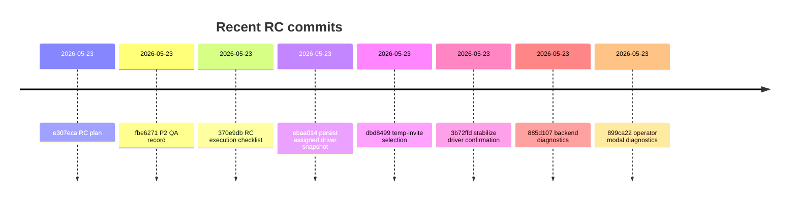
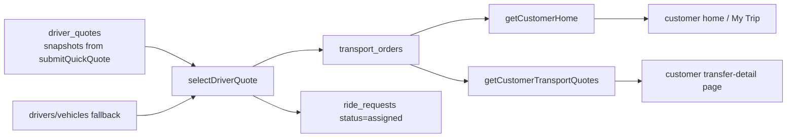

# Farland Mini Program RC QA Technical Report

## Executive Summary

Observed Terminal HEAD is `899ca22` (`Show operator driver confirmation failure details`), with local status still showing only `?? docs/design-assets/`. GitHub confirms the latest RC thread of fixes: `885d107` added step-level backend diagnostics, `3b72ffd` hardened driver confirmation and `transport_orders` writes, `ebaa014` switched customer assigned-driver reads to `transport_orders`, and `dbd8499` relaxed temporary-invite quote selection. The current RC blocker is still the driver-assignment chain: customer pages render **assigned** but fall back to **待确认** when `assigned_transport` is absent/empty, and operator confirmation can now surface `failed_step=save_transport_order`, which isolates the likely fault to `transport_orders` persistence rather than the customer UI. fileciteturn3file0L1-L3 fileciteturn28file0L1-L3 fileciteturn5file0L1-L3 fileciteturn6file0L1-L3 fileciteturn7file0L1-L3

## Current State

| Hash | Message | Files changed |
|---|---|---|
| `899ca22` | Show operator driver confirmation failure details | `miniprogram/pages/operator/request-detail/request-detail.js`, `TODO.md` fileciteturn3file0L1-L3 |
| `885d107` | Add operator driver confirmation diagnostics | `cloudfunctions/selectDriverQuote/index.js`, `TODO.md` fileciteturn28file0L1-L3 |
| `3b72ffd` | Stabilize operator driver confirmation snapshot | `cloudfunctions/selectDriverQuote/index.js` fileciteturn5file0L1-L3 |
| `ebaa014` | Persist assigned driver snapshot for customers | `cloudfunctions/selectDriverQuote/index.js`, `cloudfunctions/getCustomerHome/index.js`, `TODO.md` fileciteturn6file0L1-L3 |
| `dbd8499` | Allow temporary invite quote selection without profile save | `cloudfunctions/selectCustomerQuote/index.js`, customer `transfer-detail` JS/WXML/WXSS, `TODO.md` fileciteturn7file0L1-L3 |
| `370e9db` | Add P3 release candidate execution checklist | `docs/reviews/p3-release-candidate-execution-checklist.md` fileciteturn10file0L1-L3 |
| `fbe6271` | Add P2 device QA record | `docs/reviews/p2-device-qa-record.md` fileciteturn9file0L1-L3 |
| `e307eca` | Add formal release candidate plan | `docs/product/p3-formal-release-plan.md` fileciteturn8file0L1-L3 |

| Added docs file | Purpose |
|---|---|
| `docs/product/p3-formal-release-plan.md` | RC boundary, deployment, security, rollback plan. fileciteturn8file0L1-L3 |
| `docs/reviews/p2-device-qa-record.md` | Device QA record, validation commands, manual deployment checklist. fileciteturn9file0L1-L3 |
| `docs/reviews/p3-release-candidate-execution-checklist.md` | RC deployment order and operator/driver/customer/security QA checklist. fileciteturn10file0L1-L3 |



## Code Findings

`selectDriverQuote` is the critical path. Current main resolves driver/vehicle fallback from `drivers`/`vehicles`, builds a customer-safe `transport_orders` snapshot, writes it in `saveTransportOrder()`, then updates `driver_quotes` and `ride_requests`; exceptions now return `error_code: SELECT_DRIVER_QUOTE_FAILED` with `failed_step`. Because `save_transport_order` happens **before** `update_selection_records`, an error at that step should prevent a same-attempt `ride_requests.status='assigned'`; if a request already shows assigned, that state likely came from an earlier/stale deployment or prior attempt. fileciteturn11file0L1-L3 fileciteturn12file0L1-L3 fileciteturn13file0L1-L3

`getCustomerHome` and `getCustomerTransportQuotes` both read assigned-driver data from `transport_orders`, map it via `toAssignedTransport()`, and log `transport_orders_read_failed` / `transport_orders_missing_for_assigned_request` when data is missing. The customer `transfer-detail.wxml` explicitly renders `司机/车辆/电话：待确认` when `request.assigned_transport.*` is empty. `submitQuickQuote` is supposed to seed the source snapshots: `driver_name_snapshot`, `driver_phone_snapshot`, `vehicle_model_snapshot`, `vehicle_type_snapshot`, `seats_snapshot`, and `luggage_capacity_snapshot`. `selectCustomerQuote` now permits valid temporary invites to select customer quotes and writes `customer_selected_quote_id` / `customer_selected_openid` back to `ride_requests`. fileciteturn14file0L1-L3 fileciteturn15file0L1-L3 fileciteturn16file0L1-L3 fileciteturn17file0L1-L3 fileciteturn18file0L1-L3 fileciteturn22file0L1-L3 fileciteturn23file0L1-L3 fileciteturn19file0L1-L3



## Runtime Issues and Remediation

| Issue | Likely cause | Exact code location | Concrete remediation |
|---|---|---|---|
| Customer page shows **接送已预约 / 已确认司机** but fields are **待确认** | `transport_orders` missing, unreadable, or written with empty snapshot fields; customer page only renders `assigned_transport`. fileciteturn22file0L1-L3 | `getAssignedTransport()` in `cloudfunctions/getCustomerTransportQuotes/index.js` (~lines 70–120), `toAssignedTransport()` + aggregator in `getCustomerHome` (~126–168, ~342–415), WXML assigned-driver card. fileciteturn17file0L1-L3 fileciteturn15file0L1-L3 fileciteturn16file0L1-L3 | Redeploy `selectDriverQuote`, `getCustomerTransportQuotes`, `getCustomerHome`; verify `transport_orders` for the new request; if old assigned rows existed pre-`ebaa014`, backfill one `transport_orders` row per request. |
| First operator selection showed generic **选择失败** | Old operator UI only used toast; details were hidden. Current main shows modal with `failed_step` / `error_code`. fileciteturn3file0L1-L3 | `miniprogram/pages/operator/request-detail/request-detail.js` around the `wx.cloud.callFunction('selectDriverQuote')` failure branch. fileciteturn20file0L1-L3 | Preview/upload Mini Program from `899ca22` before retest. |
| Modal now shows `failed_step=save_transport_order`, `error_code=SELECT_DRIVER_QUOTE_FAILED` | Failure is inside `saveTransportOrder()` or its immediate callsite; likely `transport_orders` write/index/collection problem. Backend audit log should contain the raw error. fileciteturn13file0L1-L3 | `saveTransportOrder()` (~95–123) and `exports.main` step `save_transport_order` (~150–190) in `cloudfunctions/selectDriverQuote/index.js`. fileciteturn11file0L1-L3 fileciteturn12file0L1-L3 | Inspect `audit_logs` immediately; confirm `transport_orders` collection exists; create needed indexes if error indicates index; as code hardening, consider removing `orderBy` from existence lookup or keying one order doc per `request_id`. |

## Deployment and Verification

| Priority | Deploy in WeChat DevTools / CloudBase | Reason |
|---|---|---|
| P0 | `selectDriverQuote` | Required for `transport_orders` write, driver/vehicle fallback, step diagnostics, and correct assignment metadata. fileciteturn5file0L1-L3 fileciteturn28file0L1-L3 |
| P1 | `getCustomerTransportQuotes` | Transfer detail reads assigned transport here; also logs read/missing failures. fileciteturn17file0L1-L3 fileciteturn18file0L1-L3 |
| P1 | `getCustomerHome` | Home/My Trip cards read assigned transport here. fileciteturn15file0L1-L3 fileciteturn16file0L1-L3 |
| P2 | `selectCustomerQuote` | Needed only if RC QA includes “temporary invite can select without save”. fileciteturn7file0L1-L3 |
| P2 | Mini Program preview/upload | Needed to surface `899ca22` operator modal diagnostics. fileciteturn3file0L1-L3 |

```js
// 1) driver quote snapshot
db.collection('driver_quotes').doc('<quote_id>').field({
  driver_name_snapshot: true,
  driver_phone_snapshot: true,
  vehicle_model_snapshot: true,
  vehicle_type_snapshot: true,
  seats_snapshot: true,
  luggage_capacity_snapshot: true,
  request_id: true,
  driver_id: true,
  vehicle_id: true
}).get()

// 2) ride request assignment + customer selection
db.collection('ride_requests').doc('<request_id>').field({
  status: true,
  selected_quote_id: true,
  selected_driver_id: true,
  selected_vehicle_id: true,
  customer_selected_quote_id: true,
  customer_selected_openid: true
}).get()

// 3) transport order by request
db.collection('transport_orders')
  .where({ request_id: '<request_id>' })
  .orderBy('updated_at', 'desc')
  .get()

// 4) customer quote linkage
db.collection('customer_transport_quotes')
  .where({ request_id: '<request_id>', source_driver_quote_id: '<quote_id>' })
  .get()

// 5) failure diagnostics
db.collection('audit_logs')
  .where({ action: 'select_driver_quote_failed', related_request_id: '<request_id>' })
  .orderBy('created_at', 'desc')
  .get()
```

If `audit_logs.detail.error.errMsg` mentions an index, add at least: `transport_orders(request_id ASC, updated_at DESC)` and `transport_orders(request_id ASC, order_status ASC, updated_at DESC)`.

| QA step | Expected result | Verification query |
|---|---|---|
| Driver submits quote | `driver_quotes` has snapshot fields populated | Query 1 |
| Operator confirms driver | Cloud function returns success + `transport_order_id` | UI modal / console |
| Verify DB | One `transport_orders` row exists with `request_id`, `order_status='assigned'`, `driver_name`, `driver_phone`, `vehicle_model`, `source_driver_quote_id` | Query 3 |
| Customer opens transfer detail | Assigned-driver card shows real driver/vehicle/phone, not placeholders | Query 3 + page check |

## Rollback and Recommendation

Rollback guidance already exists in the new RC docs: revert the latest customer-flow or operator-flow commit as needed, redeploy prior cloud-function versions, and do **not** delete production data during rollback. For this RC, the recommendation is **not ready for full QA sign-off** until a brand-new request passes the path `driver_quotes → selectDriverQuote → transport_orders → getCustomerTransportQuotes/getCustomerHome → customer page`, with `audit_logs` clean and `transport_orders` verified. Medium-priority architecture hardening after that: make `transport_orders` truly one-record-per-request and extract shared mapping logic so `selectDriverQuote`, `getCustomerHome`, and `getCustomerTransportQuotes` stop duplicating assignment-shaping code. fileciteturn8file0L1-L3 fileciteturn10file0L1-L3 fileciteturn11file0L1-L3 fileciteturn14file0L1-L3 fileciteturn17file0L1-L3