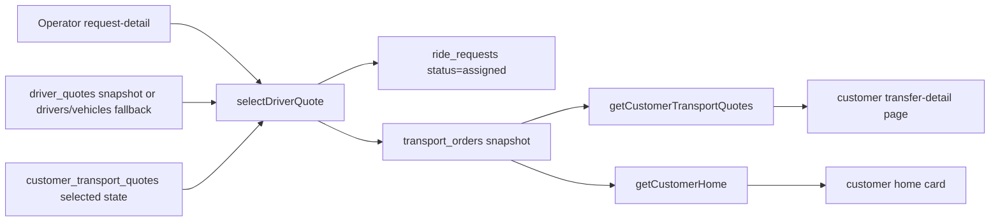

# Farland Miniapp RC State and Driver Assignment Research

## Executive Summary

The current repository state shows a clear progression toward the intended architecture: `ebaa014` introduced customer-safe assigned-driver snapshots in `transport_orders` and wired `getCustomerHome` to read them; `dbd8499` separated temporary invite quote selection from profile-saving; and `3b72ffd` hardened `selectDriverQuote` by broadening the operator confirmation status gate, resolving driver/vehicle fallbacks from `drivers` and `vehicles`, and returning `transport_order_id` for debugging. The repo therefore now encodes the right **write path** for assigned-driver persistence. fileciteturn6file0L1-L3 fileciteturn7file0L1-L3 fileciteturn5file0L1-L3

The user-visible failure remains real: the customer transfer-detail screen can show `接送已预约` / `已确认司机` while still rendering `司机：待确认 / 车辆：待确认 / 电话：待确认`. That is not a pure UI bug. In the current architecture, customer pages do **not** read from `driver_quotes`; they read an assigned-driver snapshot from `transport_orders` through `getCustomerTransportQuotes` and, on home cards, `getCustomerHome`. If `transport_orders` is missing, unreadable, or populated with empty fields, the UI will show “pending” placeholders even though `ride_requests.status` is already `assigned`. fileciteturn11file0L1-L3 fileciteturn10file0L1-L3 fileciteturn15file0L1-L3 fileciteturn16file0L1-L3

For **brand-new assigned requests** that still fail after `3b72ffd`, the most likely explanations are now runtime-state issues rather than missing repo logic: stale cloud deployment, a live `transport_orders` read-path failure that is being silently swallowed by `.catch(() => ({ data: [] }))`, or a runtime data problem in the order snapshot itself. A second, independent issue explains the blank request snapshot fields in the screenshot: `createRideRequest` currently writes only a minimal schema and does **not** persist pickup, dropoff, passengers, luggage, or customer name. fileciteturn9file0L1-L3 fileciteturn11file0L1-L3 fileciteturn10file0L1-L3 fileciteturn20file0L1-L3

My bottom-line recommendation is **not ready for RC** until the live runtime proves the full chain on a fresh request: `selectDriverQuote` must persist a non-empty `transport_orders` record; `getCustomerTransportQuotes` must read it successfully in the cloud environment; and the customer detail page must render driver, vehicle, and phone from that snapshot. In parallel, the code should stop swallowing `transport_orders` query failures, unify `assigned` and `confirmed` handling, and add index/idempotency safeguards around `transport_orders`. MongoDB’s own documentation is consistent with that direction: multi-document atomicity belongs in transactions, unique indexes enforce one-row invariants, and compound indexes are the standard way to support mixed filter-plus-sort access patterns. fileciteturn9file0L1-L3 fileciteturn11file0L1-L3 fileciteturn15file0L1-L3 citeturn11view1turn11view3turn11view5turn13view2

I also attempted Refero first. In this session the tool could reach the Refero landing page, but it did not surface retrievable pattern pages specific to trip-confirmation or assigned-driver detail flows, so it did not materially alter the repo-driven diagnosis. citeturn2view0

## Current Status and Reproduction Evidence

### Current status

From the repository side, the relevant release-candidate timeline on `main` is concentrated on 2026-05-23: `370e9db` added the P3 RC execution checklist, `ebaa014` introduced the first assigned-driver snapshot fix, `dbd8499` changed temporary invite quote-selection behavior, and `3b72ffd` stabilized operator driver confirmation snapshot handling. Those commits are the key technical context for the current RC state. fileciteturn8file0L1-L3 fileciteturn6file0L1-L3 fileciteturn7file0L1-L3 fileciteturn5file0L1-L3

The local terminal transcript you supplied adds one important piece that GitHub itself cannot show: after the latest push, the local worktree reportedly retained only one untracked path, `docs/design-assets/`. That is a **local terminal observation**, not a GitHub-visible repository fact, so I treat it as developer-supplied metadata rather than something independently verifiable from the connector. The same transcript also reported that the latest pushed commit was `3b72ffd`. That matches the repository-side commit fetch. fileciteturn5file0L1-L3

A compact timeline of the operative commits is below.

| Commit | UTC time | Main effect |
|---|---:|---|
| `370e9db` | 2026-05-23 08:21 | Added RC execution checklist |
| `ebaa014` | 2026-05-23 15:26 | First `transport_orders` write/read fix |
| `dbd8499` | 2026-05-23 15:35 | Allowed temporary invite quote selection |
| `3b72ffd` | 2026-05-23 17:15 | Stabilized operator confirmation snapshot flow |

This timeline is compiled directly from the fetched commit metadata and diffs. fileciteturn8file0L1-L3 fileciteturn6file0L1-L3 fileciteturn7file0L1-L3 fileciteturn5file0L1-L3

### Reproduction evidence

The failure is visible in the customer transfer-detail UI itself. The screenshot below shows the customer page presenting an apparently finalized state—`接送已预约`, `已确认司机`, and `Farland 已完成最终确认`—while the assigned-driver block still renders placeholder values:

- `司机：待确认`
- `车辆：待确认`
- `电话：待确认`

It also shows the separate request-snapshot issue:
- `下车点：待确认`
- `人数 / 行李：- 人 / - 件`


This visual behavior is consistent with the current page code. The detail page calls `getCustomerTransportQuotes`, builds `request.assigned_transport` from `result.assigned_transport`, and only populates it when `summary.status === 'assigned'`. The corresponding WXML then renders `driver_name`, `vehicle_model` or `vehicle_type`, and `driver_phone`, each with a fallback of `待确认` when the underlying values are empty. That means the screenshot is exactly what the current page will produce if the backend returns a null/empty assigned transport snapshot. fileciteturn15file0L1-L3 fileciteturn16file0L1-L3

Two page snippets make that behavior explicit:

```js
const assignedTransport = result.assigned_transport || {};
...
assigned_transport: summary.status === 'assigned' ? assignedTransport : null,
```

and:

```xml
<view class="body-text">司机：{{request.assigned_transport.driver_name || '待确认'}}</view>
<view class="body-text">车辆：{{request.assigned_transport.vehicle_model || request.assigned_transport.vehicle_type || '待确认'}}</view>
<view class="body-text">电话：{{request.assigned_transport.driver_phone || '待确认'}}</view>
```

Those snippets are pulled directly from the current `transfer-detail` JS/WXML pair. fileciteturn15file0L1-L3 fileciteturn16file0L1-L3

## Code Path Analysis

### End-to-end flow

The intended runtime flow is now this:



That flow is not aspirational anymore; it is what the current repo code actually implements across the cloud functions and customer page. fileciteturn9file0L1-L3 fileciteturn11file0L1-L3 fileciteturn10file0L1-L3 fileciteturn15file0L1-L3

### `selectDriverQuote`

`cloudfunctions/selectDriverQuote/index.js` is now the crucial write path. It authenticates an operator, loads the target `driver_quotes` row and `ride_requests` row, rejects `cancelled`, short-circuits already-finalized `assigned` and `confirmed`, allows direct confirmation for `quoting`, `quoted`, `customer_selected`, and `published`, and also accepts a customer-selected quote path when there is a related `customer_transport_quotes` row whose `source_driver_quote_id` matches the chosen driver quote and whose `quote_status` is `selected`. It then resolves driver/vehicle information from either the quote snapshots or fallback `drivers` / `vehicles`, constructs a `transport_orders` snapshot, persists it, marks the chosen driver quote `selected`, rejects the others, moves the request to `assigned`, and returns `transport_order_id`, `driver_name`, and `vehicle_model`. fileciteturn9file0L1-L3

The decisive logic is captured by this pattern:

```js
const DIRECT_CONFIRM_STATUSES = ['quoting', 'quoted', 'customer_selected', 'published'];
const resolved = await resolveDriverVehicle(quote);
const transportOrderId = await saveTransportOrder(transportOrderData, now);
```

That is the reason the repo-side diagnosis is now “the write path is mostly correct.” fileciteturn9file0L1-L3

### `getCustomerTransportQuotes`

`cloudfunctions/getCustomerTransportQuotes/index.js` is the detail-page read path. It verifies caller access, reads only customer-visible quote states from `customer_transport_quotes`, transforms them into safe client-facing quote objects, and reads the assigned-driver snapshot from `transport_orders` using:

- `request_id`
- `order_status in ['assigned', 'confirmed']`
- `orderBy('updated_at', 'desc')`
- `limit(1)`

But one important asymmetry remains: it only attempts that assigned-transport read when `request.status === 'assigned'`. It does **not** treat `confirmed` the same way at this stage, even though the internal `getAssignedTransport` helper is already prepared to read either `assigned` or `confirmed` orders. That mismatch is not necessarily the present bug, but it is a real structural inconsistency. fileciteturn11file0L1-L3

The relevant gate is:

```js
const assignedTransport = request.status === 'assigned'
  ? await getAssignedTransport(request_id)
  : null;
```

That line is one of the key reasons I classify the current design as “nearly right, but not fully normalized.” fileciteturn11file0L1-L3

### `getCustomerHome`

`cloudfunctions/getCustomerHome/index.js` already reads `transport_orders` more broadly than the detail page does. It gathers visible requests, filters those whose status is `assigned` or `confirmed`, reads `transport_orders` for those request IDs with `order_status in ['assigned', 'confirmed']`, maps those rows through `toAssignedTransport()`, and injects `assigned_transport` into each transfer request returned to the home page. That is architecturally consistent with the desired “customer pages read assigned snapshots from `transport_orders`, not from `driver_quotes`” rule. fileciteturn10file0L1-L3

### `selectCustomerQuote`

`cloudfunctions/selectCustomerQuote/index.js` is relevant for two reasons. First, `dbd8499` intentionally changed access rules so that a valid temporary invite can select a customer quote without forcing a saved Farland profile. Second, the function now writes `ride_requests.customer_selected_quote_id`, `customer_selected_openid`, and `customer_selected_at`, but it does **not** change `ride_requests.status`. That means operator-side confirmation cannot rely only on `ride_requests.status`; it must also consider the linked `customer_transport_quotes.source_driver_quote_id` relation. The latest `selectDriverQuote` does that. fileciteturn12file0L1-L3 fileciteturn7file0L1-L3 fileciteturn5file0L1-L3

It is also worth noting that `selectCustomerQuote` protects against another OPENID overriding an already-selected quote, but those checks are still implemented as pre-write reads plus subsequent writes rather than as a transaction. That reduces accidental overwrites, but it is not a complete race-proof guarantee under concurrency. fileciteturn12file0L1-L3

### `submitQuickQuote`

`cloudfunctions/submitQuickQuote/index.js` is the source of the original driver/vehicle snapshots stored on `driver_quotes`. On a new driver, it creates `users`, `drivers`, and `vehicles` records, then writes a `driver_quotes` row containing:

- `driver_name_snapshot`
- `driver_phone_snapshot`
- `vehicle_type_snapshot`
- `vehicle_model_snapshot`
- `seats_snapshot`
- `luggage_capacity_snapshot`

That is why, for a truly fresh request with a fresh quote, blank driver name, phone, or vehicle model in `transport_orders` is **less likely** than a stale deployment or a failed read path. One caveat remains: `submitQuickQuote` does not persist `plate_number_snapshot` on the quote, so plate numbers depend on the later fallback path through `vehicles`. fileciteturn13file0L1-L3

### Supporting paths that matter

Two supporting functions clarify edge cases. `createCustomerQuoteDraft` persists `source_driver_quote_id` into `customer_transport_quotes`, which is exactly the linkage `selectDriverQuote` now uses to recognize that a customer-selected quote belongs to a given driver quote. `publishCustomerQuotesBatch` publishes drafts but does not itself mutate `ride_requests.status`, which helps explain why `selectDriverQuote` had to stop depending on a narrow request-status gate alone. fileciteturn21file0L1-L3 fileciteturn22file0L1-L3

The operator frontend is also straightforward here: `pages/operator/request-detail/request-detail.js` simply calls `selectDriverQuote` and shows either `result.message` or a generic “选择失败”. There is no frontend-side block that would independently prevent confirmation, so the earlier “cannot select” incident almost certainly came from backend state validation rather than client UI logic. fileciteturn24file0L1-L3

## Database Model Review and Root Causes

### Database model review

The current data model has a fairly clean intended boundary, even if the runtime is not yet fully stable. `driver_quotes` is the internal supply-side pool, created by `submitQuickQuote` and consumed by operator/admin flows plus draft creation. It contains raw supplier-side snapshots and should stay off customer pages. `customer_transport_quotes` is the customer-safe quote layer, created from approved `driver_quotes`, linked back through `source_driver_quote_id`, and surfaced to customers through `getCustomerTransportQuotes` and `getCustomerHome`. `ride_requests` is the workflow backbone, but in today’s implementation it is often sparsely populated. `transport_orders` is the intended single source of truth for the customer-visible assigned-driver snapshot after operator confirmation. fileciteturn13file0L1-L3 fileciteturn21file0L1-L3 fileciteturn11file0L1-L3 fileciteturn10file0L1-L3 fileciteturn20file0L1-L3 fileciteturn9file0L1-L3

That architectural intent is good. The weakness is not primarily “wrong table,” but rather “multi-collection state transition without strong runtime guarantees.” The confirmation flow touches `driver_quotes`, `ride_requests`, and `transport_orders`; customer quote selection touches `customer_transport_quotes` and `ride_requests`; and both home/detail readers tolerate missing data by silently defaulting to placeholders. In RC terms, this is a consistency problem disguised as a rendering problem. MongoDB’s transaction guidance is directly relevant here: single-document operations are atomic, but multi-document atomicity requires transactions, and upsert-style one-row invariants should use uniquely indexed filters. fileciteturn9file0L1-L3 fileciteturn12file0L1-L3 citeturn11view0turn11view1turn11view5

### Root causes with evidence

The **original** root cause is well established: before `ebaa014`, the customer-facing assigned-driver display depended on `transport_orders`, but the operator confirm-driver flow did not reliably create that snapshot, so the UI could know the request was `assigned` without having any customer-safe driver record to display. `ebaa014` explicitly states that it fixed this by writing a `transport_orders` assignment snapshot in `selectDriverQuote` and teaching `getCustomerHome` to read it. fileciteturn6file0L1-L3

For the **current** state—where even new assigned requests still show empty driver fields—the highest-confidence explanation is now a live runtime mismatch rather than a missing repo feature. The latest `selectDriverQuote` on `main` does write `transport_orders`, resolves driver and vehicle details with fallback logic, and returns `transport_order_id`. If a fresh request still renders placeholders after that code exists, then either the cloud function is stale, or the read path is failing at runtime, or the stored row is still blank in the live database. The repo alone cannot distinguish those three possibilities, so that part is currently **unspecified** until the live DB is inspected. fileciteturn9file0L1-L3 fileciteturn15file0L1-L3 fileciteturn16file0L1-L3

A particularly important hypothesis is **silent read failure on `transport_orders`**. Both `getCustomerTransportQuotes` and `getCustomerHome` wrap their `transport_orders` reads in `.catch(() => ({ data: [] }))`, which means any runtime error—permissions, unexpected query behavior, missing supporting indexes, or other cloud-side query failures—collapses into an empty result and therefore into “待确认” placeholders instead of a surfaced fault. This is one of the strongest remaining explanations for “new request, still empty” because it aligns with the exact symptom: the request successfully moved to `assigned`, but the UI read path quietly returned no snapshot. fileciteturn11file0L1-L3 fileciteturn10file0L1-L3

A second independent root cause explains the blank request snapshot fields in the screenshot. `createRideRequest` writes only `service_type`, `service_date`, `driver_region`, `task_description`, `quote_deadline`, `internal_note`, and workflow fields. It does **not** populate `pickup`, `dropoff`, `passengers`, `luggage`, or `customer_name`. The customer page then falls back to `待确认` or `-` for those fields. So the empty request snapshot is not evidence that the assigned-driver fix failed; it is evidence that the current ride-request schema is minimal. fileciteturn20file0L1-L3 fileciteturn10file0L1-L3 fileciteturn11file0L1-L3 fileciteturn16file0L1-L3

A third important issue is **status handling inconsistency**. `getCustomerHome` treats `assigned` and `confirmed` symmetrically, but `getCustomerTransportQuotes` and the transfer-detail page only treat `assigned` as the state in which assigned-driver details should be shown. If any later process moves a request from `assigned` to `confirmed`, the home page can still show driver info while the detail page can stop showing it. That is not confirmed as today’s failing path, but it is an obvious future bug and a real explanation for any later “it worked, then disappeared” report. fileciteturn10file0L1-L3 fileciteturn11file0L1-L3 fileciteturn15file0L1-L3 fileciteturn16file0L1-L3

The concurrency/idempotency story remains weaker than RC-grade robustness would ideally require. `selectDriverQuote` and `selectCustomerQuote` both coordinate updates across multiple collections without a transaction and without a unique-index-backed upsert invariant on their target “single current row” collections. MongoDB’s documentation is relevant here: transaction support exists specifically for multi-document atomicity, unique indexes enforce “at most one” row conditions, and upserts should be paired with uniquely indexed filters to avoid duplicate rows. That does not prove the current cloud runtime is wrong, but it does show why races and duplicates remain plausible technical risks. fileciteturn9file0L1-L3 fileciteturn12file0L1-L3 citeturn11view1turn11view3turn11view5

## Immediate Fixes Applied

### Commit `ebaa014`

`ebaa014` was the first substantive repair to this area. It added `toTransportOrderData()` and `saveTransportOrder()` in `selectDriverQuote`, so operator confirmation would persist a customer-safe assignment snapshot to `transport_orders`. It also changed `getCustomerHome` so that requests in `assigned` or `confirmed` state would read `transport_orders` and return `assigned_transport` instead of always returning `null`. That commit is the moment the repo first codified `transport_orders` as the customer-facing source of truth for assigned-driver details. fileciteturn6file0L1-L3

### Commit `dbd8499`

`dbd8499` was not a driver-assignment fix, but it changed the handshake that precedes operator confirmation. It removed the old requirement that a temporary invite viewer must save the trip before selecting a customer quote, changed invite access verification to return `temporary_invite` directly, added conflict guards so a different OPENID cannot override a prior selection, and wrote non-binding request metadata (`customer_selected_quote_id`, `customer_selected_openid`, `customer_selected_at`) into `ride_requests`. This matters because customer-quote selection can now occur earlier and more often, which is exactly why `selectDriverQuote` later had to broaden its confirmation logic. fileciteturn7file0L1-L3

### Commit `3b72ffd`

`3b72ffd` is the strongest targeted hardening pass so far. It widened the operator confirmation status gate to include `quoting`, `quoted`, `customer_selected`, and `published`; introduced `getRelatedCustomerQuote()` so a selected customer quote can legitimize confirmation even if `ride_requests.status` alone is insufficient; added `resolveDriverVehicle()` to fall back from missing quote snapshots to `drivers` and `vehicles`; changed `saveTransportOrder()` to return a stable row ID; and returned `transport_order_id`, `driver_name`, and `vehicle_model` from the function result for QA/debugging. In practical terms, this commit addressed both “first selection said cannot select” and “assigned snapshot may be blank if quote snapshots are incomplete.” fileciteturn5file0L1-L3

### Commit context from `370e9db`

While not a logic change, `370e9db` added the RC execution checklist that already names the critical cloud functions and the deployment/QA expectations for the release candidate. That checklist is useful here because it confirms the intended RC operational discipline: redeploy critical cloud functions, preview the mini program, run operator/driver/customer/security QA, and keep rollback prepared. fileciteturn8file0L1-L3

## Recommended Fixes and Deployment Checklist

### Recommended code-level changes

The first required move is **not more feature work** but **runtime observability**. Right now, both customer read paths swallow `transport_orders` errors and degrade to empty data. For RC, that is the wrong failure mode. Keep the customer UI safe, but log the actual exception with request ID and function name, and in operator-preview contexts return a diagnostic error code instead of silently treating the issue as “no assigned transport.” This recommendation is grounded directly in the current `.catch(() => ({ data: [] }))` pattern. fileciteturn11file0L1-L3 fileciteturn10file0L1-L3

The second fix is to **normalize status handling**. `getCustomerTransportQuotes`, the transfer-detail page JS, and the WXML should treat `confirmed` the same way they treat `assigned`. Concretely:
- read assigned transport when `request.status` is `assigned` **or** `confirmed`;
- show the assigned-driver card for `assigned` **or** `confirmed`;
- use the same status text logic in detail that home already uses.
Without that, home and detail can drift apart on the same request. fileciteturn10file0L1-L3 fileciteturn11file0L1-L3 fileciteturn15file0L1-L3 fileciteturn16file0L1-L3

The third fix is to strengthen **idempotency and uniqueness** around `transport_orders`. The current code assumes one effective order row per request but does not enforce that invariant in the schema. The best RC-grade approach is:
- one unique key for the current row, ideally `request_id`;
- a read/query-supporting compound index for the live access pattern, likely `(request_id, order_status, updated_at)` or an equivalent cloud-supported variant;
- transaction or compare-and-swap semantics so operator confirmation cannot partially commit across `driver_quotes`, `ride_requests`, and `transport_orders`.
MongoDB’s documentation is directly aligned with those recommendations: unique indexes prevent duplicate values, upsert-like operations should use uniquely indexed filters to avoid multiple upserts, and compound indexes are how filter-plus-sort query shapes are supported. citeturn11view2turn11view3turn11view5turn13view2

The fourth fix is to make the snapshot more self-sufficient. Even with the new fallback, `submitQuickQuote` still omits `plate_number_snapshot`, and the system depends on later lookup into `vehicles` for that field. Adding `plate_number_snapshot` at quote-submission time would make downstream customer-safe snapshot generation more deterministic and reduce dependency on secondary lookups. fileciteturn13file0L1-L3

The fifth fix is product-contract cleanup around `ride_requests`. If the customer page is going to show “pickup / dropoff / passengers / luggage,” then either `createRideRequest` must start collecting and saving those fields, or the customer UI copy needs to stop implying that those values are part of the canonical request snapshot at creation time. Right now the page layout promises more than the request creator function actually stores. fileciteturn20file0L1-L3 fileciteturn16file0L1-L3

### Cloud function matrix

| Cloud function | Purpose | Changed in relevant commits | Redeploy now |
|---|---|---|---|
| `selectDriverQuote` | Operator confirms driver; writes `ride_requests` + `transport_orders` | Yes | **Yes** |
| `getCustomerTransportQuotes` | Customer detail read path | No recent code diff, but runtime-critical | **Yes, if cloud copy may be stale** |
| `getCustomerHome` | Customer home read path | Yes | **Yes** |
| `selectCustomerQuote` | Customer selects quote via saved access or temporary invite | Yes | **Yes if `dbd8499` is not already deployed** |
| `submitQuickQuote` | Driver submits quote and snapshot | No | Only if cloud runtime is broadly stale |
| `createCustomerQuoteDraft` | Creates customer-safe quote from approved driver quote | No | No immediate redeploy required |
| `publishCustomerQuotesBatch` | Publishes draft quotes | No | No immediate redeploy required |
| `createRideRequest` | Creates minimal ride request shell | No | No immediate redeploy required, but schema gap remains |

This table is synthesized from the current main-branch implementations and the three relevant 2026-05-23 commits. fileciteturn5file0L1-L3 fileciteturn6file0L1-L3 fileciteturn7file0L1-L3 fileciteturn11file0L1-L3 fileciteturn10file0L1-L3 fileciteturn12file0L1-L3 fileciteturn13file0L1-L3 fileciteturn20file0L1-L3

### Recommended redeploy order

For the **driver-assignment issue itself**, redeploy in this order:

1. `selectDriverQuote`
2. `getCustomerTransportQuotes`
3. `getCustomerHome`

If the cloud environment has not yet picked up the temporary-invite change from `dbd8499`, also redeploy:

4. `selectCustomerQuote`

That order follows the data path from write-side to read-side and minimizes false debugging caused by mixed cloud versions. The broader RC checklist in `370e9db` still stands for a full regression pass, but the list above is the minimum repair order for the current blocker. fileciteturn5file0L1-L3 fileciteturn10file0L1-L3 fileciteturn11file0L1-L3 fileciteturn12file0L1-L3 fileciteturn8file0L1-L3

### Exact commands to run

Use these repo-side commands before any more code changes:

```bash
git log --oneline -n 8
git show --stat --oneline 3b72ffd
git show --stat --oneline ebaa014
git show --stat --oneline dbd8499

node --check cloudfunctions/selectDriverQuote/index.js
node --check cloudfunctions/getCustomerTransportQuotes/index.js
node --check cloudfunctions/getCustomerHome/index.js
node --check cloudfunctions/selectCustomerQuote/index.js
node --check cloudfunctions/submitQuickQuote/index.js
node --check cloudfunctions/createRideRequest/index.js

git diff --check

grep -R "transport_orders" cloudfunctions/selectDriverQuote cloudfunctions/getCustomerTransportQuotes cloudfunctions/getCustomerHome
grep -R "customer_selected_quote_id" cloudfunctions miniprogram/pages/operator
grep -R "source_driver_quote_id" cloudfunctions/createCustomerQuoteDraft cloudfunctions/selectDriverQuote cloudfunctions/selectCustomerQuote
grep -R "assigned_transport" miniprogram/pages/customer/transfer-detail
```

These commands are aimed at confirming syntax, surfacing the exact access paths, and keeping the current RC worktree disciplined.

## QA Plan and Backfill Options

### New-request QA plan

Run the RC check on a **brand-new request**, not on old data. The old data may predate `transport_orders`, and that will confuse diagnosis. The fresh-request QA flow should be:

1. Operator creates a new ride request.
2. Driver submits a fresh quote via `submitQuickQuote`.
3. Operator approves the driver quote and creates/publishes a customer quote.
4. Customer opens the invite and selects a quote if that path is part of the scenario.
5. Operator confirms the driver via `selectDriverQuote`.
6. Immediately inspect the database.
7. Open the customer transfer-detail page.
8. Verify that driver name, vehicle, and phone render from `transport_orders`.

Those steps align with the RC checklist already committed to the repo, but here the emphasis is on the exact data transition that must be verified for the current blocker. fileciteturn8file0L1-L3

The expected records after step 5 are:

- `ride_requests`: `status = assigned`, `selected_quote_id`, `selected_driver_id`, `selected_vehicle_id`, `assigned_at`, `assigned_by_openid`
- `driver_quotes`: chosen quote `quote_status = selected`; others `quote_status = rejected`
- `customer_transport_quotes`: chosen quote may already be `selected`; `source_driver_quote_id` should trace back to the driver quote
- `transport_orders`: exactly one current row for the request with non-empty `driver_name`, `driver_phone`, `vehicle_model` or `vehicle_type`, and `source_driver_quote_id`

That expected shape comes straight from the current cloud-function implementations. fileciteturn9file0L1-L3 fileciteturn12file0L1-L3 fileciteturn21file0L1-L3

### Exact DB queries to inspect

If you are using CloudBase / cloud function debugging, inspect the following immediately after operator confirmation:

```js
// 1) Request status and selected IDs
db.collection('ride_requests').doc('REQUEST_ID').get()

// 2) All supplier quotes for the request
db.collection('driver_quotes')
  .where({ request_id: 'REQUEST_ID' })
  .get()

// 3) Customer-visible quotes and source linkage
db.collection('customer_transport_quotes')
  .where({ request_id: 'REQUEST_ID' })
  .get()

// 4) Assigned-driver snapshot rows
db.collection('transport_orders')
  .where({ request_id: 'REQUEST_ID' })
  .orderBy('updated_at', 'desc')
  .get()
```

For the failing case, record these exact fields from `transport_orders`:

```js
{
  _id,
  request_id,
  order_status,
  source_driver_quote_id,
  driver_id,
  vehicle_id,
  driver_name,
  driver_phone,
  vehicle_type,
  vehicle_model,
  seats,
  luggage_capacity,
  plate_number,
  assigned_at,
  assigned_by_openid,
  updated_at
}
```

And record these fields from the selected `driver_quotes` row:

```js
{
  _id,
  request_id,
  driver_id,
  vehicle_id,
  quote_status,
  driver_name_snapshot,
  driver_phone_snapshot,
  vehicle_type_snapshot,
  vehicle_model_snapshot,
  seats_snapshot,
  luggage_capacity_snapshot,
  submitted_at,
  updated_at
}
```

If `transport_orders` exists and those customer-safe fields are non-empty, the write path is working and the remaining bug is the read path. If `transport_orders` does not exist, the write path is still broken in the live runtime. If it exists but is empty, the resolver path or source data is broken. Those are the three decisive branches.

### Backfill options for old data

For old already-assigned requests, there are three viable paths.

The safest option **right now** is to **ignore old data for RC validation** and use only brand-new requests for the RC pass. That avoids mixing current code with legacy rows that never received a `transport_orders` snapshot. fileciteturn6file0L1-L3

If you must recover old assigned requests, do a **manual backfill** per request:

1. Read the `ride_requests` row.
2. Take `selected_quote_id` or `selected_driver_id` / `selected_vehicle_id`.
3. Load the selected `driver_quotes` row.
4. If any snapshot field is missing, resolve from `drivers` and `vehicles`.
5. Insert or update one `transport_orders` row for that `request_id`.
6. Re-open the customer detail page.

If you need broader cleanup, write a **one-time backfill script** that iterates all `ride_requests` with `status in ['assigned', 'confirmed']`, detects missing `transport_orders`, reconstructs the snapshot from `driver_quotes` plus `drivers` / `vehicles`, and upserts one row per `request_id`. Pair that script with a unique invariant on `request_id` so repeated runs stay idempotent. Unique indexes and uniquely indexed upsert filters are the standard pattern for that kind of “one current row” repair. citeturn11view2turn11view3turn11view5

## Architecture Improvements, Risks, Rollback Plan, and Final Recommendation

The current architecture is conceptually sound and should be preserved: customer pages should read only customer-safe layers (`customer_transport_quotes`, `ride_requests` safe fields, `transport_orders` assigned snapshots), while `driver_quotes` remains operator/internal supply-side data. `transport_orders` should become the **single source of truth** for customer-visible assigned-driver information across both home and detail pages, and `selectCustomerQuote` should continue to record the selecting OPENID and access source without forcing profile binding. The main improvement needed is not a new feature but stronger consistency guarantees and better observability around that existing boundary. fileciteturn11file0L1-L3 fileciteturn10file0L1-L3 fileciteturn12file0L1-L3

The biggest RC risks are straightforward. First, the customer-facing demo can look internally contradictory—“confirmed” state with empty assigned-driver fields—which is a credibility problem. Second, the detail page’s `assigned`-only gate can diverge from the home page’s `assigned`/`confirmed` logic. Third, silent read catches can hide production faults and convert them into misleading UI placeholders. Fourth, the current multi-collection writes are only partially idempotent, so retries or concurrent actions can still create duplicate or inconsistent state unless schema/index guarantees are tightened. fileciteturn15file0L1-L3 fileciteturn16file0L1-L3 fileciteturn10file0L1-L3 fileciteturn11file0L1-L3 fileciteturn9file0L1-L3

The rollback plan should stay narrow. If `3b72ffd` introduces new operator-confirmation regressions, revert **only** `3b72ffd` first and preserve `ebaa014`’s foundational `transport_orders` write/read architecture. If temporary invite quote selection becomes a separate RC problem, revert `dbd8499` independently and redeploy `selectCustomerQuote` plus the customer transfer-detail frontend. The broader rollback discipline in the RC checklist still applies: redeploy known-good cloud functions and avoid deleting production data during rollback without explicit approval. fileciteturn5file0L1-L3 fileciteturn6file0L1-L3 fileciteturn7file0L1-L3 fileciteturn8file0L1-L3

**Final recommendation: not ready for RC.** The repository is materially closer to the correct architecture than it was before `ebaa014` and `3b72ffd`, but the live symptom you reported on fresh requests means the end-to-end runtime proof is still missing. The release candidate becomes defensible only after a fresh request demonstrates all of the following in the live cloud environment: `transport_orders` is created on operator confirmation; its driver fields are non-empty; `getCustomerTransportQuotes` reads it successfully; and the customer detail page renders those values instead of placeholders. Until that happens, this is still a release-blocking issue rather than a post-RC polish item. fileciteturn9file0L1-L3 fileciteturn11file0L1-L3 fileciteturn15file0L1-L3 fileciteturn16file0L1-L3