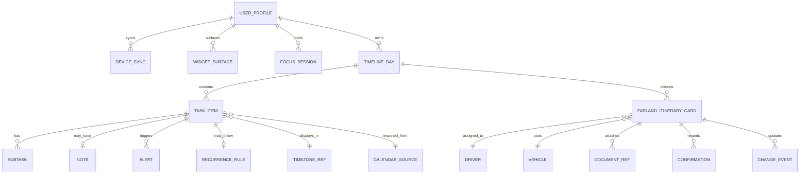
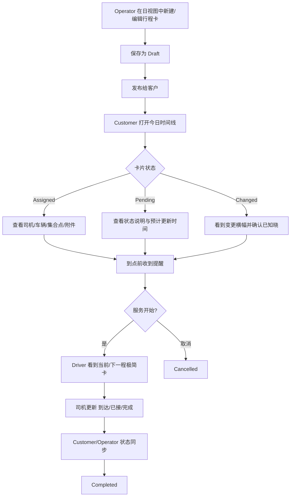
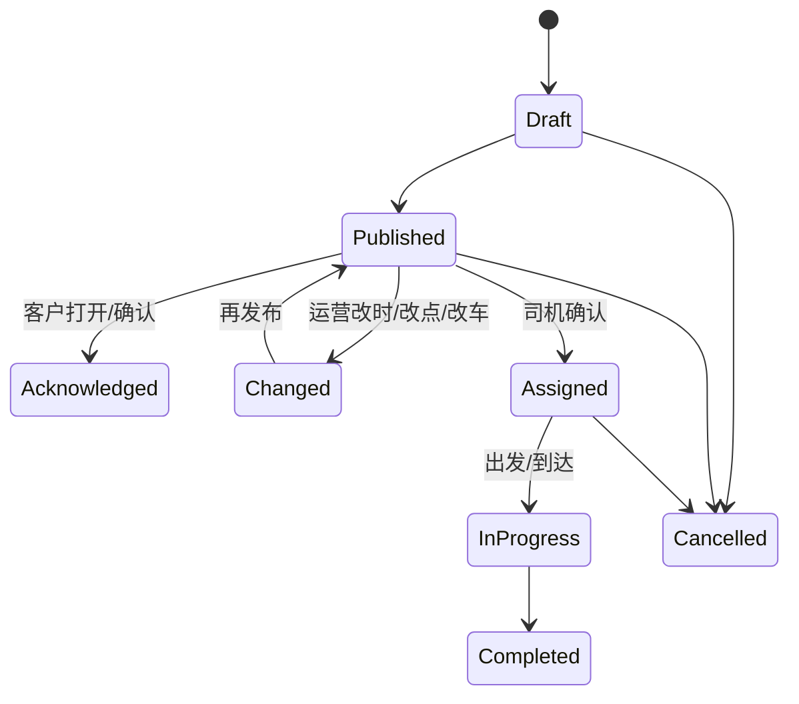

# Structured App UI 与用户行为逻辑研究报告

## 执行摘要

Structured 的官方定位不是会务或出行协作系统，而是一个以“单日可视化时间线”为核心的视觉日程规划产品：它把任务、提醒、习惯、导入日历、焦点计时器、再计划、桌面/锁屏挂件等能力，尽量收束到同一条时间线与同一套编辑语法里。它最有价值的设计资产，不在“功能多”，而在“单日信息如何被快速读懂”：顶部日期带、居中的竖向时间线、当前任务高亮、点击即编辑、拖拽即重排、未完成事项的再计划入口、以及跨设备的一致信息层级。官方站点、帮助中心、App Store 文案与 press kit 都反复强调这一点。citeturn2view0turn30view1turn39view0turn9view0

对 Farland 来说，Structured 最值得借鉴的，不是它的 AI、习惯养成或面向 ADHD 的品牌叙事，而是它把“今天发生什么、当前该关注什么、如果计划变化怎么办”压缩成低认知负担 UI 的能力。把这种逻辑转译成 Farland 的“每日用车行程卡”，会得到一条很清晰的产品方向：以“日视图时间线 + 当前/下一程高亮 + 卡片化详情抽屉 + 轻量变更确认 + 周条压缩预览”为中心，而不是把首页做成信息瀑布、表格式派车单、或者地图优先界面。citeturn39view0turn10view2turn26view0turn23view4

结合 GitHub 仓库 `violetwind123/farland-driver-quote-miniapp`，Farland 当前小程序已经具备与 Structured 接近的若干基础条件：客户首页已有 hero、今日 itinerary、timeline、transfer card、quote card；客户接送详情已采用 hero + 需求快照 + 状态卡 + 方案列表 + 活动流；运营页也已经进入“审核—报送客户—确认司机”的分阶段流程。换言之，Farland 不是从零开始做“行程卡”，而是从已有运价/接送流，向一个更强的“单日行程展示系统”收束。fileciteturn19file0L3-L3 fileciteturn7file0L3-L3 fileciteturn12file0L3-L3 fileciteturn13file0L3-L3 fileciteturn17file0L3-L3

## Farland 当前上下文与研究边界

从仓库可见，Farland 当前客户首页 `getCustomerHome` 返回的核心对象已经非常接近“日行程卡”骨架：`today_itinerary`、`trip_overview`、`transportation_appointments`、`charter_services`、`transfer_requests`、`transport_orders` 等对象同时存在，且 `today_itinerary.items` 已经用按时间排序的单日条目表达“酒店出发、访校、返程接送需求”等节点。前端 `customer/home` 页面又把这些数据渲染为头部 hero、日时间线、transfer/charter/benefit 等卡片，说明 Farland 已经拥有做单日用车视图的页面容器与视觉语言，只是信息结构还没有完全收束到“一个可持续扩展的日视图卡语法”上。fileciteturn19file0L3-L3 fileciteturn6file0L3-L3 fileciteturn7file0L3-L3 fileciteturn9file0L3-L3 fileciteturn11file0L3-L3

另一个关键背景是：Farland 的接送详情页已经天然接近 Structured 的“时间线 + 详情编辑”思路。`customer/transfer-detail` 页面有统一 hero、需求快照、运营状态、已确认司机信息、对客户可见的多个方案卡片、处理进度流，并且在 JS 中通过 7 秒轮询刷新状态；运营端 `operator/request-detail` 也通过 8 秒轮询刷新详情，并把司机报价拆成“拒绝报价 / 报送客户 / 选择司机 / 司机拒绝 / 确认司机”等动作。这意味着 Farland 最需要的不是再造一个新模块，而是把这些分散页面的状态表达与交互节奏统一到一个更像 Structured 的“单日主界面语言”里。fileciteturn12file0L3-L3 fileciteturn13file0L3-L3 fileciteturn14file0L3-L3 fileciteturn15file0L3-L3 fileciteturn16file0L3-L3 fileciteturn17file0L3-L3

本报告因此只做一件事：只研究 Structured 的 UI 与用户行为逻辑，并把这些模式直接映射到 Farland 的“每日车辆行程卡”。所有关于多人协作、司机回传、客户确认、文件附件、证件展示等内容，凡是 Structured 原生没有的，我都会明确标注为“Farland 扩展”，而不会把它伪装成 Structured 现成能力。Structured 的公开 API、数据库契约和内部性能指标并未公开，所以涉及数据结构与实现层的部分，均为基于官方 UI/帮助中心反推的高可信概念模型，而不是协议级真相。citeturn30view1turn5view2turn22view1

## 产品身份与界面清单

### 产品身份

Structured 的官方名称在 press kit 与 App Store 中分别写作 **Structured – Daily Planner** / **Structured: Daily Planner Todo**，开发者为 **unorderly GmbH**。它的目标人群在官方材料中非常明确：其一是需要“视觉时间线”而不仅仅是待办列表的用户；其二是 ADHD 用户、学生、忙碌的专业人士与创业者；其三是在日常规划、习惯建立、时间区块安排中需要低压可视化界面的用户。App Store 文案把这种定位写得非常直白：它强调“把任务与日历映射到一条视觉时间线”“为 ADHD 脑、忙碌专业人士和学生设计”；press kit 则补充了父母、学生、专业人士与创业者三类面向。citeturn39view0turn30view1

平台上，Structured 目前覆盖 iPhone、iPad、Mac、Apple Watch、Android 和 Web。帮助中心对各端说明得很细：iPhone 需要 iOS 17+，iPad 需要 iPadOS 17+，Mac 需要 macOS 14+，Apple Watch 文档写 watchOS 10 起可用但对 watchOS 10 有兼容问题并建议升级到 11/26，Android 帮助文档写 Android 11+；同时 Web 通过浏览器访问并依赖 Structured Cloud。press kit 的 fact sheet 还给出一个更宽的营销口径，写 Android 9+。对 Farland 设计评估而言，应优先采信帮助中心中的操作性文档：也就是把“Android 11+、Web 需网络与 Cloud”的约束看作当前更可信的运行前提。citeturn7view0turn7view1turn7view2turn7view3turn6view1turn6view0turn30view1

部署模式上，Structured 是典型的 freemium 跨端产品：核心功能可免费使用，部分进阶功能需要 Structured Pro；Web 登录与跨平台同步依赖 Structured Cloud，Apple 生态内部也保留 iCloud sync 作为旧路径。值得注意的是，它**不要求每个用户都先创建账号才能使用**；本地使用是允许的，只有需要跨设备时才进入 Structured Cloud 的邮箱验证码流程。这种“先本地、后同步”的门槛处理，对 Farland 非常有启发。citeturn39view0turn6view0turn25view1turn15view0

### 界面清单与截图参考

下表只列与 Farland“每日用车行程卡”最相关的界面，不做泛泛功能罗列。

| 界面/表面 | 结构特征 | 官方截图或说明参考 | 对 Farland 的直接意义 |
|---|---|---|---|
| 日视图时间线 | 顶部日期带 + 单日竖向时间线 + 当前任务高亮 + 底部 tab bar + 浮动加号 | 官方 press kit iPhone 截图可见日视图与底部导航；App Store 与帮助中心都把“visual timeline / drag-and-drop timeline”作为核心卖点。citeturn35view3turn30view1turn39view0 | 这是 Farland “今日用车卡”最应直接借用的主容器。 |
| 周视图 | 多天并列、任务压缩成纵向彩色胶囊，点击单项回到日视图 | 4.0 更新说明新增 Weekly View；帮助中心说明周视图通过拖拽/点击从日视图切换；官方截图展示压缩周视图。citeturn31view0turn10view2turn35view2 | 非常适合 Farland 做“本周行程 / 多城转场预览”，但应保持压缩，不要在周视图里塞太多详情。 |
| Inbox | 无日期/时间事项的临时存放处；大屏端为左侧展开的 split view | 官方文档说明 Inbox 在手机 tab bar，在 iPad/Mac/Web 位于左上并可展开为分屏；AppleInsider 也把它视为“先收集、后安排”的核心入口。citeturn10view1turn6view0turn7view1turn7view2turn19view0 | Farland 可把“待顾问确认 / 待客户确认 / 待司机回执”的未排定节点做成 Inbox 式缓冲池，而不是混进已定行程。 |
| 任务编辑器/详情页 | 点击任务即进入编辑器；字段顺序固定：标题、时间、时长、提醒、重复、能量、子任务、备注；底部主 CTA 明确 | 官方帮助文档逐步展示创建/编辑/删除任务；iOS26 press release 说明编辑器被重新设计；帮助截图还能看到大按钮式“Create Task”。citeturn9view0turn30view2turn36view3 | Farland 的行程卡详情也应采用“一个一致的编辑/查看抽屉”，而不是客户页、运营页、司机页各写一套字段顺序。 |
| 拖拽/重排 | 任务可在时间、日期、全部事项、Inbox、删除区之间拖动 | 官方文档明确拖拽可改时间、改天、转 all-day、移动到 Inbox 或删除。citeturn10view0 | Farland 不一定需要强拖拽，但非常需要 Structured 的“轻重排语义”，尤其用于延误/改点/司机变更。 |
| 再计划 Replan | 对未完成任务做二次处理：重排、放回 Inbox、完成、删除；支持 prompt 与通知 | 官方文档详细描述 Replan 的入口、四种处理动作与 prompt。citeturn26view0 | 这是 Farland “需求变更 / 司机取消 / 客户晚到”最值得借用的处理心理模型。 |
| Widget / 锁屏 / 焦点态 | 当前或下一任务在锁屏、桌面、StandBy、Focus 模式中以极简态展示 | Widget 文档写 timeline widget / inbox widget / lock screen widget；Focus 模式显示当前任务与倒计时；规划提醒文档写 morning planning / overdue reminders。citeturn23view4turn10view6turn27view0turn36view6 | Farland 在小程序里无法复制 iOS 原生组件，但可以把“当前/下一程”的 glanceable 逻辑移植到首页置顶卡和订阅消息。 |
| 设置/个性化 | App color、背景 Light/Dark、字体大小、OpenDyslexic、图标 | 帮助中心提供应用配色/背景/字体/无障碍设置；截图可见色板与浅深背景。citeturn23view3turn23view2turn37view0 | Farland 不需要把个性化做到这么深，但状态颜色、字体层级、浅深底色逻辑可以直接借用。 |
| Web / iPad / Mac 大屏界面 | 大屏侧重“左 Inbox + 右 Timeline”的双栏组织与键盘效率 | Web、iPad、Mac 文档都强调 Inbox 左置/左上展开和大屏操作。citeturn6view0turn7view1turn7view2 | Farland 的运营后台/H5 详情页，可直接采用双栏结构：左边待处理，右边当日行程。 |
| 地图页 | 在本次审阅的官方站点、帮助中心、press kit、App Store 文案中，未发现独立地图页 | 审阅范围内未见官方 map-first 界面描述。citeturn39view0turn30view1turn5view2 | Farland MVP 不宜把地图做成一级主界面；位置应先服务于“卡片理解”。 |

## 信息架构与交互逻辑

### 信息架构与数据模型

Structured 的信息架构非常克制。用户真正感知到的一级对象只有四类：**有时刻的 Timeline task**、**无具体时间的 All-day task**、**无日期的 Inbox task**、**循环的 Recurring task**。在此之上才叠加出 notes、subtasks、alerts、time zones、导入日历事件、widgets、focus、replan 等二级能力。其关键不是“任务类型很多”，而是所有对象最后都被还原为“某一天如何被占用、当前该看什么、未完成如何处理”。官方文档对这条主线的表达高度一致：创建任务由加号或空白时段发起；编辑由点击任务发起；移动由拖拽发起；未完成由 Replan 发起；跨设备则通过 Cloud/iCloud 保持同一时间线。citeturn9view0turn10view0turn26view0turn10view7turn10view8

这套架构对 Farland 的启发非常明确：不要把“接送单、包车段、司机信息、路线说明、文件附件、确认记录”分别做成孤立模块；应先把它们收束为**Day → Itinerary Item → Detail Drawer** 三层结构，然后再在 detail 中承载 driver、vehicle、documents、confirmations 等业务字段。Structured 没有公开 API schema，下面的模型是基于官方 UI/帮助中心反推的概念化表达，用来指导 Farland 的页面和数据契约设计，而不是声称这是 Structured 的真实后端结构。citeturn30view1turn22view1turn9view0

```json
{
  "timeline_day": {
    "day_id": "2026-06-03",
    "date": "2026-06-03",
    "timezone": "America/New_York",
    "summary_chips": ["today", "energy:medium", "3-items-left"],
    "items": ["task_1", "task_2", "task_3"],
    "inbox_count": 4,
    "current_item_id": "task_2",
    "surfaces": {
      "widget_mode": "current_or_next",
      "focus_mode_item_id": "task_2"
    }
  }
}
```

```json
{
  "task_item": {
    "task_id": "task_2",
    "kind": "timeline | all_day | inbox | recurring | imported_event",
    "title": "Visit Local Cafe",
    "icon": "coffee",
    "color_token": "green",
    "start_at": "2026-06-03T10:00:00-04:00",
    "end_at": "2026-06-03T10:49:00-04:00",
    "duration_min": 49,
    "timezone_mode": "floating | fixed",
    "timezone": "Europe/Paris",
    "alerts": [
      {"type": "at_start"},
      {"type": "before_start", "offset_min": 15}
    ],
    "subtasks": [
      {"title": "confirm location", "done": false}
    ],
    "notes": "address / phone / context",
    "source": "manual | calendar_import | reminders_import | ai",
    "status": "planned | running | done | missed"
  }
}
```

```json
{
  "farland_vehicle_itinerary_card": {
    "card_id": "itn_2026_06_03_001",
    "day_id": "2026-06-03",
    "kind": "pickup | transfer | standby | charter_segment | airport_meet",
    "title": "Boston College → Boston Marriott Cambridge",
    "status": "draft | published | acknowledged | assigned | in_progress | changed | completed | cancelled",
    "start_at": "2026-06-03T17:30:00-04:00",
    "end_at": "2026-06-03T18:20:00-04:00",
    "pickup": {
      "name": "Boston College",
      "meeting_point": "Main Gate",
      "latitude": null,
      "longitude": null
    },
    "dropoff": {
      "name": "Boston Marriott Cambridge"
    },
    "passengers": 3,
    "luggage": 3,
    "driver": {
      "driver_id": "drv_001",
      "display_name": "Driver D.",
      "phone": "+1 ...",
      "language": ["zh", "en"]
    },
    "vehicle": {
      "vehicle_id": "veh_001",
      "class": "Business SUV",
      "model": "Chevrolet Suburban",
      "plate_number": "Confirmed"
    },
    "documents": [
      {"type": "meeting_sign", "url": "..."},
      {"type": "voucher", "url": "..."}
    ],
    "confirmations": {
      "customer_ack_at": null,
      "operator_publish_at": "2026-06-03T11:18:00-04:00",
      "driver_accept_at": null
    },
    "change_log": [
      {"type": "time_changed", "at": "2026-06-03T15:10:00-04:00", "actor": "operator"}
    ],
    "alerts": [
      {"type": "T-60"},
      {"type": "driver_arrived"},
      {"type": "pickup_now"}
    ]
  }
}
```

下面这个 ER 图体现的是“Structured 原生的时间线语法”与“Farland 用车行程卡扩展”如何衔接：



结合 Farland 仓库看，这种抽象并不是空中楼阁：现有 `getCustomerHome` 已有 `today_itinerary.items`、`transfer_requests.quotes`、`transport_orders.driver` 等雏形；`getCustomerTransportQuotes` 又把 `request_summary`、`assigned_transport`、`quotes`、`customer_notice` 压成客户可消费对象，并限制最多返回三条可见方案。Farland 当前真正欠缺的，不是字段，而是一个统一的“day-centered card grammar”。fileciteturn19file0L3-L3 fileciteturn18file0L3-L3

### 用户旅程与微交互

Structured 原生是单用户产品，并不存在 Farland 意义上的 customer / organizer / driver / operator 多角色权限系统。它的原生 persona 本质上只有一个：**planner**。但它的交互语法可以被很自然地映射到 Farland 四类角色的不同视图层。为了避免“把 Structured 没有的东西说成它有”，下表明确区分“Structured 原生行为”与“Farland 应用映射”。citeturn25view1turn10view7

| 角色 | Structured 原生对应 | 可复用的交互逻辑 | Farland 映射 |
|---|---|---|---|
| Customer | 单用户查看当日日程 | 先看今天、再看当前项、点击展开详情、被动接收提醒 | 客户看到“今日用车时间线”，当前/下一程置顶，点击行程卡看司机/车辆/集合点/附件 |
| Organizer / Advisor | 规划者本人 | 用 Inbox 收集，再安排到具体日期/时段 | 顾问把待确认接送节点放在“待安排”池，确认后排到当日时间线 |
| Operator | 维护时间线的人 | 点开编辑器、修改字段、拖拽重排、Replan 未完成项 | 运营在后台编辑单日行程、处理变更、给客户发布更新版本 |
| Driver | 原生无此角色 | 当前任务高亮 + 提醒 + 极简 glance surface | 司机页面只保留当前/下一程、到达/上客/完成动作，不暴露客户侧复杂信息 |

Structured 的核心微交互非常统一。创建动作只有两条主路：点右下角大加号，或者在空白时段点 “Add Task”；编辑动作则是“点卡片开编辑器”；重排通过 drag-and-drop 实现，可以把任务拖到新时段、新日期、all-day 顶部区域、Inbox，甚至拖向删除区；未完成项的后处理由 Replan 负责，给用户四个简单决策：重排、回 Inbox、完成、删除。citeturn9view0turn10view0turn26view0turn36view0turn36view3

对 Farland 来说，这组行为逻辑应直接改写为：
运营创建或编辑行程卡时，不要把页面做成传统表单页，而应采用“点击卡片 → 统一抽屉/详情编辑器”；
客户端不要先进入详情列表，再选具体接送，而应先看到单日日程，再从当前或下一程进入详情；
司机端更不应该展示一个派车单列表，而应只展示此刻最相关的一张卡，并允许一两个状态动作。上面的逻辑，其实已经与 Farland 仓库中 `customer/transfer-detail` 的 hero + snapshot + quote options + activity，以及 `operator/request-detail` 的审核/报送/确认结构形成呼应，只差统一日视图承载层。fileciteturn12file0L3-L3 fileciteturn13file0L3-L3 fileciteturn17file0L3-L3

下面用一个 Farland 化 flowchart 表达 Structured 交互语法落地后的主流程：



而状态转换最好像 Structured 的 Replan 那样，尽量用少而稳的状态集合表达，而不是让用户在十几个业务状态里猜当前阶段：



边界情况上，Structured 有三类特别值得 Farland 借鉴。第一类是**时区**：它允许任务使用 floating time zone，也支持设置固定的异地时区；对旅行/跨城服务很关键。第二类是**导入对象不可随意改写**：导入日历事件可显示、可通知，但在某些二次流程中不可像原生任务那样自由处理。第三类是**平台差异公开化**：Android 与 Web 缺失某些功能时，帮助中心会明确写出，而不是让用户踩坑。这种诚实的能力矩阵，对 Farland 的小程序与后台协同同样重要。citeturn38view0turn10view8turn10view0turn10view2turn10view6

## 视觉层级与系统行为

### 视觉层级与可供性

Structured 的视觉层级不是靠厚重装饰建立的，而是靠极少数强约束完成。最上层是**日期与时间范围**：顶部日期条把“今天处于哪一天/哪一周”在导航前置；第二层是**当前任务**：当前项会用剩余时间、不同底色或更强轮廓突出；第三层才是任务文本、图标与右侧完成控件。官方截图中，颜色不是用来代表复杂状态机，而是用来支持扫读、分组和当前项识别；帮助中心和 App Store 也不断强调 color coding、icons、visual timeline、focus timer 这些“看一眼就知道今天怎么过”的 affordance。citeturn35view3turn35view2turn39view0turn19view0

在控件布局上，Structured 有两个特别强的规律。其一，**高频主操作永远固定**：底部 tab bar 承担一级导航，右下浮动加号承担创建，几乎不漂移；4.0 之后官方还把控制入口从顶部移到底部，以提高可达性。其二，**详情编辑器的 CTA 永远在底部收口**，像 `Create Task` 这种大按钮给用户非常明确的结束点。这种“创建入口固定、一级导航固定、表单出口固定”的手法，对 Farland 特别重要，因为一旦客户和司机在不同状态页里看到不一致的主按钮，他们会把“确认”“查看详情”“联系顾问”“刷新状态”当成不同层级的动作，认知成本会迅速上升。citeturn31view0turn36view0turn36view3

Structured 的大屏逻辑也很成熟：iPad、Mac、Web 不是简单把手机页拉宽，而是把 Inbox 抽到左侧，把 Timeline 留在主区，形成“缓冲区 + 主日程区”的双栏布局。这个模式对 Farland 后台非常有价值。运营后台完全可以把“待确认变更 / 待司机回执 / 待客户确认”放左栏，把“当日时间线与行程卡详情”放右栏。这样既不像传统 CRM 那样割裂，也比一屏堆满字段更接近用户心智。citeturn6view0turn7view1turn7view2

需要注意的是，Structured 并不依赖大面积折叠区或复杂手势来隐藏信息。它更偏向**默认只显示最需要看的层次**，更深入的信息靠点击任务进入编辑器或详情，而不是把页面做成多层 accordion。对 Farland，这意味着“行程卡默认态”必须极短，只保留时间、路线、状态、当前关注点；司机电话、meeting point 图片、凭证文件、服务说明都应该进入同一详情抽屉，而不是首页展开。citeturn9view0turn35view3turn36view3

### 通知与实时更新逻辑

Structured 的通知系统是“**以任务对象为中心**”而不是“以消息线程为中心”。它支持 push notifications 与 alerts；Apple 端允许更换通知声音、为单个任务配置单独声音、设置开始/结束/提前提醒；Android 端则默认支持开始、结束、开始前 1 小时，并可加新提醒；all-day 任务默认在当天 8:00 提醒；导入的日历/Reminders 项可以决定是否通知，但提醒时点受外部源控制。与此同时，Structured 还把“Morning Planning”和“Overdue Reminders”做成规划层提醒，而不是每条任务都轰炸。citeturn10view3turn24view4turn27view0

更重要的是，Structured 把“通知之后的第二落点”设计得很轻。通知之外，用户还能通过 lock screen widget、home screen widget、Focus Mode、StandBy/Live Activities 之类的表面快速确认当前或下一任务，而不必回到复杂主页面。帮助中心甚至说明了锁屏 widget 可直接打开任务，某些组件还能直接勾选完成。这告诉 Farland：如果要做“实时更新”，不该把所有变化都塞进聊天消息或长 activity log；更好的方式是让“当前/下一程卡”的展示状态即时变化，Push 只是把用户拉回这张卡。citeturn23view4turn10view5turn10view6turn39view0

但必须明确：Structured 不是多人协作产品。官方同步文档明确写出它**还不能与其他 Structured 用户共享数据或协作**。因此，像 message targeting、read receipts、多角色广播、失败重试队列、已读回执这类会务/出行协作系统常见设计，并不是 Structured 提供的能力。基于当前文档，Structured 的通知更接近“单用户提醒系统”，而不是“多方协同消息系统”。对 Farland 的意义是：可以借它的“事件驱动提醒 + 当前卡面更新”模式，但不能照抄到多人业务上，Farland 还必须自己建立 operator / customer / driver 的事件投递、确认与冲突处理机制。citeturn25view1turn10view3turn24view4

结合 Farland 当前仓库，这一点更关键。Farland 现有客户接送详情页用 7 秒轮询刷新、运营详情页用 8 秒轮询刷新，而且 `getCustomerTransportQuotes` 本身只返回最多三条客户可见报价并写入审计日志。也就是说，Farland 今天已经不是“无状态静态页面”，而是简化版实时系统。Structured 的启发不是替代这套机制，而是告诉 Farland：**轮询/推送更新后，用户第一眼应该看到什么**。答案应该是一张状态被更新过的“当前/下一程卡”，而不应是刷新后重排的大列表。fileciteturn12file0L3-L3 fileciteturn15file0L3-L3 fileciteturn18file0L3-L3

### 权限、安全、离线与同步

Structured 的权限模型很轻：默认没有复杂角色，也**不强制注册账号**。本地数据会存在设备上；如果启用 iCloud 或 Structured Cloud，数据才进入同步路径。Structured Cloud 使用邮箱 + 6 位验证码登录，Web 也沿用同一邮箱账户体系；iCloud 则是 Apple 生态旧同步路径。帮助中心还明确说明两种同步路径不能混用，同时当前不支持与他人协作共享数据。citeturn15view1turn25view1turn25view0

安全上，Structured 的公开做法非常值得 Farland 参考。其一，iOS 端支持 Face ID / passcode 锁定应用，并提醒用户开启后通知预览和 Spotlight 内容会被抑制。其二，隐私条款说明：本地输入的 tasks / notes / activities 默认存于本机；只有启用 iCloud 或 Structured Cloud 时，数据才被用于同步；Structured Cloud 服务器位于法兰克福；匿名分析默认可关。其三，AI 使用场景被单独揭示：Structured AI 使用外部服务（帮助中心写的是 OpenAI），AI 输入可能被发送到 Structured 与 OpenAI 服务器，并可保存最长 30 天以改进该功能。citeturn10view10turn22view1turn22view0turn26view1

离线行为方面，官方没有给出系统化“offline-first”说明，所以不能把它说成完整离线产品。高可信结论只有两条：Web 端明确要求稳定网络；本地任务数据默认在设备上存储，因此移动端至少具备“非纯云渲染”的本地数据基础。更精确的离线队列、冲突合并、重连回写机制，在公开文档中没有被详细说明。对 Farland 来说，这意味着：如果未来在小程序里要做“司机离线打点 / 弱网签收 / 机场落地后网络恢复再同步”，不能假设 Structured 提供现成可复制的实现，只能借鉴它的“本地心智 + 同步作为附加层”原则。citeturn6view0turn22view1turn15view0

### 性能、可访问性与本地化

虽然 Structured 没公开性能指标，但从它的 UI 组织方式可以看出明显的性能取舍：主视图牢牢围绕“一个 day”；周视图通过压缩为图标/胶囊降低信息密度；Widget 只展示 current/upcoming；Replan 只处理未完成项；Web 版先要求 Cloud 和网络，再提供更完整的大屏编辑能力。这些做法共同指向一个原则：**永远不要在首屏让系统渲染超过“用户现在要处理”的那一层数据**。citeturn10view2turn23view4turn26view0turn6view0

把这个原则映射到 Farland 的小程序，就会得到很具体的工程要求。首页只加载“今日与下一日的时间带 + 当前/下一程卡 + 必要状态”；长周期数据只在用户向下滚动或切换周条时再取；文档图片与 meeting point 图片必须懒加载；活动流要折叠，只在详情中展开；司机/客户/运营共享同一张业务卡的数据骨架，再按角色裁剪字段，而不是三套几乎重复的对象。Farland 仓库当前已经有很好的苗头：客户报价云函数只返回最多三条客户可见方案；客户详情与运营详情都已有 polling 与局部刷新心智。下一步要做的是把“节流”扩展到 day-card 体系，而不是只用在报价列表。fileciteturn18file0L3-L3 fileciteturn12file0L3-L3 fileciteturn15file0L3-L3

在可访问性上，Structured 的官方口径比很多同类产品都清晰：App Store 明写支持 VoiceOver、Voice Control、dyslexia-friendly font 和多语言；帮助中心进一步写到字体大小可跟随设备、可减少透明度与动效、可使用 OpenDyslexic 字体；锁屏/StandBy/Widget 等表面也强化了 glanceability。对于 Farland，这意味着“高级感视觉”不能以牺牲识别性为代价。实际落地时，时间、状态、司机名、集合点四个字段必须在高对比模式下仍可读，且颜色不能成为唯一状态编码。citeturn39view0turn23view2turn23view3

在本地化上，Structured 官方 marketing 口径写 30+ languages，App Store 页面写 English + 27 more；同时帮助中心提供时区设置、floating time zone 和跨时区显示逻辑。对于 Farland 这样的跨城跨国服务场景，这一点非常关键：时间显示必须区分“当地时间”“服务地时间”“客户设备时区”；集合点与司机联系信息应允许双语标签；状态文案则应短而一致。Structured 在这方面给出的不是“地图导航式”方案，而是“时间标签优先”的方案，这正适合 Farland 的一日用车行程卡。citeturn30view1turn39view0turn38view0

## 面向 Farland 日用车行程卡的落地建议

### Structured 模式到 Farland 功能的映射

下面是最值得直接借用的 UI 模式，不做横向比较，只讨论 Structured → Farland 的一对一映射。

| Structured 模式 | Farland 应落地为 | 说明 |
|---|---|---|
| 单日竖向 Timeline | 今日用车时间线首页 | 用“时间 + 路线 + 当前状态 + 关键动作”组织今天，而不是先显示订单列表。citeturn35view3turn39view0 |
| Current item 高亮 | 当前/下一程大卡 | 对客户与司机都应该优先显示“现在最重要的一程”；其他历史/未来节点压缩。citeturn35view3turn23view4 |
| Inbox | 待安排/待确认池 | 顾问未最终确认的接送需求、待司机回执事项不进入已定时间线。citeturn10view1turn6view0 |
| Task editor | 行程卡统一详情抽屉 | 统一字段顺序：时间、路线、乘客/行李、司机/车辆、说明、附件、确认动作。citeturn9view0turn36view3 |
| Drag & Drop / Replan | 改时改点与异常处理 | 让运营通过“改单/重排”而非纯文本解释异常；客户侧只看到变更横幅与新版卡。citeturn10view0turn26view0 |
| Weekly compressed view | 本周多城/多段预览 | 仅供预览，不在周视图展示司机电话、附件等细节。citeturn10view2turn35view2 |
| Widgets / Planning reminders | 首页置顶卡 + 订阅消息 | 在小程序里替代 iOS widget/live activity 的“低摩擦提醒”角色。citeturn23view4turn27view0 |
| Bottom tab + fixed CTA | 稳定的信息架构 | 客户、司机、运营三端都要固定主操作位置，避免状态切换后按钮漂移。citeturn31view0turn35view3 |

### 优先级路线图

| 阶段 | 建议实现 | 目标 |
|---|---|---|
| MVP | 单日时间线首页；当前/下一程卡；三类状态卡（已确认、待确认、已变更）；统一详情抽屉；手动刷新；客户变更确认按钮；司机只读极简卡 | 先把“今天发生什么”做清楚 |
| P1 | 周条压缩预览；运营端双栏视图；变更横幅与时间线标记；行程附件区；司机到达/已接/完成回传；订阅消息 | 让“变化如何被理解”变清楚 |
| P2 | 异常 Replan 流；顾问快速模板；AI 从顾问备注/文档提取行程草稿；跨时区显示；离线缓存与冲突提示；更丰富的 document surfaces | 让“编辑成本降下来”且可扩展 |

### 具体 UI 建议

Farland 的首页建议采用“两层式结构”。第一层是顶部日条与当日摘要：日期、城市、是否跨城、是否已有司机确认、是否有变更。第二层是日时间线：把每一段用车都视作 timeline item，采用统一卡语法。每张卡的默认态只保留五类字段：时间、路线、状态 pill、当前关键说明、下一动作。点击后才进入详情抽屉。这样能最大限度借到 Structured 的“扫读效率”。citeturn35view3turn35view2turn9view0

在卡片状态上，建议 Farland 不要直接复用报价流里的全部状态词，而是做用户可理解的可视状态。最少应保留：
**已确认**：展示司机/车辆/meeting point；
**待确认**：展示 Farland 正在协调/司机待回复/客户需确认；
**已变更**：显式展示“时间/地点/司机有更新”，并把变更原因与新版本时间写进详情。
这种做法不是把 Structured 的 task status 搬过来，而是借它“状态少而明显、当前任务显著”的哲学。citeturn39view0turn26view0

在详情抽屉字段顺序上，建议严格固定，不要不同卡类型随意变。推荐顺序是：
时间与时区 → 上下车点与 meeting point → 乘客/行李 → 司机/车辆 → 特殊说明 → 附件/凭证 → 操作区。
Structured 的编辑器之所以好用，并不是字段少，而是顺序非常稳定，用户几乎形成肌肉记忆。Farland 也应追求这一点。citeturn9view0turn30view2

在运营端，建议把当前 `operator/request-detail` 中“报送客户 / 选择司机”的流，进一步整合进“日视图编辑器”：运营看到的不是一个个分散订单，而是当日用车时间线；点击某一程后打开编辑抽屉，里面可以换司机、改时间、添加附件、发布更新。这样客户侧与运营侧会天然共享一套卡语法，只是字段权限不同。Farland 现有 repo 已经证明审核—发布—确认是分层存在的，下一步只需把这些动作挂接到统一日视图容器中。fileciteturn16file0L3-L3 fileciteturn17file0L3-L3

### 风险判断

最大的风险不是“功能做不完”，而是**把 Structured 的单用户轻量体验误译成 Farland 的多人业务流程**。Structured 没有协同权限、没有多人消息路由、没有读回执，也没有司机-客户-运营三方状态冲突；Farland 全都有。因此，可迁移的是**信息组织与交互节奏**，不是权限系统本身。citeturn25view1turn10view3

第二个风险是**时间线过载**。Structured 之所以清楚，是因为它永远强调“今天”而不是“所有历史”。Farland 一旦把报价、接送、包车段、顾问备注、酒店安排、活动节点全部塞进主时间线，首页会迅速退化成 CRM 列表。建议主时间线只纳入“对客户/司机此刻有行为意义的节点”，把其他信息压入详情抽屉或辅助分区。citeturn39view0turn10view2

第三个风险是**小程序平台能力与原生平台能力差异**。Structured 的焦点模式、锁屏 widget、Live Activities、Face ID 原生锁定、Apple Watch complication 都是系统级能力。Farland 小程序不能直接复制这些表面。正确的做法是提炼其“glanceable state”思想，再用小程序能力重做，而不是追求像就行。citeturn23view4turn10view6turn10view10

## 开放问题与局限

本研究的高可信结论都来自 Structured 官方站点、帮助中心、App Store、官方 press kit，以及少量英文评测；但仍有几项公开材料没有覆盖清楚。第一，Structured 没有公开 API 或数据库契约，所以文中的 schema 与 ER 图是概念模型。第二，官方没有系统阐明完整离线机制、同步冲突策略、通知送达重试语义，因此相关部分只能做边界推断。第三，在本次审阅的官方材料里没有发现独立地图页，所以“地图非主界面”是基于已审阅材料的研究结论，而不是对产品所有版本的绝对断言。citeturn22view1turn6view0turn39view0turn30view1

对 Farland 项目本身，当前最值得尽快确认的开放问题不是 Structured，而是你们自己的业务取舍：每日主时间线到底只面向客户，还是同时服务客户/司机/运营三端；“待确认”是否要进主时间线；附件与 meeting point 图片是首页可见还是仅详情可见；以及客户是否需要明确的“已知晓变更”动作。这四个决定，会直接决定你们能否真正把 Structured 的“低负担单日时间线”翻译成一张可持续演进的 Farland 用车行程卡。fileciteturn19file0L3-L3 fileciteturn12file0L3-L3 fileciteturn17file0L3-L3