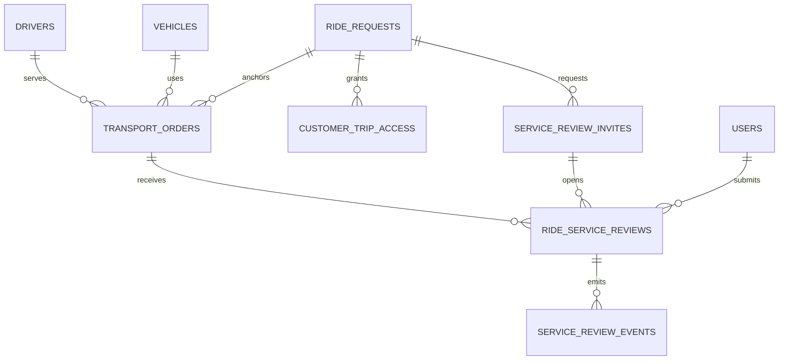
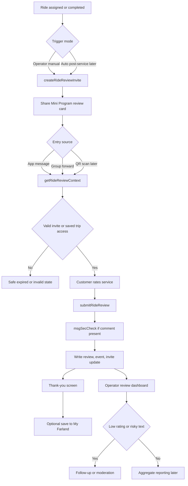

# P5 Service Review System Plan

## 1. Product Positioning

The P5 review system is a Farland-controlled service feedback flow for completed or near-completed transportation service.

It is not a public driver rating marketplace, ride-hailing score wall, or open supplier review board. The customer is reviewing the delivered Farland service experience, not raw driver bidding or internal supplier operations.

Recommended product name:

```text
Farland Service Review
```

Primary customer question:

```text
How was this Farland ride / transport service?
```

Primary operator question:

```text
Did this service need follow-up, recovery, or supplier quality action?
```

## 2. Current Product Fit

The current mini-program already has the primitives needed for a controlled review flow:

- operator-created customer share paths
- invite-bound temporary customer access
- explicit customer trip binding through `claimCustomerInvite`
- customer-safe request and transport projections
- customer My Trip surface
- operator request detail surface
- assigned transport snapshots through `transport_orders`
- audit-oriented cloud function style

The review system should extend these patterns. It should not introduce frontend direct database access or a separate public review surface.

## 3. Naming Boundary

Do not overload existing quote-review names.

Existing meaning:

```text
reviewDriverQuote = operator reviews internal supplier / driver quote
```

New service-review concepts must use a distinct namespace.

Recommended collections:

- `ride_service_reviews`
- `service_review_invites`
- `service_review_events`
- optional later: `service_review_aggregates`

Recommended cloud functions:

- `createRideReviewInvite`
- `getRideReviewContext`
- `submitRideReview`
- `listRideReviewsForOperator`
- `moderateRideReview`
- optional later: `getRideReviewMetrics`

Avoid ambiguous names:

- `review`
- `submitReview`
- `reviewDetail`
- `customerReview`

## 4. Phase One Scope

P5 phase one should be a small operator-triggered MVP.

Include:

- operator manually creates a review invite for a completed or assigned transport service
- customer opens a dedicated review card page from a WeChat share card
- customer sees a safe service summary
- customer submits one rating
- customer may choose quick feedback tags
- customer may add optional text
- system records `OPENID` from the cloud function
- operator can see review status and submitted review summary

Do not include in phase one:

- automatic post-service push
- public testimonial wall
- supplier-facing review dashboard
- QR poster generation
- group companion multi-review mode
- aggregate analytics dashboard
- payment-linked review incentives
- full customer service ticketing
- AI sentiment analysis

## 5. Recommended Entry Model

Use a hybrid entry model.

### Dedicated Review Card

This is the default entry for phase one.

Operator creates and shares:

```text
/pages/customer/review-card/review-card?request_id=xxx&invite_code=xxx
```

This mirrors the current customer invite model and supports temporary customers who have not saved the trip.

### My Trip Inline CTA

For customers who already saved the trip, My Trip can show a secondary CTA:

```text
评价本次用车
```

This should call the same review context and submission functions. It should not create a second review system.

### QR Code

QR code entry is useful later for offline handoff, hotel desk support, or cross-device completion. Do not include it in phase one.

## 6. Identity Model

Use invite-bound identity by default.

Internally record:

- `submitted_by_openid`
- `submitted_by_user_id` if a customer profile exists
- `customer_trip_access_id` if the trip is saved
- `review_invite_id`
- `request_id`
- `transport_order_id` when available

Externally display:

- customer display name if already known and safe
- otherwise `Farland Guest`

Do not require the customer to save the trip before submitting feedback.

Do not treat a review submission as customer profile binding.

Do not trust frontend-provided `openid`.

## 7. Service Anchor

The preferred review anchor is:

```text
transport_orders
```

Reason:

- it represents the assigned customer-facing transport service
- it carries customer-safe driver / vehicle snapshots
- it is the natural post-service review target

However, current implementation history shows that `transport_orders` may not always be fully reliable if assignment snapshot writes fail.

Phase one must therefore choose one of these before implementation:

1. Stabilize `selectDriverQuote` so `transport_orders` is a dependable canonical assignment anchor.
2. Allow review records to use `request_id` as a fallback anchor when `transport_order_id` is missing.

Recommended MVP decision:

```text
Use transport_order_id when available.
Fallback to request_id only for phase one compatibility.
```

Do not expose this fallback to customers.

## 8. Data Model

### `service_review_invites`

Purpose:

Stores shareable review entry tokens and invite policy.

Required fields:

```js
{
  invite_code,
  request_id,
  transport_order_id,
  review_cycle_no,
  invite_policy,
  status,
  share_path,
  allow_group_forward,
  max_distinct_openids,
  created_by,
  created_by_openid,
  expires_at,
  first_opened_at,
  first_submitted_at,
  claimed_primary_openid,
  created_at,
  updated_at
}
```

Allowed statuses:

- `active`
- `submitted`
- `expired`
- `revoked`

### `ride_service_reviews`

Purpose:

Canonical submitted service review record.

Required fields:

```js
{
  request_id,
  transport_order_id,
  review_cycle_no,
  review_type,
  submission_status,
  moderation_status,
  visibility_status,
  access_source,
  review_invite_id,
  customer_trip_access_id,
  submitted_by_openid,
  submitted_by_user_id,
  customer_identity_mode,
  display_name_snapshot,
  service_snapshot,
  rating_overall,
  quick_tags,
  comment_text,
  operator_followup_status,
  operator_followup_owner,
  operator_followup_note,
  idempotency_key,
  submitted_at,
  created_at,
  updated_at
}
```

`service_snapshot` must be customer-safe and may include only:

- service date
- pickup
- dropoff
- route summary
- driver name if already customer-visible
- vehicle model if already customer-visible

### `service_review_events`

Purpose:

Immutable review lifecycle event log.

Recommended events:

- `review_invite_created`
- `review_invite_opened`
- `review_started`
- `review_submitted`
- `review_comment_blocked`
- `operator_review_viewed`
- `operator_followup_added`
- `review_invite_revoked`

## 9. Index Checklist

Recommended indexes:

- `service_review_invites.invite_code` unique
- `service_review_invites(request_id, status, created_at desc)`
- `ride_service_reviews(request_id, review_cycle_no, submitted_at desc)`
- `ride_service_reviews(transport_order_id, submission_status, updated_at desc)`
- `ride_service_reviews(submitted_by_openid, request_id)`
- `ride_service_reviews.idempotency_key` unique
- `service_review_events(review_id, created_at asc)`

## 10. Cloud Function Contracts

### `createRideReviewInvite`

Operator-only.

Inputs:

```js
{
  request_id,
  transport_order_id,
  review_cycle_no,
  invite_policy,
  expires_in_days
}
```

Returns:

```js
{
  success,
  code,
  review_invite_id,
  invite_code,
  share_path,
  expires_at,
  reused
}
```

Rules:

- require operator or super_admin role
- validate request exists
- validate service is assigned, completed, or otherwise eligible
- reuse active invite when appropriate
- never expose internal driver quote data

### `getRideReviewContext`

Customer-facing.

Inputs:

```js
{
  request_id,
  invite_code
}
```

Returns:

```js
{
  success,
  code,
  access_source,
  review_status,
  can_submit,
  service_summary,
  review_form
}
```

Rules:

- authorize through valid review invite or saved trip access
- read `OPENID` from `cloud.getWXContext()`
- return customer-safe service summary only
- return expired / revoked states safely

### `submitRideReview`

Customer-facing.

Inputs:

```js
{
  request_id,
  invite_code,
  idempotency_key,
  rating_overall,
  quick_tags,
  comment_text,
  display_name,
  source_share_type
}
```

Returns:

```js
{
  success,
  code,
  review_id,
  submission_status,
  moderation_status,
  message
}
```

Rules:

- require valid invite or saved trip access
- require rating from 1 to 5
- allow optional tags
- allow optional comment with max length
- use idempotency guard for double taps
- one review per `request_id + review_cycle_no + OPENID` unless companion mode is explicitly enabled
- write review, update invite, and write event in one transaction where possible

### `listRideReviewsForOperator`

Operator-only.

Purpose:

Show review status and submitted feedback on operator screens.

Must not expose:

- customer private phone unnecessarily
- raw driver quote pool
- supplier private notes
- company margin

### `moderateRideReview`

Operator or super_admin only.

Purpose:

Update moderation and follow-up state.

Phase one can keep this minimal or defer it if all reviews remain internal-only.

## 11. Customer Review Page

Future page:

```text
miniprogram/pages/customer/review-card/review-card
```

Recommended structure:

1. service summary
2. overall rating
3. quick feedback tags
4. optional comment
5. submit button
6. thank-you state

Suggested Chinese copy:

- `这次 Farland 用车体验如何？`
- `大约 20 秒完成，您的反馈将帮助 Farland 优化后续服务。`
- `提交反馈`
- `感谢反馈，Farland 已收到您的评价。`
- `还有什么想告诉 Farland 的？选填。`
- `准时到达`
- `车辆整洁`
- `乘坐舒适`
- `司机专业`
- `沟通顺畅`
- `需要跟进`

The default action should never be `联系司机`.

## 12. Operator UI

Phase one operator entry point:

```text
pages/operator/request-detail/request-detail
```

Add later:

- create review invite
- copy / share review card
- review submitted status
- low-rating follow-up status

Do not add this until the P5 cloud functions are implemented.

## 13. Visibility And Sensitive Information Rules

Customer review pages must not show:

- raw `driver_quotes`
- other driver quotes
- driver internal cost
- company margin
- internal notes
- operator internal notes
- supplier private notes
- driver phone before assignment is customer-visible
- plate number before assignment is customer-visible
- full operator audit trail

The review context should be a customer-safe projection, not a raw `ride_requests` or `transport_orders` dump.

## 14. Moderation And Abuse Controls

Phase one should be structured-first:

- rating is required
- quick tags are optional
- text comment is optional
- text length should be limited

If comment moderation is enabled:

- run text through WeChat content safety in the cloud function
- block or mask unsafe text
- preserve numeric rating if policy allows
- mark moderation state clearly

Recommended moderation states:

- `not_needed`
- `pending`
- `passed`
- `blocked`
- `masked_internal_only`

Recommended abuse guards:

- duplicate submit detection
- expired invite rejection
- revoked invite rejection
- too many OPENIDs for single-response invite
- idempotency replay handling

## 15. QA Checklist

Manual QA before release:

- operator creates review invite from eligible request
- active invite can be reused or versioned intentionally
- customer opens valid review card
- safe service snapshot displays
- expired invite shows safe expired state
- revoked invite shows safe unavailable state
- rating submission succeeds
- double tap creates only one review
- second OPENID on single-response invite is blocked or read-only
- optional comment length limit works
- unsafe text is blocked or masked if content safety is enabled
- operator can see submitted review
- low rating can be flagged for follow-up
- saved-trip entry reaches same review record

Security QA:

- no frontend `wx.cloud.database()`
- no frontend OPENID trust
- customer page does not read `driver_quotes`
- customer page does not expose internal cost, margin, or notes

## 16. Rollout Plan

### Phase P5-0: Planning

Create this product and technical plan.

### Phase P5-1: Manual Review Invite MVP

Implement:

- `service_review_invites`
- `ride_service_reviews`
- `service_review_events`
- `createRideReviewInvite`
- `getRideReviewContext`
- `submitRideReview`
- customer review card page
- operator request-detail entry point

### Phase P5-2: My Trip Inline CTA

Add review CTA to My Trip for saved-trip customers.

### Phase P5-3: Automation And QR

Add:

- automatic post-service invite
- QR code poster
- recent-service backfill with dry run

### Phase P5-4: Metrics

Add:

- response rate
- median rating
- low-rating rate
- unresolved follow-up count
- supplier / region / route quality rollups

## 17. Out Of Scope For P5-1

Do not implement in the first review MVP:

- public review wall
- supplier-facing review portal
- payment rewards
- automatic AI sentiment scoring
- full CRM ticket system
- live map replay
- broad historical backfill
- external spreadsheet sync
- customer driver marketplace ranking

## 18. Pre-Implementation Checklist

Before writing P5-1 code, confirm:

- current RC and P4 customer itinerary QA is stable
- `transport_orders` behavior is reliable enough, or request fallback is accepted
- review naming is approved
- collections and indexes are approved
- text moderation policy is decided
- operator-only management permissions are clear
- no conflict with `reviewDriverQuote`

## 19. Recommended Next Task

After this document is reviewed, the next implementation task should be:

```text
P5-1A: Create service review cloud function skeleton and collection contract
```

Keep the first code PR backend-only or page-only, not both, unless the scope is explicitly approved.

## 20. Complete Research Findings To Preserve

The research report should be treated as the baseline for P5 planning. The following findings must remain visible when later implementation tasks are created.

### Current repo primitives

The mini-program already has:

- path-based customer sharing from operator pages
- invite-bound temporary customer access
- persistent trip access after explicit claim
- customer-safe cloud function projections
- customer home and transfer detail pages
- operator request detail and dashboard pages
- driver quick quote token flow
- `audit_logs` usage across action-oriented cloud functions

Therefore the review system should reuse the existing Farland service card model instead of introducing a separate public review app.

### Customer access pattern

The review flow should follow the same broad model as customer invite access:

```text
operator creates invite
-> customer opens Mini Program card
-> customer sees customer-safe context
-> customer submits action
-> optional save / profile continuity remains separate
```

Submitting a review must not silently create a customer profile.

### Privacy boundary

The review context is a projection layer. It should never be a raw database document returned to the frontend.

Customer-safe review context may include:

- service date
- pickup and dropoff
- route summary
- customer-visible service status
- customer-visible driver name after assignment
- customer-visible vehicle model after assignment

Customer-safe review context must not include:

- raw `driver_quotes`
- other suppliers or candidate drivers
- internal cost
- company margin
- internal notes
- operator-only remarks
- supplier private notes
- unconfirmed driver phone
- unconfirmed plate number

### Documentation drift risk

The code already uses `transport_orders` in assigned transport display flows, while some older documents still describe the full transport order backend as future scope. P5 implementation tasks should not rely on stale documents that say customer quote or transport order flows do not exist.

Before coding P5, confirm the current behavior from source files and current product docs.

### Naming collision risk

The term `review` already appears in the driver quote lifecycle as operator review of supplier quotes. P5 must keep customer service feedback vocabulary separate.

Use:

- `service review`
- `ride service review`
- `feedback`
- `service_review_invites`
- `ride_service_reviews`

Do not use generic `review` names for cloud functions or pages when a more precise service-review name is available.

## 21. Product Model Comparisons

### Entry model comparison

| Option | Strengths | Weaknesses | Recommendation |
|---|---|---|---|
| Inline only inside My Trip | Clean for saved-trip customers | Fails temporary invite users and operator-triggered outreach | Not enough |
| Dedicated review card only | Best for forwarding, operator share, and QR | Slightly more navigation overhead for saved-trip customers | Good foundation |
| Dedicated card plus My Trip CTA | Covers temporary invite, saved trip, forwarding, and operator outreach | Slightly larger implementation scope | Recommended |

### Identity model comparison

| Model | Customer friction | Auditability | Abuse resistance | Follow-up capability | Recommendation |
|---|---:|---:|---:|---:|---|
| Fully anonymous | Lowest | Weak | Weak | Weak | Do not use |
| Invite-bound alias | Low | Strong | Good | Good | Recommended default |
| Fully profile-bound | Medium | Strong | Strong | Strong | Optional upgrade |

The default should be invite-bound alias:

```text
internal identity = OPENID + invite + request/order
external label = display name or Farland Guest
```

### Trigger model comparison

| Trigger | Use case | Pros | Cons | Recommendation |
|---|---|---|---|---|
| Operator-triggered | VIP follow-up, manual pilot, service recovery | Highest control | Manual work | Use in phase one |
| Automatic post-service | Standardized review coverage | Better response coverage | Requires stable completion state and throttling | Phase two |
| Re-engagement batch | Recent historic completed rides | Useful launch seed | Lower quality if too old | Recent window only |

Phase one should stay operator-triggered because it has the lowest operational risk.

## 22. Entity Relationship Model

Recommended conceptual relationship:



Implementation note:

- `ride_requests` remains the broad service/request anchor.
- `transport_orders` is the preferred post-assignment anchor.
- `service_review_invites` controls access policy and share path.
- `ride_service_reviews` stores canonical submitted feedback.
- `service_review_events` stores immutable lifecycle events.

## 23. Complete Document Shape Examples

### `ride_service_reviews`

```json
{
  "_id": "srvrev_01J...",
  "request_id": "req_01J...",
  "transport_order_id": "ord_01J...",
  "review_cycle_no": 1,
  "review_type": "post_service",
  "submission_status": "submitted",
  "moderation_status": "pending",
  "visibility_status": "internal_only",
  "access_source": "temporary_invite",
  "review_invite_id": "rinv_01J...",
  "customer_trip_access_id": "",
  "submitted_by_openid": "oA123...",
  "submitted_by_user_id": "usr_01J...",
  "customer_identity_mode": "invite_bound_alias",
  "display_name_snapshot": "Ms. Wan",
  "service_snapshot": {
    "service_date": "2026-06-05",
    "pickup": "Boston",
    "dropoff": "Providence",
    "route_summary": "Boston -> Amherst -> Providence",
    "driver_name": "John",
    "vehicle_model": "Toyota Sienna"
  },
  "rating_overall": 5,
  "quick_tags": ["on_time", "clean_vehicle", "smooth_coordination"],
  "comment_text": "Everything was smooth and on time.",
  "operator_followup_status": "none",
  "operator_followup_owner": "",
  "operator_followup_note": "",
  "idempotency_key": "c9a8e6d5-1e65-4f2b-9f72-5d77d0d6794d",
  "source_share_type": "app_message",
  "share_context": {
    "entry_path": "/pages/customer/review-card/review-card?invite_code=RV01JABCDXYZ&request_id=req_01J...",
    "share_ticket_hash": ""
  },
  "submitted_at": "2026-05-28T20:10:00.000Z",
  "edited_at": "",
  "created_at": "2026-05-28T20:10:00.000Z",
  "updated_at": "2026-05-28T20:10:00.000Z"
}
```

### `service_review_invites`

```json
{
  "_id": "rinv_01J...",
  "invite_code": "RV01JABCDXYZ",
  "request_id": "req_01J...",
  "transport_order_id": "ord_01J...",
  "review_cycle_no": 1,
  "invite_policy": "single_response",
  "status": "active",
  "share_path": "/pages/customer/review-card/review-card?invite_code=RV01JABCDXYZ&request_id=req_01J...",
  "share_type_default": "app_message",
  "allow_group_forward": true,
  "max_distinct_openids": 1,
  "created_by": "usr_operator_01J...",
  "created_by_openid": "oOp123...",
  "expires_at": "2026-06-11T20:00:00.000Z",
  "first_opened_at": "",
  "first_submitted_at": "",
  "claimed_primary_openid": "",
  "created_at": "2026-05-28T20:00:00.000Z",
  "updated_at": "2026-05-28T20:00:00.000Z"
}
```

### `service_review_events`

```json
{
  "_id": "srevt_01J...",
  "review_id": "srvrev_01J...",
  "request_id": "req_01J...",
  "transport_order_id": "ord_01J...",
  "event_type": "review_submitted",
  "actor_role": "customer",
  "actor_openid": "oA123...",
  "actor_user_id": "usr_01J...",
  "detail": {
    "rating_overall": 5,
    "quick_tags": ["on_time", "clean_vehicle"],
    "access_source": "temporary_invite"
  },
  "created_at": "2026-05-28T20:10:00.000Z"
}
```

## 24. Full API Examples

### `createRideReviewInvite`

Request:

```json
{
  "request_id": "req_01J...",
  "transport_order_id": "ord_01J...",
  "review_cycle_no": 1,
  "invite_policy": "single_response",
  "expires_in_days": 14,
  "allow_group_forward": true
}
```

Response:

```json
{
  "success": true,
  "code": 0,
  "review_invite_id": "rinv_01J...",
  "invite_code": "RV01JABCDXYZ",
  "share_path": "/pages/customer/review-card/review-card?invite_code=RV01JABCDXYZ&request_id=req_01J...",
  "expires_at": "2026-06-11T20:00:00.000Z",
  "reused": false
}
```

### `getRideReviewContext`

Request:

```json
{
  "request_id": "req_01J...",
  "invite_code": "RV01JABCDXYZ"
}
```

Response:

```json
{
  "success": true,
  "code": 0,
  "access_source": "temporary_invite",
  "review_status": "not_submitted",
  "can_submit": true,
  "service_summary": {
    "service_date": "2026-06-05",
    "pickup": "Boston",
    "dropoff": "Providence",
    "route_summary": "Boston -> Amherst -> Providence",
    "status_text": "Service completed",
    "driver_name": "John",
    "vehicle_model": "Toyota Sienna"
  },
  "review_form": {
    "rating_labels": ["Poor", "Fair", "Good", "Very good", "Excellent"],
    "quick_tag_options": [
      { "value": "on_time", "label": "On time" },
      { "value": "clean_vehicle", "label": "Clean vehicle" },
      { "value": "smooth_coordination", "label": "Easy coordination" },
      { "value": "helpful_driver", "label": "Helpful driver" }
    ],
    "comment_optional": true,
    "comment_max_length": 300
  }
}
```

### `submitRideReview`

Request:

```json
{
  "request_id": "req_01J...",
  "invite_code": "RV01JABCDXYZ",
  "idempotency_key": "c9a8e6d5-1e65-4f2b-9f72-5d77d0d6794d",
  "rating_overall": 5,
  "quick_tags": ["on_time", "clean_vehicle", "smooth_coordination"],
  "comment_text": "Everything was smooth and on time.",
  "display_name": "Ms. Wan",
  "source_share_type": "app_message"
}
```

Response:

```json
{
  "success": true,
  "code": 0,
  "review_id": "srvrev_01J...",
  "submission_status": "submitted",
  "moderation_status": "pending",
  "message": "Thank you. Farland has received your feedback.",
  "followup": {
    "show_save_trip_cta": true,
    "save_trip_path": "/pages/customer/home/home?request_id=req_01J..."
  }
}
```

## 25. Transaction And Idempotency Policy

`submitRideReview` should use a transaction when possible.

The transaction should:

1. create or upsert the `ride_service_reviews` record
2. update `service_review_invites`
3. insert one `service_review_events` record

Business idempotency:

```text
one review per request_id + review_cycle_no + submitted_by_openid
```

Technical idempotency:

```text
one unique idempotency_key per submit attempt
```

Replay behavior:

- if the same `idempotency_key` is submitted again, return the existing review
- if the same `OPENID` submits again without same key, return a controlled already-submitted response
- if another `OPENID` opens a single-response invite after submission, show a safe read-only or feedback-collected state

This matters because Mini Program users may double tap during network delay.

## 26. Review Lifecycle And Sharing Mechanics

Recommended lifecycle:



Share mechanism comparison:

| Share mechanism | Best use case | Pros | Cons | Recommendation |
|---|---|---|---|---|
| Mini Program app-message path | Default operator-to-customer flow | Native, fast, already matches repo pattern | WeChat-only | Default |
| Group forwarding with shareTicket | Family or group travel contexts | Allows group-aware behavior later | More privacy complexity | Optional, not required for v1 |
| QR code through permanent Mini Program code | Offline handoff or cross-device completion | Durable and easy to print | Needs backend image generation | Phase two |

Phase one should not depend on `shareTicket` or group identity decryption.

## 27. Customer UX Specification

The customer review flow should be:

```text
one page
one rating decision
quick tags
optional comment
single submit action
thank-you state
```

Do not use a blocking modal as the primary review surface.

Recommended page:

```text
miniprogram/pages/customer/review-card/review-card
```

Recommended states:

- `loading`
- `ready`
- `submitting`
- `submitted`
- `already_submitted`
- `expired`
- `revoked`
- `invalid`
- `network_error`

Recommended structure:

1. hero card
2. service snapshot
3. rating card
4. quick tag grid
5. optional comment box
6. primary submit button
7. optional save-trip CTA after submit

Sample WXML skeleton:

```xml
<view class="review-shell">
  <view class="hero-card">
    <text class="eyebrow">SERVICE REVIEW</text>
    <text class="hero-title">这次 Farland 用车体验如何？</text>
    <text class="hero-subtitle">大约 20 秒完成，您的反馈将帮助 Farland 优化后续服务。</text>
  </view>

  <view class="summary-card">
    <text class="section-label">SERVICE SNAPSHOT</text>
    <text class="route">{{serviceSummary.pickup}} -> {{serviceSummary.dropoff}}</text>
    <text class="meta">{{serviceSummary.service_date}}</text>
    <text class="meta">司机：{{serviceSummary.driver_name || 'Farland 已安排'}}</text>
    <text class="meta">车辆：{{serviceSummary.vehicle_model || '待确认'}}</text>
  </view>

  <view class="rating-card">
    <text class="section-label">OVERALL RATING</text>
    <view class="star-row">
      <block wx:for="{{[1,2,3,4,5]}}" wx:key="*this">
        <view class="star-chip {{ratingOverall >= item ? 'active' : ''}}"
              data-value="{{item}}"
              bindtap="onTapStar">
          {{item}}
        </view>
      </block>
    </view>

    <text class="section-label">QUICK FEEDBACK</text>
    <view class="tag-grid">
      <block wx:for="{{quickTagOptions}}" wx:key="value">
        <view class="tag-chip {{selectedTagsMap[item.value] ? 'selected' : ''}}"
              data-value="{{item.value}}"
              bindtap="onToggleTag">
          {{item.label}}
        </view>
      </block>
    </view>

    <textarea class="comment-box"
              maxlength="300"
              placeholder="还有什么想告诉 Farland 的？选填。"
              value="{{commentText}}"
              bindinput="onInputComment" />

    <button class="primary-btn"
            loading="{{submitting}}"
            disabled="{{!ratingOverall || submitting}}"
            bindtap="onSubmitReview">
      {{submitting ? '提交中...' : '提交反馈'}}
    </button>
  </view>
</view>
```

Customer copy table:

| Context | Chinese copy |
|---|---|
| Page title | `这次 Farland 用车体验如何？` |
| Subtitle | `大约 20 秒完成，您的反馈将帮助 Farland 优化后续服务。` |
| Submit | `提交反馈` |
| Success | `感谢反馈，Farland 已收到您的评价。` |
| Comment placeholder | `还有什么想告诉 Farland 的？选填。` |
| Low rating follow-up | `我们可以从哪些方面改进？` |
| Tag | `准时到达` |
| Tag | `车辆整洁` |
| Tag | `乘坐舒适` |
| Tag | `司机专业` |
| Tag | `沟通顺畅` |
| Tag | `需要跟进` |

## 28. Operator UX Specification

Phase one operator entry:

```text
pages/operator/request-detail/request-detail
```

Operator actions:

- create review invite
- share review card
- copy review card path if needed
- see invite status
- see submitted review status

Operator states:

- `未创建评价邀请`
- `评价邀请已创建`
- `客户已打开`
- `客户已提交`
- `评价已过期`
- `评价已撤销`
- `需要跟进`

Low rating behavior:

- rating 1 to 2 should create follow-up state
- rating 3 may be neutral but visible
- rating 4 to 5 does not require follow-up by default
- any `needs_followup` tag should create follow-up state

Do not show customer review entry points on driver pages.

## 29. Moderation, Metrics, And Retention Detail

### Content moderation

Phase one can ship with structured-only feedback if text moderation is not ready.

If optional comments are enabled, the implementation should:

- limit comment length
- run content safety before storing visible text
- store moderation state
- store numeric rating even if comment text is blocked, if product policy permits

Blocked text should not be shown back in normal operator views.

### Event-based metrics

Use `service_review_events` for funnel metrics:

- invite created
- invite opened
- review started
- review submitted
- comment blocked
- operator viewed
- operator followed up

Useful product KPIs:

- response rate
- median rating
- low-rating rate
- top negative quick tags
- unresolved low-rating follow-up count
- supplier-level quality trend
- route or region quality trend
- operator follow-up time

### Retention policy

Recommended starting point:

- raw reviews and events: 18 to 24 months
- low-rating and follow-up cases: at least 24 months
- unused invites: 30 to 90 days
- derived aggregates: multi-year or indefinite

Retention is a product policy and should be approved before broad rollout.

## 30. Deployment Checklist

Before deploying P5-1:

1. Create `service_review_invites`.
2. Create `ride_service_reviews`.
3. Create `service_review_events`.
4. Add approved indexes.
5. Add cloud function security rules for operator-only review management functions.
6. Add content safety permission if optional text is enabled.
7. Deploy `createRideReviewInvite`.
8. Deploy `getRideReviewContext`.
9. Deploy `submitRideReview`.
10. Deploy operator list or status function if included.
11. Register customer review page in `app.json`.
12. Preview in WeChat DevTools.
13. Test operator account.
14. Test customer temporary invite account.
15. Test saved-trip customer account.
16. Test double-submit and expired invite states.

## 31. Full QA Matrix

| Scenario | Expected result |
|---|---|
| Operator creates review invite from eligible request | Share path generated |
| Operator reopens same request | Latest active invite reused or clearly versioned |
| Customer opens valid review card | Safe service snapshot shown |
| Customer opens expired invite | Safe expired state |
| Customer opens revoked invite | Safe unavailable state |
| Customer submits rating only | Review saved |
| Customer submits rating plus tags | Review saved with tags |
| Customer submits optional comment | Comment handled by moderation policy |
| Customer double taps submit | One review persisted |
| Same OPENID resubmits | Idempotent or already-submitted response |
| Different OPENID opens single-response invite after submission | Blocked or read-only |
| Saved-trip customer opens inline CTA | Same review context appears |
| Operator sees submitted review | Review visible with status |
| Rating 1 or 2 submitted | Follow-up state set |
| Unsafe text submitted | Text blocked or masked |
| Customer page security scan | No frontend direct DB or `driver_quotes` exposure |

## 32. Implementation Effort Estimate

| Task | Main area | Estimated effort |
|---|---|---:|
| Refresh architecture docs and naming | docs | 0.5 to 1 day |
| Stabilize or mitigate `transport_orders` anchor | `selectDriverQuote` or P5 fallback | 1 to 2 days |
| Create collections and indexes | CloudBase console / scripts | 0.5 day |
| Build `createRideReviewInvite` | cloud function | 1 day |
| Build `getRideReviewContext` | cloud function | 1 to 1.5 days |
| Build `submitRideReview` | cloud function | 2 to 3 days |
| Build operator review list/status | cloud function and operator page | 1 to 1.5 days |
| Build customer review card page | mini-program page | 1.5 to 2.5 days |
| Add My Trip inline CTA | customer home / transfer detail | 0.5 to 1 day |
| Add QR generation later | backend and asset handling | 1 to 2 days |
| Add metrics later | events / dashboard | 1 to 2 days |
| QA and pilot | preview and device QA | 1 to 2 days |

Realistic P5-1 MVP:

```text
10 to 15 engineering days depending on moderation, operator UI depth, and QR deferral.
```

## 33. Backfill And Migration Policy

Do not backfill all historical rides by default.

If backfill is needed:

- use a recent window such as 30 or 60 days
- skip records that already have a review cycle
- dry run first
- create invites but do not automatically push all customer cards
- allow operations to exclude sensitive VIP or edge-case rides

Illustrative pseudo-code:

```js
async function backfillRecentCompletedRideReviewInvites(db, nowIso) {
  const recentCompleted = await db.collection('ride_requests')
    .where({
      status: 'completed'
      // plus service_date >= cutoffDate
    })
    .limit(100)
    .get();

  for (const request of recentCompleted.data) {
    const existingInvite = await db.collection('service_review_invites')
      .where({
        request_id: request._id,
        review_cycle_no: 1
      })
      .limit(1)
      .get();

    if (existingInvite.data.length) continue;

    const inviteCode = generateReviewInviteCode();

    await db.collection('service_review_invites').add({
      data: {
        invite_code: inviteCode,
        request_id: request._id,
        transport_order_id: request.transport_order_id || '',
        review_cycle_no: 1,
        invite_policy: 'single_response',
        status: 'active',
        share_path: `/pages/customer/review-card/review-card?invite_code=${inviteCode}&request_id=${request._id}`,
        allow_group_forward: true,
        max_distinct_openids: 1,
        expires_at: plusDays(nowIso, 14),
        created_at: nowIso,
        updated_at: nowIso,
        backfill_source: 'completed_rides_migration'
      }
    });

    await db.collection('service_review_events').add({
      data: {
        review_id: '',
        request_id: request._id,
        transport_order_id: request.transport_order_id || '',
        event_type: 'review_invite_backfilled',
        actor_role: 'system',
        actor_openid: '',
        actor_user_id: '',
        detail: { migration_batch: 'p5_review_backfill' },
        created_at: nowIso
      }
    });
  }
}
```

## 34. Final Architecture Recommendation

Before or alongside P5-1 implementation:

1. Treat `transport_orders` as the canonical post-assignment service anchor when present.
2. Keep `request_id` fallback only as a phase-one compatibility bridge.
3. Keep all customer-visible data behind cloud functions.
4. Keep customer review and operator quote review names separate.
5. Keep phase one manual and operator-triggered.
6. Add automation only after manual review invites work reliably.

This keeps P5 as a natural extension of Farland's existing advisor-led service architecture rather than a separate marketplace review feature.
