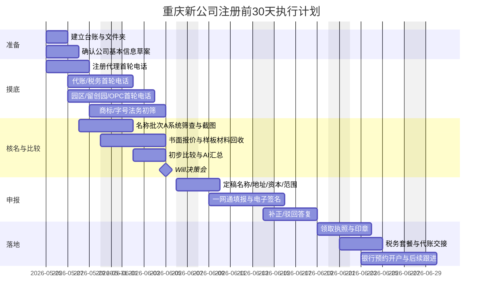

# 重庆新员工入职与工作指引

## 执行摘要

你在重庆的核心任务，不是“尽快把营业执照办出来”这么简单，而是要在 **30 天内做出一套可落地、可追溯、低风险的注册决策包**：选对公司名称、确认安全的经营范围、找到可用的注册地址、筛出靠谱的注册代理和代账、把园区/孵化器政策摸清楚，并且把所有关键口头承诺都变成书面证据。重庆目前企业开办可通过“开办企业一网通”“渝快办”“E企办”等渠道联办，名称实行自主申报；重庆企业开办系统会对名称筛查给出红、黄、绿提示，其中黄灯通常要求补充授权文书；新开办企业通过“一网通”可领取一套免费印章；重庆市市场监管局最新版《公司登记服务指南》已于 2026 年 5 月 1 日起实施。citeturn27view0turn4search7turn4search3turn15search0turn0search9

从政策角度看，你要区分三类机会，不要把它们混在一起。第一类是“留创计划”：截至 2026 年 5 月，重庆市人社局留学回国人员栏目里公开可见的最新“回国创业创新支持计划”申报通知仍是 2025 年版，公开栏目中尚未看到 2026 年创业创新支持计划的新一轮申报通知；2025 年版创业类资助标准为 50 万/30 万/20 万/10 万元，但门槛较高，要求在渝工商登记和纳税、注册资本认缴不低于 20 万元、申报人占股不低于 30%，并且企业要有自主知识产权或发明专利、项目有市场潜力、能够吸纳 5 人以上就业并参保。第二类是“高校毕业生等青年创业支持”：2025 年重庆“渝创渝新”大学生创业启航计划明确将 **毕业 10 年内的普通高校毕业生（含经教育部门认定的留学回国人员）**纳入对象，支持内容包括 1 万至 3 万元资助、最长 1 年免费创业工位、个人最高 50 万元与企业最高 600 万元创业担保贷款。第三类是“园区/工位/OPC 社区支持”：重庆 2025 年明确提出提供 1 万个免费创业工位，2026 年又针对 AI/一人公司启动 OPC 社区布局，并提出租金减免、共享办公、零租工位等支持。你的电话里必须把这三类政策分别问清，否则代理最容易用“有补贴”“能申报”这种模糊话术误导你。citeturn26search0turn8view0turn9view0turn40search7turn40search4turn40search0turn22search9turn40search5

你注册的首选路径，应当是 **“数字科技/信息科技类内资有限责任公司”**，而不是一上来就碰牌照更重的“旅行社业务”。国家层面的“自费出国留学中介服务机构资格认定”行政许可已于 2017 年取消，但旅行社业务仍属于明确许可事项，相关经营许可由文旅主管部门管理。因此，第一阶段公司名称和经营范围应当尽量采用 **数字科技 + 信息咨询 + 教育咨询 + 留学/生活服务相关的一般经营类表述**，避免把公司直接推入“旅行社牌照”路径。citeturn24search0turn24search9turn25search1turn25search3

你接下来日常工作的方法是对的：**每打完一个电话，立刻记录、立刻要求对方微信书面确认、立刻把通话记录贴给 AI 做复盘，再决定下一通电话怎么打。** 这份指引就是按这个逻辑设计的。

## 任务目标与工作边界

你的工作目标只有五个，做完这五个，Will 才能做决定。

第一，做出 **名称决策包**。你需要先做系统筛查，再做代理人工预判，再做商标/字号法律风险初筛。重庆企业名称采用自主申报，企业名称一般由“行政区划名称 + 字号 + 行业或者经营特点 + 组织形式”组成，字号通常由两个以上汉字组成。名称通过系统筛查并不代表百分之百最终安全，因为名称自主申报下，申请人对名称合法性承担责任，登记机关对名称登记实行形式审查。citeturn20search1turn20search8turn15search0

第二，做出 **主体结构决策包**。你要确认是单一自然人股东还是双股东。按现行《公司法》，有限责任公司可以由一个以上五十个以下股东设立；有限责任公司的注册资本为股东认缴出资额，原则上要在公司成立之日起五年内缴足；只有一个股东的公司是允许的，但如果股东不能证明公司财产独立于股东自己的财产，股东要对公司债务承担连带责任。登记时还要配合实名登记，并涉及章程、出资期限、董监高、联络员、受益所有人等备案信息。citeturn32view0turn29view0turn42view0

第三，做出 **地址决策包**。重庆企业开办系统在住所登记上至少存在“一般程序”“申报承诺”“集群注册”三种路径。一般程序和集群注册通常需要上传住所使用证明；申报承诺在系统中可不上传住所证明，但你不能因为系统能选就默认低风险，必须让代理或园区说明该地址方案是否真实、是否支持银行开户、是否支持后续政策申报。citeturn27view0

第四，做出 **代理与代账决策包**。注册代理负责设立登记、核名、地址方案、章程文书、电子签名流程、营业执照领取和印章配合；代账负责税费种认定、发票、申报、社保公积金协同、年报和后续跨境付款风险提示。重庆企业开办“一网通”本身已经把印章、就业参保、税务服务、预约开户、公积金缴纳放在同一流程中，所以你选择服务商时，要优先考虑谁最能把这些环节串起来，而不是只看低价。citeturn27view0turn4search7

第五，做出 **政策路径决策包**。你要明确告诉任何中介：2026 年创业创新支持计划公开通知目前未看到，不能承诺；如果他们说“能报留创计划”，你就要问他对应的是哪一类政策、对应年度是哪一年、对应条件是否满足、是否能发你书面条款来源。这个问题上，**没有文件就不算数**。citeturn26search0turn8view0turn9view0

你的工作边界也必须清楚。你 **不能** 做以下事情：不能替 Will 决定最终名称；不能在没有 Will 书面同意前交订金；不能口头承诺政策一定能批；不能自作主张把“旅行社业务”“出境旅游业务”放进经营范围；不能擅自使用北京公司的公章、字号、商标、域名、公众号、合同模板去做注册或宣传；不能在没有律师确认前推进“远思致行”授权或转让。

## 首 30 天流程与里程碑

官方流程层面，你要知道重庆的线上设立入口、资料字段、电子签名和办理状态。重庆市场监管局公开操作手册显示，企业可以通过“重庆市开办企业一网通”进入设立流程；名称筛查后如果尚未准备正式申请，可以先点击“保留名称”；进入正式填报时，系统会依次填写名称信息、基本信息、经营范围、组织架构、人员信息、住所、多证合一、开办企业事项、材料上传、领取方式和提交审核；流程状态会出现“资料确认中”“电子签名中”“待受理”“审核中”“已审批”“已办结”等。citeturn27view0

你这 30 天的项目计划应该按下面执行，而不是散打式打电话。之所以这样排，是因为企业名称保留期一般为 2 个月、同一出资人在保留期内自主申报的企业名称不得超过 3 个，所以你不能太早正式保留，也不能一口气把所有备选名字都锁死。citeturn15search7turn15search3



你每天和每周的工作节奏，应该固定成项目管理动作，而不是临时起意。

| 时间频率 | 你要做的事 | 完成标准 |
|---|---|---|
| 每天 09:30 前 | 回看前一天 AI 复盘，调整当天电话顺序 | 当天目标名单明确 |
| 每天 10:00–12:00 | 打 2–4 个高优先联系人电话 | 每通都有记录 |
| 每天 14:00–17:00 | 追微信书面确认、催报价、收截图 | 口头承诺尽量转书面 |
| 每天 17:00–18:00 | 更新总表，把每通电话贴给 AI 复盘 | 当天 100% 录入 |
| 每周一 | 更新本周名单和目标 | 形成“本周先打谁” |
| 每周三 | 做中期比较表 | 初步优先级变化可见 |
| 每周五 | 发给 Will 本周决策摘要 | 写清需拍板事项 |

如果你看到系统状态进入“电子签名中”，你的工作重点就不再是打代理电话，而是立刻催齐所有需要实名确认/签字的人，避免流程停住。citeturn27view0

## 名称策略与核名执行

你现在最适合采用 **“远境”系名字优先，“远思致行”系名字后置”** 的策略。原因不是法律层面的“绝对不能用远思致行”，而是从项目管理上看，“远境”路径更干净、更少历史包袱、更适合重庆新公司独立搭建；而“远思致行”路径因为还牵涉北京旧主体、字号使用权、授权/转让可能性、公司注销状态和印章使用风险，所以应该放在后备批次，而不能作为第一批锁名对象。

重庆名称申报的官方机制决定了你必须批次化处理：系统筛查可能出现红灯、黄灯、绿灯；黄灯还可能要求你上传授权文书；同一出资人在保留期内最多保留 3 个名称；名称保留期一般为 2 个月。因此，你要先做广泛筛查，再正式保留最强的 3 个，不要反着做。citeturn27view0turn15search3turn15search7

建议你正式执行的名称优先级如下：

| 优先级 | 拟申报名称 | 定位 | 风险判断 | 建议动作 |
|---|---|---|---|---|
| 1 | 重庆远境数字科技有限公司 | 最贴合你们当前数字化、平台化、服务中台定位 | 中低 | 第一批正式申报 |
| 2 | 重庆远境信息科技有限公司 | 比“数字科技”更通用，适合信息咨询和软件服务 | 中低 | 第一批正式申报 |
| 3 | 重庆远境科技有限公司 | 最短、最好记，但常见度更高，近似风险略高 | 中 | 第一批正式申报 |
| 4 | 重庆远境知行数字科技有限公司 | 如果“远境”短名被占，可保留品牌调性 | 中 | 第二批备用 |
| 5 | 重庆远思致行数字科技有限公司 | 品牌连续性强，但历史权属与授权问题重 | 中高 | 仅在律师确认后用 |
| 6 | 重庆远思致行科技有限公司 | 同上，且近似/历史风险更高 | 中高 | 最后备用 |

你的核名执行顺序应该是：

第一步，**对 6 个名字全部做系统筛查，但只保留截图，不急着正式保留**。
第二步，找 3 家代理分别做人工预判，让他们告诉你：有没有近似企业、是否可能黄灯、黄灯依据是什么、是否需要授权文书。
第三步，只有当代理、地址、经营范围和主体结构已经进入可提交状态时，再对前 3 个名称做正式保留。
第四步，如果前三个中有两个同时失败，再释放一个位置给第四个。
第五步，只要涉及“远思致行”，先停下来让 Will 决定是否走授权/转让法律路径。

你每次核名必须提交以下材料给 Will：

- 名称筛查截图；
- 系统提示颜色；
- 代理文字结论；
- 相似名称截图或说明；
- 是否需要授权文书；
- 你的建议：继续、替换、暂缓。

重庆一网通操作手册明确显示：如果系统筛查黄色提示，需要在“资料上传”栏上传授权文书；如果尚未准备正式申请，可以先保留名称。换句话说，授权文书不是“以后再说”的附件，而是可能直接影响你第一天能不能继续往下走。citeturn27view0

## 对外联络清单与逐类电话脚本

### 官方优先联系名单

先打官方，再打中介。这样你后面跟代理、代账、园区谈判时，心里有底，不会被“政策包办”“地址包过”“补贴包申”牵着走。

下表中的留创园、区县人社和商标官方窗口，均来自重庆市官方公开名单。citeturn7view0turn38view0turn45view0

| 类型 | 机构 | 电话 | 备注 |
|---|---|---:|---|
| 留创园 | 中国重庆两江新区留学人员创业园 | 023-63395813 | 两江新区，优先级很高 |
| 留创园 | 中国重庆留学人员创业园（高新区） | 023-68158905 | 高新区，适合科技类 |
| 留创园 | 重庆市渝中区留学人员创业园 | 18908327877 | 渝中，交通方便 |
| 留创园 | 江北高层次留学人员创业园 | 023-67983825 | 江北，可问配套支持 |
| 留创园 | 重庆大学城科技创新留学人员创业园 | 023-61738666 | 沙坪坝，大学城资源 |
| 留创园 | 重庆水木英华留学人员创业园 | 023-62622123 | 南岸备选 |
| 区县人社 | 两江新区留学人员工作联系 | 67212050 | 政策核实 |
| 区县人社 | 高新区留学人员工作联系 | 68681116 | 政策核实 |
| 区县人社 | 渝中区留学人员工作联系 | 63765137 | 政策核实 |
| 区县人社 | 江北区留学人员工作联系 | 67852482 | 政策核实 |
| 区县人社 | 南岸区留学人员工作联系 | 62986606 | 政策核实 |
| 区县人社 | 沙坪坝区留学人员工作联系 | 65096670 | 政策核实 |
| 市级政策咨询 | 重庆市留创计划咨询 | 12333 / 86868904 | 先核实再信代理 |
| 商标官方窗口 | 国家知识产权局重庆业务受理窗口 | 023-67606650 | 主窗口 |
| 商标官方窗口 | 商标业务重庆江北受理窗口 | 023-67737255 | 近两江 |
| 商标官方窗口 | 商标业务重庆两江新区受理窗口 | 023-63395048 | 两江优先 |
| 商标官方窗口 | 商标业务重庆高新区受理窗口 | 023-68886797 | 高新区优先 |

如果官方园区不合适，再去问 OPC 社区。重庆 2026 年已明确在两江新区、渝中区、南岸区、北碚区和重庆高新区首批布局 OPC 创业社区，并提出一站式服务、共享办公、租金减免和零租工位等支持，所以你在联系园区时，可以把“留创园”和“OPC/数字园区”并行摸底。citeturn22search9turn40search5turn22search2

### 注册代理电话问题清单

你打给注册代理，目标不是“问报价”，而是 **测试专业度和透明度**。下面这套问题按顺序问。

**开场话术：**

```text
你好，我这边准备在重庆新设一家内资有限责任公司，优先考虑单一自然人股东，主营方向是数字科技、信息咨询、教育咨询、留学服务相关，不做旅行社牌照。我们内部在比较注册方案，想请你按几个关键点给我口头说明，并在电话后微信书面确认。
```

**必须问的 12 个问题：**

1. 你们最近 3 个月做过多少家重庆内资有限公司设立？有没有做过 **单一自然人股东 + 数字科技/信息咨询类** 的案例？
2. 你们熟不熟悉重庆“一网通”全流程？能不能代做资料梳理、电子签名前检查、驳回补正？
3. 我准备申报这些名字：
   - 重庆远境数字科技有限公司
   - 重庆远境信息科技有限公司
   - 重庆远境科技有限公司
   - 重庆远境知行数字科技有限公司
   - 重庆远思致行数字科技有限公司
   - 重庆远思致行科技有限公司
   请你先做文字预判，哪些最可能绿灯，哪些可能黄灯，黄灯依据是什么？
4. 如果系统黄灯，需要什么授权文书？你们有没有可以先发我参考的模板？
5. 重庆同一出资人在保留期内最多能保留几个名称？你建议我 **什么时候正式保留**，避免 2 个月保留期浪费？
6. 你们能提供哪几种地址：一般程序地址、申报承诺地址、集群注册地址？每种能不能给我看一份 **住所使用证明样稿**？重庆系统确有这三种路径，所以你要他们明确自己是哪条路径，不许泛泛而谈。citeturn27view0
7. 这个地址是否支持：工商登记、税务落地、银行开户、后续迁址、人才/园区政策申请？如果不支持其中任何一项，请直接说。
8. 你们是否协助把“一网通”里的以下事项一起配置：免费刻章、税务服务、就业参保、公积金、预约开户？重庆系统把这些事项放在“开办企业”环节统一勾选，你要确认代理是否真懂这个界面。citeturn27view0turn4search3
9. 你们报价怎么拆：设立服务费、地址费、刻章费、银行协助费、税务报到费、后续变更费。有没有任何必须绑定的隐藏收费？
10. 付款节点是什么？有没有退款机制？如果核名失败、地址不通过、银行不接收，分别怎么处理？
11. 你们建议注册资本多少？为什么？如果你建议高于 30 万元，请你把理由说清楚。现行公司法要求有限责任公司出资一般应在成立之日起五年内缴足，因此注册资本不能随便写大。citeturn32view0turn42view0
12. 请你在微信里把以上结论发我，尤其是：**推荐名称顺序、地址方案、费用明细、时效、是否支持后续政策。**

**电话后统一追微信的文字：**

```text
谢谢刚才电话。为便于内部决策，请您微信文字确认以下内容：
1）推荐名称排序及各名称风险；
2）是否需要授权文书，若需要请发模板；
3）地址方案类型（一般程序/申报承诺/集群注册）；
4）可否支持工商、税务、银行开户、后续政策；
5）分项费用、付款节点、退款条件；
6）预计办理时长。
麻烦尽量今天发我，感谢。
```

### 代账与税务电话问题清单

你打给代账，不是问“一个月多少钱”，而是问 **你们能不能理解我们的业务和跨境风险**。

**开场话术：**

```text
你好，我们准备在重庆新设一家内资有限责任公司，业务是数字科技、教育咨询、留学家庭服务、信息咨询，可能存在中国公司与美国公司之间的服务协作。想了解你们对新办企业税务、发票和跨境付款的处理能力，请按几个关键点回复，并尽量微信书面确认。
```

**必须问的 12 个问题：**

1. 对我们这种业务，你建议先做 **小规模纳税人** 还是主动申请 **一般纳税人**？为什么？
2. 你们是否了解现行一般纳税人登记规则：年应征增值税销售额超过小规模标准通常应办理一般纳税人登记，未超过标准但会计核算健全且能提供准确税务资料的，也可以办理一般纳税人登记？目前税务总局解释中继续以 **500 万元** 作为示例标准。citeturn33view0turn16search9
3. 对我们拟开的发票类型，你建议哪些：信息咨询、技术服务、软件服务、教育咨询、票务代理、酒店管理等。请你按业务场景做一个初步列表。
4. 零申报阶段你们如何处理？什么时候不建议再长期零申报？
5. 如果公司未来向境外主体支付服务费、技术费、品牌费、软件费，你们是否能先出一版 **书面税务风险清单**？
6. 你们如何判断境外服务费是否涉及境内应税行为、是否需要代扣代缴增值税？税务部门公开答复明确提到，境外单位或个人在境内发生应税行为且境内无经营机构的，购买方可能是增值税扣缴义务人；但“完全在境外发生的服务”又不属于在境内销售服务，因此不能拍脑袋判断。citeturn36view0
7. 你们如何判断向境外企业付款是否涉及非居民企业所得税源泉扣缴？企业所得税法和税务部门热点问答均明确：非居民企业在中国境内未设机构但取得来源于中国境内所得时，支付人可能成为扣缴义务人。citeturn35view0turn37view0
8. 你们能否处理员工工资、社保、公积金、年报、汇算清缴？
9. 你们会不会给每月固定交付物？例如：申报截图、财务报表、发票汇总、银行流水核对表。
10. 你们月费/年费怎么构成？包含多少张票？超出如何收费？
11. 如果后续从小规模转一般纳税人，你们如何配合？税务总局解释明确说明了超过标准或自愿登记的一般纳税人生效时间和申报衔接。citeturn33view0
12. 请微信发我：建议纳税人类型、发票建议、月度服务内容、报价、跨境风险能力说明。

**电话后统一追微信：**

```text
谢谢刚才电话。请微信书面确认：
1）建议纳税人类型及依据；
2）建议发票类别；
3）月度服务清单；
4）报价与超出计费规则；
5）如涉及对境外付款，你们能否提供书面风险提示和处理建议。
```

### 园区、孵化器、留创园、OPC 电话问题清单

你打给园区，目标是判断 **它是不是“真实地址 + 服务支持 + 政策对接”三者兼备**。重庆官方对市级创业孵化基地（园区）的功能要求很明确：要能提供低成本场地、创业指导、财务代账/融资担保/专利申请/法律维权等事务代理、融资对接以及政策落实功能。citeturn43view0

**开场话术：**

```text
你好，我这边准备在重庆新设一家数字科技类公司，主要服务留学家庭和国际教育相关客户。想了解你们园区/留创园/社区是否支持注册落地、地址使用、政策对接和后续办公，请我问几个具体问题，方便的话之后请微信书面发我。
```

**必须问的 12 个问题：**

1. 你们是 **重庆市留学人员创业园**、**市级创业孵化基地/园区**，还是 **OPC/数字园区/普通共享办公**？
2. 你们可否提供可用于 **工商登记** 的地址？是一般程序、申报承诺，还是集群注册？
3. 你们可否提供 **住所使用证明/租赁合同/产权相关文件样稿** 给我内部看？
4. 该地址是否支持 **银行开户**？是否有企业实际在这里成功开过基本户？
5. 该地址是否支持后续 **政策申报**、尤其是留创相关和区县创业支持？
6. 你们给新企业的基础服务有哪些：工商、税务、代账、法务、知识产权、融资、活动、导师、客户资源？重庆对市级创业孵化基地的官方功能要求中就包含这些内容。citeturn43view0
7. 房租/工位是什么方案：免费、减免、补贴、共享、独立、试用期？
8. 如果我们以后需要从注册地址升级为实际办公室，能否在园区内迁移？
9. 如果我们未来想报 **留创计划**，你们园区以往辅导过吗？最新公开可见政策仍以 2025 年通知为准，而且企业条件比较高。citeturn26search0turn8view0turn9view0
10. 如果我们不一定满足高门槛留创计划，园区还有没有更轻量的支持，例如办公、推广、导师、比赛、投融资对接、工位？重庆 2025—2026 年公开政策中均提到免费工位和创业载体支持。citeturn40search0turn40search7turn22search9
11. 入驻门槛是什么：是否要求学历、留学经历、毕业年限、团队人数、营业执照、流水、专利、社保？
12. 请微信发我：地址类型、样板文件、费用方案、政策支持列表、联系人。

**电话后统一追微信：**

```text
谢谢刚才电话。请微信文字确认：
1）你们园区性质（留创园/孵化基地/OPC/普通园区）；
2）可提供的地址类型及是否支持银行开户；
3）可提供的服务清单；
4）工位/办公室/租金方案；
5）是否协助对接区县人社或其他政策；
6）若方便，请发一份地址证明或入驻资料样稿。
```

### 法务与商标电话问题清单

公司名和商标要一起做，而不是营业执照下来以后再想品牌名。国家知识产权局明确说明，国内申请人办理商标可以自行办理，也可以委托 **在国家知识产权局商标局备案的商标代理机构** 办理；重庆也公开了多个商标业务受理窗口。citeturn46view0turn45view0

**开场话术：**

```text
你好，我们在做重庆新公司注册，想同时把公司字号和品牌名做初步法律风险筛查。中文候选是“远境”“远境知行”“远思致行”，英文品牌可能涉及“Farland”。请帮我们做一个轻量级初筛，并说明你们是否为备案代理机构或律师团队，之后请微信书面发我要点。
```

**必须问的 10 个问题：**

1. 你们是否是 **国家知识产权局备案商标代理机构**，或者律师事务所？
2. 请先查中文字号/商标：远境、远境知行、远思致行。
3. 请初筛英文标识：Farland。
4. 对我们业务，建议重点关注哪些类别与服务项？至少要让对方给你一版建议，不要只说“都可以注”。
5. 若公司名叫“重庆远境数字科技有限公司”，但品牌用 “Farland”，你建议先申哪个、先保护哪个？
6. 如果“远思致行”涉及既有主体历史使用，最合理的是 **授权**、**许可**、还是 **转让**？
7. 如果北京旧主体处于注销、清算、股权不明或法定代表人并非当前控制人，是否应暂停任何授权/转让动作？
8. 如果重庆核名系统黄灯，需要上传授权文书，你们能否提供 **审过的授权样本**？
9. 商标初筛费、申请费、代理费分别多少？
10. 请微信发我：初筛结论、建议类别、风险点、建议顺序、费用。

**电话后统一追微信：**

```text
谢谢刚才电话。请微信确认：
1）你们执业/备案身份；
2）“远境/远境知行/远思致行/Farland”的初筛结论；
3）建议优先保护的类别；
4）如涉及授权或转让，需要先准备哪些材料；
5）报价。
```

## 文档、模板与 AI 复盘指令

### 文件夹结构

你一上手就建立下面这个文件夹，不要等资料散了再整理。

```text
/重庆注册项目
  /01_核名截图
  /02_注册代理报价
  /03_代账税务报价
  /04_园区与政策
  /05_商标与法务
  /06_公司资料草案
  /07_书面确认截图
  /08_AI复盘记录
  /09_最终决策包
```

### 通话记录模板

每一通电话都必须按这个模板记录；通话一结束就填，不许晚点再补。

```text
【通话记录】
日期：
时间：
联系人类型：注册代理 / 代账 / 园区 / 区县人社 / 商标法务 / 银行
机构名称：
联系人姓名：
电话：
微信：
是谁先联系谁：
通话时长：

一、对方已明确确认的信息
1.
2.
3.

二、对方口头说了但未书面确认的信息
1.
2.
3.

三、报价信息
1. 设立服务费：
2. 地址费：
3. 代账费：
4. 其他费用：

四、名称相关
1. 对哪些名字判断更高通过率：
2. 是否提到黄灯/授权文书：
3. 是否能提供样板或截图：

五、地址相关
1. 地址类型：一般程序 / 申报承诺 / 集群注册
2. 是否有住所使用证明：
3. 是否支持银行开户：
4. 是否支持后续政策：

六、税务/合规相关
1. 建议纳税人类型：
2. 是否提到跨境付款风险：
3. 是否能提供书面税务清单：

七、风险点
1.
2.
3.

八、我下一步要追问的事项
1.
2.
3.

九、是否需要当天升级给Will
是 / 否
原因：
```

### 日报模板

```text
【重庆注册项目日报】
日期：

一、今天完成
1. 打电话数量：
2. 新增有效联系人：
3. 收到书面确认：
4. 新增核名截图：
5. AI复盘次数：

二、今天的最佳进展
1.
2.

三、今天发现的主要风险
1.
2.
3.

四、目前最优组合
1. 名称：
2. 代理：
3. 代账：
4. 园区/地址：
5. 法务/商标：

五、需要Will拍板的事项
1.
2.

六、明天最优先三件事
1.
2.
3.
```

### 决策摘要模板

```text
【阶段性决策摘要】
截止日期：

一、推荐方案
1. 名称首选：
2. 名称备选：
3. 注册代理首选：
4. 代账首选：
5. 地址首选：
6. 预计注册资本：
7. 经营范围原则：

二、推荐理由
1.
2.
3.

三、未决问题
1.
2.
3.

四、如果今天必须拍板，建议Will决定
1.
2.
3.
```

### 对外提供的公司信息样稿

下面这份信息，是你给代理、代账、园区统一口径时使用的，不要每次说法都变。

```text
【拟注册公司基本信息样稿】

1. 拟注册地：重庆
2. 公司类型：内资有限责任公司
3. 股东结构：优先单一自然人股东（如Will）；如确有必要，再讨论第二股东
4. 建议注册资本：30万元认缴（五年内缴足）
5. 公司名称优先顺序：
   1）重庆远境数字科技有限公司
   2）重庆远境信息科技有限公司
   3）重庆远境科技有限公司
   4）重庆远境知行数字科技有限公司
   5）重庆远思致行数字科技有限公司
   6）重庆远思致行科技有限公司

6. 业务方向：
   面向留学家庭和国际教育相关客户，提供数字化服务、信息咨询、教育咨询、留学服务支持、品牌与内容服务、酒店/票务/本地生活协同服务等。

7. 经营范围拟定原则：
   以一般经营项目为主，优先采用“技术服务、软件开发、信息技术咨询、数字技术服务、信息咨询服务、教育咨询服务（不含涉许可审批的教育培训活动）、自费出国留学中介服务、企业管理咨询、品牌管理、市场营销策划、会议及展览服务、翻译服务、票务代理服务、商务代理代办服务、酒店管理、广告设计/代理/制作/发布、摄像及视频制作服务”等标准表述，由代理按重庆系统规范表述查询结果最终确认。
   第一阶段原则上不加入“旅行社业务”“出境旅游业务”等许可事项。

8. 地址要求：
   必须可用于工商登记，优先选择可支持银行开户、税务落地和后续政策申请的真实地址/园区地址。

9. 结算与税务特点：
   前期以咨询/服务类业务为主；未来可能涉及与境外主体的协作或付款，需要代账能识别跨境税务风险。

10. 需求偏好：
   需要代理/园区/代账把关键承诺微信书面确认。
```

选择 **30 万元认缴注册资本** 的原因，是它既满足重庆 2025 年留创计划创业类对注册资本 **不低于 20 万元** 的公开门槛，又不会把未来五年出资责任写得太夸张；现行公司法要求有限责任公司认缴出资一般应在成立之日起五年内缴足。citeturn8view0turn9view0turn32view0turn42view0

### 字号授权与品牌转移检查清单

只要走到“远思致行”路径，你就要按这个检查，不许跳步。

```text
【字号/品牌授权或转移检查清单】

A. 主体状态
[ ] 北京主体当前工商状态已核实
[ ] 是否已进入注销/清算程序已核实
[ ] 法定代表人、股东、清算组情况已核实
[ ] 是否存在诉讼、冻结、股权纠纷已核实

B. 权利范围
[ ] 企业字号使用权
[ ] 注册商标/商标申请
[ ] 域名
[ ] 微信公众号/视频号/抖音/小红书
[ ] 网站/海报/宣传物料
[ ] 软件/代码/版权
[ ] 客户名单/CRM/数据
[ ] 合同模板/报价模板
[ ] 公章、合同章、财务章、发票章

C. 法律文件
[ ] 股东会/董事会/清算组同意文件
[ ] 授权协议或转让协议
[ ] 授权期限、区域、用途明确
[ ] 是否允许用于企业名称申报明确
[ ] 是否允许用于商标申请明确
[ ] 是否允许用于宣传和签约明确
[ ] 对价、违约责任、终止条款明确
[ ] 律师审核完成

D. 风险判断
[ ] 权利归属明确
[ ] 不存在多头授权
[ ] 不存在历史欠款/纠纷拖带风险
[ ] 不存在未经法定程序擅自用章风险
```

### 字号授权书样稿

这个样稿 **只能作为讨论版**。如授权方主体状态不清、处于注销/清算、法定代表人不一致、商标权不明、股东不同意，绝不能直接使用，必须交律师改。重庆核名如果出现黄灯，才考虑是否用到这类文书。citeturn27view0

```text
字号授权书（样稿）

授权方：北京远思致行科技有限公司
统一社会信用代码：________________
法定代表人：________________

被授权方：重庆________________有限公司（筹）
拟设立申请人/实际控制人：________________

鉴于授权方在经营活动中长期使用“远思致行”作为字号/品牌标识，现授权方自愿就该字号的阶段性使用作出如下授权：

一、授权内容
授权方同意被授权方在以下范围内使用“远思致行”字样：
1. 用于重庆新设公司企业名称自主申报、核名预判及相关沟通；
2. 用于与市场监管、园区、商标代理、律师、会计等机构进行注册筹备；
3. 用于内部品牌与商标可行性评估。

二、授权限制
1. 本授权不当然构成商标转让、股权安排或永久许可；
2. 未经授权方另行书面同意，被授权方不得以“远思致行”对外签署正式商业合同、收款、开票、开展大规模宣传；
3. 若授权方进入注销、清算、诉讼、争议、权利瑕疵状态，本授权自动中止，直至相关法律风险排除。

三、授权期限
自____年__月__日起至____年__月__日止。

四、声明
授权方声明，其对本授权涉及的字号/品牌使用具有相应处分权或已取得必要内部同意；如因授权瑕疵引发争议，由授权方与被授权方另行协商解决。

授权方（盖章）：
法定代表人/有权签字人：
日期：
```

### 每通电话后的 AI 提示词

这段提示词是你每天最高频使用的工具。**每通电话结束后必须立即贴给 AI**。

```text
你是我的“重庆公司注册项目分析助手”。

背景：
- 我们要在重庆注册一家内资有限责任公司；
- 主方向是数字科技、信息咨询、教育咨询、留学家庭服务；
- 第一阶段不想碰旅行社牌照；
- 名称优先级大致是：
  1）重庆远境数字科技有限公司
  2）重庆远境信息科技有限公司
  3）重庆远境科技有限公司
  4）重庆远境知行数字科技有限公司
  5）重庆远思致行数字科技有限公司
  6）重庆远思致行科技有限公司
- 我们希望找到低风险名称、真实可用地址、靠谱代理和代账，并尽量争取重庆园区/留创/工位支持。
- 我需要把每个联系人都放进比较表。

下面是我刚刚的通话记录：
【粘贴通话记录】

请按以下格式输出：
1. 这通电话中“已确定”的信息
2. 这通电话中“仍未确定”的关键信息
3. 明显风险点或自相矛盾之处
4. 对方必须微信书面确认的内容
5. 下一通追问最该问的5个问题
6. 建议我给对方发的一条微信跟进消息
7. 该联系人评分（专业度/透明度/风险/性价比，各10分）
8. 是否建议进入 shortlist（是/否/待观察）及理由
9. 是否需要马上升级给Will（是/否）及原因

重要要求：
- 请优先识别“口头承诺没证据”“补贴吹得过大”“地址不真实”“经营范围可能有许可风险”“跨境税务被轻描淡写”“名称可能需要授权文书”这几类问题。
- 回答务必直接、具体、可执行。
```

## 选择标准、风险预警与升级机制

### 选择注册代理的标准

你评价代理时，不要凭“态度好”或“报价低”。按照下面五项分数来打：

| 维度 | 权重 | 合格标准 |
|---|---:|---|
| 专业清晰度 | 30% | 能明确说出核名、地址类型、电子签名、补正逻辑 |
| 书面确认意愿 | 20% | 愿意微信发清单，不怕留下证据 |
| 地址真实性 | 20% | 能提供样板证明，能讲清银行可行性 |
| 费用透明度 | 15% | 分项报价、付款节点、退款条件说清楚 |
| 后续协同能力 | 15% | 能衔接代账、税务、印章、开户、园区 |

只要出现以下任一情况，直接降级处理：

- 说“名字肯定能过”，但不愿意发书面判断；
- 说“地址绝对没问题”，但不给样板文件；
- 上来就推荐高注册资本，却讲不出原因；
- 一听你说留学服务就建议你放“旅行社业务”进去；
- 承诺“补贴一定能报”，但说不出政策年度和条件；
- 听到“远思致行”就说“你有章就能用”，这种直接淘汰；
- 不知道“统一在一网通里勾选印章/税务/开户预约”的流程。citeturn27view0

### 选择地址的标准

重庆系统里至少有三种路径，你要把它们和业务目标匹配起来。citeturn27view0

| 地址路径 | 官方系统要求 | 适合情况 | 你的判断标准 |
|---|---|---|---|
| 一般程序 | 通常要上传住所使用证明 | 最稳妥的真实办公/园区地址 | 首选；适合后续银行和政策 |
| 申报承诺 | 系统中可不上传住所证明 | 特定区县/场景下有用 | 必须让对方书面讲清适用性 |
| 集群注册 | 系统选标准地址，通常也要证明 | 园区、集群、部分孵化地址 | 重点核查能否开户和迁址 |

从业务上，你的地址优先级建议是：

1. **官方留创园 / 市级孵化基地的真实地址**
2. **官方 OPC / 数字园区 / 可出材料的共享办公地址**
3. **代理提供的集群地址或挂靠地址**

原因很简单：重庆对市级创业孵化基地（园区）的官方要求中，明确强调场地保障、事务代理、融资对接、政策落实和对服务对象的场租减免等支持；用这种地址，后续对接区县人社、园区服务和成长迁移都更顺。citeturn43view0

### 选择代账和账户的标准

代账的最低标准不是“按时报税”，而是：

- 能判断你们业务应该先做小规模还是一般纳税人；
- 能处理发票、社保、公积金、年报、汇算清缴；
- 能识别未来境外收付款的中国税务问题；
- 愿意按月给交付物；
- 不鼓励长期假零申报。

银行账户的选择，你要自己多问一句，不要完全交给代理。你至少要问：

- 这个支行开基本户是否必须法人到场；
- 是否支持后续开通外汇/跨境相关服务；
- 网银、U 盾、回单、对账、手续费如何；
- 是否能与电子税务局、三方协议、代账协同顺畅；
- 预约周期多长；
- 对园区地址、集群地址是否敏感。

重庆“一网通”可以把预约开户信息提前填写，但真正开户体验仍然是各银行、各支行差异很大，所以这一步一定要单独核实。citeturn27view0turn4search7

### 三种假设型服务商方案比较

下表是 **假设型** 价格与服务结构，不是市场报价。你要拿它作为比较框架，逼中介把报价拆清楚。

| 方案 | 设立服务费 | 地址费 | 代账费 | 服务内容 | 适合谁 | 主要风险 |
|---|---:|---:|---:|---|---|---|
| 低价线上型 | 0–800 元 | 1500–3000/年 | 2000–3500/年 | 只做基础设立，售后弱 | 只求拿照、对政策无要求 | 隐形收费、地址质量差 |
| 本地均衡型 | 800–2000 元 | 2500–5000/年 | 3000–6000/年 | 设立+税务+基础开户协同 | 你目前最可能适合 | 要核实书面承诺真实性 |
| 园区打包型 | 2000–6000 元 | 含在入驻包内或另议 | 4000–9000/年 | 地址+工位+工商税务+政策对接 | 想要长期落地和资源 | 总价高，但综合价值可能高 |

### 关键风险清单

以下风险一旦出现，必须马上升级。

第一，**名称权和字号权风险**。名称自主申报并不等于安全，尤其是“远思致行”这条线，只要一碰到需要授权文书、历史主体、旧品牌使用、注销中的北京公司，你就不能自己推进。重庆系统黄灯本身就说明存在限制使用情形。citeturn27view0turn15search0

第二，**单一股东责任穿透风险**。单一自然人股东公司是允许的，但如果公司财产和股东财产混同，法律风险很高。后续必须要求 Will 做到账户独立、费用独立、合同独立、票据独立。citeturn29view0turn32view0

第三，**经营范围许可化风险**。公司经营范围中凡是属于登记前依法须经批准的许可项目，设立时就要提交批准文件；旅行社业务就是典型重许可事项。因此第一阶段范围设计必须避开不必要牌照。citeturn42view0turn25search1turn25search3

第四，**跨境付款税务判断错误风险**。以后如果中国公司给美国主体付服务费、授权费、软件费，是否有增值税扣缴义务、是否涉及非居民企业源泉扣缴，都是专业判断，不能让普通代理一句“都不用管”带过去。citeturn36view0turn35view0turn37view0

第五，**政策误导风险**。截至 2026 年 5 月，公开可见的重庆留创创业创新支持计划最新申报通知仍是 2025 年版；所以凡是有人跟你说“2026 年这个马上能报、肯定给”，先要求文件或先打官方咨询电话核实。citeturn26search0turn8view0

### 什么时候必须 ask Will

下列事项你不需要等周报，出现就当天找 Will：

- 名称正式锁定前最后二选一；
- 任何一个名字出现黄灯并需要上传授权文书；
- 有人建议使用“远思致行”或北京公司文件；
- 有人建议把经营范围加入旅行社/牌照类事项；
- 地址需要签 1 年以上付费协议；
- 注册资本建议高于 30 万元；
- 任何定金、服务费、地址费要付款；
- 任何商标授权、转让、品牌继承、旧账号迁移；
- 任何跨境税务、境外付款、股权结构问题；
- 任何“政策包办”口头承诺。

所有涉及 **字号授权/商标转移/跨境付款/许可项经营范围** 的决定，都应在 Will 拍板后，再做律师或税务师复核。

## KPI、交付物与截止时间

这份工作不是“忙不忙”，而是“有没有产出”。你的 KPI 只看交付物，不看感觉。

| 截止时间 | 交付物 | 验收标准 |
|---|---|---|
| Day 1 | 总表、文件夹、脚本模板 | 已建立并开始使用 |
| Day 2 | 至少 5 家注册代理通话记录 | 每通都有完整记录 |
| Day 3 | 至少 6 个名称筛查截图 | 截图已存档、标注颜色 |
| Day 5 | 至少 3 家代账、4 个园区/留创园/OPC、1 个区县人社、1 个商标窗口联络完成 | 有记录，有追书面确认 |
| Day 7 | 初版比较表 | 含名称、代理、代账、地址、法务五类比较 |
| Day 10 | 阶段性决策摘要 | 可供 Will 拍板 |
| Day 14 | 最终注册资料草案 | 名称、地址、资本、范围、主体结构基本定稿 |
| Day 21 | 一网通正式提交，或提交受阻问题清单 | 有系统状态截图 |
| Day 30 | 设立结果闭环 | 营业执照/印章/税务交接/开户预约已完成或在明确节点中 |

除此之外，还有四个 **硬性质量 KPI**：

1. **100% 的通话必须有记录。**
2. **100% 的核名必须有截图。**
3. **100% 的口头承诺要尽量转为微信/短信书面确认。**
4. **100% 的通话记录要在当天贴给 AI 复盘。**

你必须把下面这三条当成纪律执行：

- **每次核名都提交截图；**
- **所有微信、短信、邮件确认全部保存；**
- **每打完一个电话，把通话记录贴给 AI，用上面的提示词复盘。**

如果某天到 18:00 你还没有完成当天记录、截图整理和 AI 复盘，就说明当天工作没有真正完成。